> **文档元信息**
>
> | 项目 | 内容 |
> |------|------|
> | 文档版本 | v1.0 |
> | 作者 | DTCoder |
> | 创建日期 | 2026-07-29 |
> | 需求来源 | 图书管理系统需求描述 |
> | 评审状态 | 待评审 |

# 图书管理系统 系分设计

## 1. 需求与范围

### 背景与目标

建设一套图书管理系统，支持管理员对图书信息和读者信息的全生命周期管理，同时为读者提供图书搜索浏览及借阅归还核心服务。系统核心业务目标是实现借阅闭环（借阅扣库存→记录期限→归还恢复库存→逾期提示），保障图书库存与借阅数据的一致性。

### 核心功能

- **角色管理**：系统区分管理员和读者两种角色，不同角色拥有不同操作权限。
- **图书管理（管理员）**：图书信息增删改查，包含书名、作者、ISBN、分类、库存等字段。
- **读者管理（管理员）**：读者信息管理。
- **借阅（核心）**：读者借阅图书时扣减库存，记录借阅期限（默认30天）。
- **归还（核心）**：归还时恢复库存，检测是否逾期并给出提示。
- **图书搜索浏览（读者）**：读者可搜索、浏览图书。
- **借阅记录查询（读者）**：读者查看自己的借阅记录。

### 约束与非功能要求

- 系统为前后端分离架构，前端通过 HTTPS REST 调用后端接口。
- 借阅/归还操作需保证库存与借阅记录的数据一致性（事务）。
- 并发借阅同一图书时需防止超卖（库存扣减并发控制）。
- 借阅期限默认30天，可配置。
- 读者借阅记录需支持按读者维度查询。

### 排除范围

- 图书封面图片上传及对象存储不在本期范围。
- 图书推荐算法、个性化推荐不在本期范围。
- 短信/邮件逾期通知推送不在本期范围（仅接口层返回逾期提示）。
- 统计报表、数据分析看板不在本期范围。

### 需求功能清单与优先级

| 编号 | 功能点 | 优先级 | PRD 原始描述/章节 | 备注 |
|------|--------|--------|-------------------|------|
| F01 | 用户登录认证（管理员/读者） | P0 | 系统分管理员和读者两种角色 | JWT Token 鉴权 |
| F02 | 角色权限控制 | P0 | 管理员和读者两种角色 | 垂直权限：管理员接口 vs 读者接口 |
| F03 | 图书信息新增 | P0 | 管理员负责图书信息的增删改查 | 含书名/作者/ISBN/分类/库存 |
| F04 | 图书信息删除 | P0 | 管理员负责图书信息的增删改查 | 逻辑删除 |
| F05 | 图书信息修改 | P0 | 管理员负责图书信息的增删改查 | 含库存调整 |
| F06 | 图书信息查询（分页） | P0 | 管理员负责图书信息的增删改查 | 管理端分页列表 |
| F07 | 读者信息新增 | P0 | 读者信息管理 | 管理员操作 |
| F08 | 读者信息删除 | P0 | 读者信息管理 | 逻辑删除 |
| F09 | 读者信息修改 | P0 | 读者信息管理 | |
| F10 | 读者信息查询（分页） | P0 | 读者信息管理 | 管理端分页列表 |
| F11 | 图书搜索浏览 | P0 | 读者可以搜索、浏览图书 | 按书名/作者/分类搜索 |
| F12 | 借阅图书 | P0 | 核心功能是借阅和归还，借阅时扣减库存并记录借阅期限（默认30天） | 事务+并发控制 |
| F13 | 归还图书 | P0 | 归还时恢复库存，逾期给出提示 | 事务+逾期检测 |
| F14 | 查看借阅记录 | P0 | 读者可以查看自己的借阅记录 | 按读者维度查询 |
| F15 | 图书分类管理 | P1 | 分类 | 管理员维护分类字典 |
| F16 | 借阅期限配置 | P2 | 默认30天 | 可配置常量 |

### 假设与待确认项

| 编号 | 假设/待确认内容 | 当前假设 | 确认状态 |
|------|-----------------|----------|----------|
| A01 | 读者是否可自助注册账号 | 假设：管理员统一录入读者信息，不支持自助注册 | 待确认 |
| A02 | 借阅期限是否支持按图书类型差异化配置 | 假设：全局统一默认30天，通过可配置常量实现，不按图书类型区分 | 待确认 |
| A03 | 逾期后是否允许继续借阅 | 假设：读者存在逾期未归还记录时，禁止新借阅 | 待确认 |
| A04 | 单读者最大借阅在借数量限制 | 假设：限制单读者同时在借不超过5本 | 待确认 |
| A05 | 图书是否支持多副本（同一ISBN多册） | 假设：库存字段表示可借数量，同一ISBN图书通过库存数量管理多副本 | 待确认 |
| A06 | 是否需要图书预约（库存为0时预约） | 假设：本期不做预约功能，库存为0时提示不可借 | 待确认 |

## 2. 架构与模块

### 功能架构

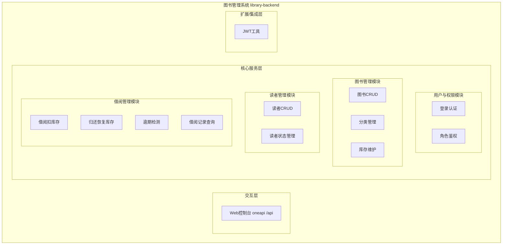

- 交互层说明：Web控制台对外暴露 oneapi REST 接口（`/api` 前缀），前端 library-frontend 通过 HTTPS 调用。
- 核心服务层说明：四个模块按依赖拓扑排序——用户与权限模块（基础鉴权）→ 图书管理模块、读者管理模块（业务数据基础）→ 借阅管理模块（依赖图书库存与读者信息）。
- 扩展/集成层说明：JWT工具提供登录态管理，本期无外部系统集成。

**模块清单**

| 模块 | 职责 | 依赖 |
|------|------|------|
| 用户与权限模块 | 管理员/读者登录认证、JWT Token 签发与校验、角色垂直权限控制、登录态拦截 | JWT工具 |
| 图书管理模块 | 图书信息CRUD、图书分类字典管理、图书库存维护（增减） | 用户与权限模块 |
| 读者管理模块 | 读者信息CRUD、读者状态管理（正常/冻结） | 用户与权限模块 |
| 借阅管理模块 | 借阅（扣库存+生成借阅记录+记录期限）、归还（恢复库存+更新记录+逾期检测）、借阅记录查询 | 用户与权限模块、图书管理模块、读者管理模块 |

### 应用集成架构

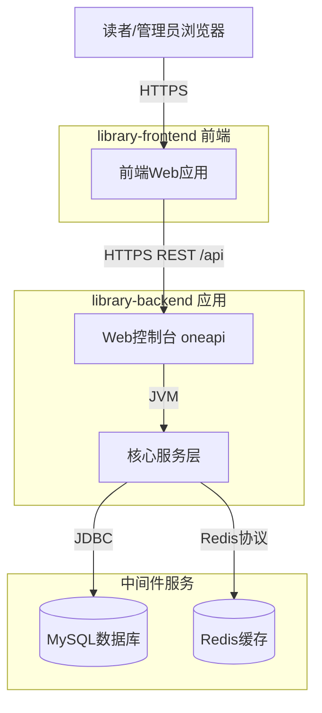

**集成关系说明：**

| 调用方 | 被调用方 | 协议 | 接口类型 | 说明 |
|--------|----------|------|----------|------|
| 读者/管理员浏览器 | library-frontend 前端 | HTTPS | Web静态资源 | 前端页面加载 |
| library-frontend 前端 | library-backend Web控制台 | HTTPS | oneapi REST | 前端调用后端 /api 接口 |
| library-backend 核心服务层 | MySQL数据库 | JDBC | SQL | 业务数据持久化 |
| library-backend 核心服务层 | Redis | Redis协议 | KV | 登录态Token缓存、图书搜索热点缓存 |

### 部署架构

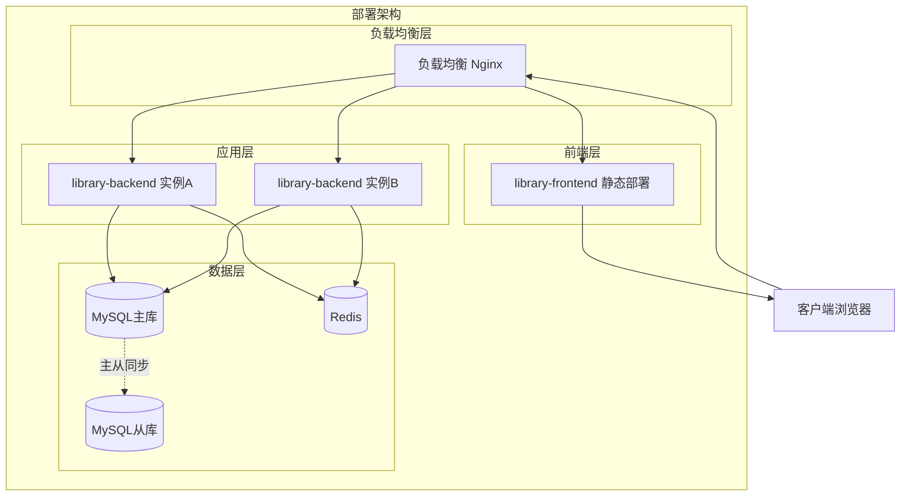

**部署说明：**
- **负载均衡层**：Nginx 负载均衡，前端静态资源与后端 API 统一入口。
- **应用层**：library-backend 部署多实例（至少2副本）保证高可用；library-frontend 静态部署于 Nginx。
- **数据层**：MySQL 主从架构（读写分离可选），Redis 单节点缓存登录态与热点数据。


## 3. 数据模型与存储

### 实体清单

| 实体名称 | 实体说明 | 所属模块 | 与其他实体的关系 |
|----------|----------|----------|-----------------|
| sys_user | 系统用户（管理员/读者统一账号） | 用户与权限模块 | 一对多关联 borrow_record（作为读者） |
| book | 图书信息 | 图书管理模块 | 一对多关联 borrow_record；多对一关联 book_category |
| book_category | 图书分类 | 图书管理模块 | 一对多关联 book |
| reader | 读者扩展信息 | 读者管理模块 | 一对一关联 sys_user；一对多关联 borrow_record |
| borrow_record | 借阅记录 | 借阅管理模块 | 多对一关联 book；多对一关联 reader/sys_user |

### 实体关系图

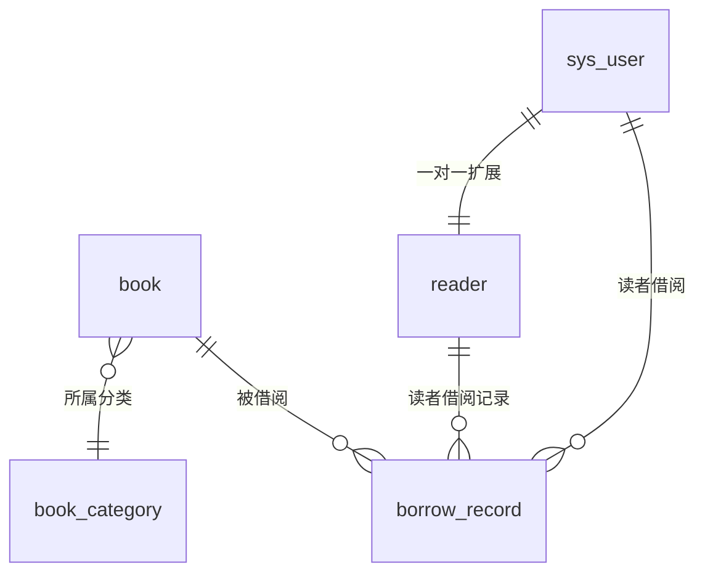

**模型说明：**
- sys_user 与 reader 为一对一关系，sys_user 存储账号通用信息（用户名/密码/角色），reader 存储读者业务扩展信息（学号/电话等）。管理员不创建 reader 扩展记录。
- borrow_record 同时关联 book 和 reader（sys_user），一条借阅记录对应一本书的一个借阅周期。
- book 与 book_category 为多对一关系，一本书归属一个分类。

## 4. 接口设计

### 4.1 oneapi（Web 控制台接口）

| 编号 | 接口名称 | 方法 | 路径 | 模块 |
|------|----------|------|------|------|
| W01 | 用户登录 | POST | /api/auth/login | 用户与权限模块 |
| W02 | 获取当前用户信息 | GET | /api/auth/current | 用户与权限模块 |
| W03 | 退出登录 | POST | /api/auth/logout | 用户与权限模块 |
| W04 | 新增图书 | POST | /api/admin/books | 图书管理模块 |
| W05 | 删除图书 | DELETE | /api/admin/books/{id} | 图书管理模块 |
| W06 | 修改图书 | PUT | /api/admin/books/{id} | 图书管理模块 |
| W07 | 分页查询图书（管理端） | GET | /api/admin/books | 图书管理模块 |
| W08 | 新增图书分类 | POST | /api/admin/categories | 图书管理模块 |
| W09 | 查询分类列表 | GET | /api/admin/categories | 图书管理模块 |
| W10 | 新增读者 | POST | /api/admin/readers | 读者管理模块 |
| W11 | 删除读者 | DELETE | /api/admin/readers/{id} | 读者管理模块 |
| W12 | 修改读者 | PUT | /api/admin/readers/{id} | 读者管理模块 |
| W13 | 分页查询读者 | GET | /api/admin/readers | 读者管理模块 |
| W14 | 搜索浏览图书（读者端） | GET | /api/books/search | 图书管理模块 |
| W15 | 借阅图书 | POST | /api/borrow | 借阅管理模块 |
| W16 | 归还图书 | POST | /api/return | 借阅管理模块 |
| W17 | 查询我的借阅记录 | GET | /api/borrow/records | 借阅管理模块 |

### 4.2 OpenAPI（对外接口）

本期无对外 OpenAPI 接口，所有接口均为 oneapi（Web控制台接口）。

### 4.3 内部接口（Service 层）

| 编号 | 接口名称 | 类 | 方法签名 |
|------|----------|------|----------|
| S01 | 登录 | AuthService | LoginResult login(LoginRequest req) |
| S02 | 校验Token | AuthService | UserInfo validateToken(String token) |
| S03 | 新增图书 | BookService | Long createBook(BookCreateRequest req) |
| S04 | 删除图书 | BookService | void deleteBook(Long id) |
| S05 | 修改图书 | BookService | void updateBook(Long id, BookUpdateRequest req) |
| S06 | 扣减库存 | BookService | void deductStock(Long bookId, int qty) |
| S07 | 恢复库存 | BookService | void restoreStock(Long bookId, int qty) |
| S08 | 新增读者 | ReaderService | Long createReader(ReaderCreateRequest req) |
| S09 | 借阅 | BorrowService | Long borrow(BorrowRequest req) |
| S10 | 归还 | ReturnResult returnBook(ReturnRequest req) |
| S11 | 查询借阅记录 | BorrowService | List<BorrowRecord> listByReader(Long userId) |
| S12 | 检测逾期 | BorrowService | boolean isOverdue(Long recordId) |

### 4.4 集成接口（Integration 层）

本期无外部系统集成接口。


## 5. 功能模块设计

### 全局约定

- **错误码格式**：`{MODULE}_{SEQ}`，MODULE 取模块缩写大写：AUTH（用户权限）、BOOK（图书）、READER（读者）、BORROW（借阅）。
- **通用出参结构**：

| 参数名称 | 类型 | 描述 |
|----------|------|------|
| code | String | 结果code，"OK"表示成功，其余为错误码 |
| msg | String | 提示信息 |
| data | Object | 业务数据 |

- **模块映射表**：

| 模块名称 | 模块缩写 | 错误码前缀 |
|----------|----------|------------|
| 用户与权限模块 | AUTH | AUTH_ |
| 图书管理模块 | BOOK | BOOK_ |
| 读者管理模块 | READER | READER_ |
| 借阅管理模块 | BORROW | BORROW_ |

### 5.1 用户与权限模块

#### 5.1.1 表结构设计

##### 5.1.1.1 sys_user（系统用户表）

| 字段名 | 数据类型 | 约束 | 默认值 | 说明 |
|--------|----------|------|--------|------|
| id | bigint | PK, 自增 | - | 系统自增主键 |
| username | varchar(64) | NOT NULL | - | 用户名/登录账号 |
| password | varchar(128) | NOT NULL | - | 密码（BCrypt加密存储） |
| role | varchar(16) | NOT NULL | - | 角色：ADMIN/READER |
| status | varchar(16) | NOT NULL | 'ACTIVE' | 状态：ACTIVE/FROZEN |
| gmt_create | datetime | NOT NULL | CURRENT_TIMESTAMP | 创建时间 |
| gmt_modified | datetime | NOT NULL | CURRENT_TIMESTAMP | 修改时间 |

**索引：**
- UK: `uk_sys_user_username` (username)
- IDX: `idx_sys_user_status` (status)

##### 5.1.1.2 枚举与常量定义

| 枚举名称 | 取值 | 含义 | 关联字段 |
|----------|------|------|----------|
| UserRole | ADMIN | 管理员 | sys_user.role |
| UserRole | READER | 读者 | sys_user.role |
| UserStatus | ACTIVE | 正常 | sys_user.status |
| UserStatus | FROZEN | 冻结 | sys_user.status |

#### 5.1.2 接口详细设计

##### W01 用户登录

- **URI**: POST /api/auth/login
- **描述**: 管理员/读者登录，校验账号密码后签发 JWT Token
- **入参**:

| 参数名称 | 类型 | 是否必填 | 描述 |
|----------|------|----------|------|
| username | String | 是 | 用户名 |
| password | String | 是 | 密码（明文，HTTPS传输） |

- **出参**:

| 参数名称 | 类型 | 描述 |
|----------|------|------|
| code | String | 结果code |
| msg | String | 提示信息 |
| data.token | String | JWT Token |
| data.role | String | 角色 |

- **错误码**:

| 错误码 | 说明 |
|--------|------|
| AUTH_001 | 用户名或密码错误 |
| AUTH_002 | 账号已冻结 |

- **业务规则**: 密码使用 BCrypt 校验；登录成功签发 JWT，过期时间24小时。

- **请求示例**:
```json
{
  "username": "admin01",
  "password": "123456"
}
```

- **响应示例**:
```json
{
  "code": "OK",
  "msg": "SUCCESS",
  "data": {
    "token": "eyJhbGciOiJIUzI1NiJ9...",
    "role": "ADMIN"
  }
}
```

#### 5.1.3 子功能详细设计

##### 5.1.3.1 用户登录（F01）

- 处理时序图
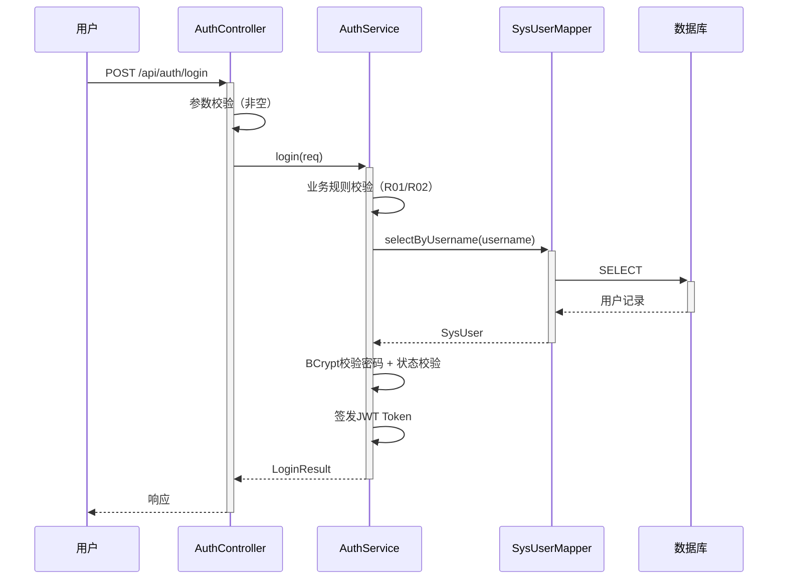

**业务规则：**
| 规则编号 | 规则描述 | 校验时机 | 不满足时的处理 |
|----------|----------|----------|--------------|
| R01 | 用户名不能为空 | 登录时 | 返回 AUTH_001 |
| R02 | 密码不能为空 | 登录时 | 返回 AUTH_001 |
| R03 | 用户必须存在 | 登录时 | 返回 AUTH_001，提示"用户名或密码错误" |
| R04 | 密码BCrypt校验通过 | 登录时 | 返回 AUTH_001 |
| R05 | 账号状态为ACTIVE | 登录时 | 返回 AUTH_002，提示"账号已冻结" |

**异常场景：**
| 异常场景 | 处理方式 |
|----------|----------|
| 数据库查询超时 | 返回系统异常，提示"登录服务繁忙" |

**并发控制（如涉及数据写入）：**
- 并发场景：无并发风险，登录为只读操作
- 控制策略：无并发风险，原因：登录不涉及写操作

##### 5.1.3.2 角色权限控制（F02）

**业务规则：**
| 规则编号 | 规则描述 | 校验时机 | 不满足时的处理 |
|----------|----------|----------|--------------|
| R01 | 所有 /api/admin/** 接口需校验登录态 | 始终（拦截器） | 返回 AUTH_003，提示"未登录" |
| R02 | /api/admin/** 接口需 ADMIN 角色 | 始终（拦截器） | 返回 AUTH_004，提示"无权限" |
| R03 | 读者端接口需校验登录态 | 始终（拦截器） | 返回 AUTH_003 |
| R04 | 读者只能操作自己的借阅记录 | 借阅记录查询时 | 返回 AUTH_005，提示"无权操作他人记录" |

**异常场景：**
| 异常场景 | 处理方式 |
|----------|----------|
| Token过期或无效 | 拦截器返回 AUTH_003，前端跳转登录页 |

**并发控制：** 无并发风险，鉴权为只读校验。

### 5.2 图书管理模块

#### 5.2.1 表结构设计

##### 5.2.1.1 book（图书信息表）

| 字段名 | 数据类型 | 约束 | 默认值 | 说明 |
|--------|----------|------|--------|------|
| id | bigint | PK, 自增 | - | 系统自增主键 |
| title | varchar(128) | NOT NULL | - | 书名 |
| author | varchar(64) | NOT NULL | - | 作者 |
| isbn | varchar(20) | NOT NULL | - | ISBN编号 |
| category_id | bigint | NOT NULL | - | 分类ID |
| stock | int | NOT NULL | 0 | 当前库存数量 |
| is_deleted | tinyint | NOT NULL | 0 | 逻辑删除：0-未删除，1-已删除 |
| gmt_create | datetime | NOT NULL | CURRENT_TIMESTAMP | 创建时间 |
| gmt_modified | datetime | NOT NULL | CURRENT_TIMESTAMP | 修改时间 |

**索引：**
- UK: `uk_book_isbn` (isbn)
- IDX: `idx_book_category` (category_id)
- IDX: `idx_book_title` (title)

##### 5.2.1.2 book_category（图书分类表）

| 字段名 | 数据类型 | 约束 | 默认值 | 说明 |
|--------|----------|------|--------|------|
| id | bigint | PK, 自增 | - | 系统自增主键 |
| name | varchar(64) | NOT NULL | - | 分类名称 |
| gmt_create | datetime | NOT NULL | CURRENT_TIMESTAMP | 创建时间 |
| gmt_modified | datetime | NOT NULL | CURRENT_TIMESTAMP | 修改时间 |

**索引：**
- UK: `uk_book_category_name` (name)

##### 5.2.1.x 枚举与常量定义

| 枚举名称 | 取值 | 含义 | 关联字段 |
|----------|------|------|----------|
| BookDeleted | 0 | 未删除 | book.is_deleted |
| BookDeleted | 1 | 已删除 | book.is_deleted |
| BORROW_PERIOD_DAYS | 30 | 借阅期限默认天数 | 常量 |

#### 5.2.2 接口详细设计

##### W04 新增图书

- **URI**: POST /api/admin/books
- **描述**: 管理员新增图书信息
- **入参**:

| 参数名称 | 类型 | 是否必填 | 描述 |
|----------|------|----------|------|
| title | String | 是 | 书名 |
| author | String | 是 | 作者 |
| isbn | String | 是 | ISBN |
| categoryId | Long | 是 | 分类ID |
| stock | Integer | 是 | 初始库存 |

- **出参**:

| 参数名称 | 类型 | 描述 |
|----------|------|------|
| code | String | 结果code |
| msg | String | 提示信息 |
| data.id | Long | 新建图书ID |

- **错误码**:

| 错误码 | 说明 |
|--------|------|
| BOOK_001 | ISBN已存在 |
| BOOK_002 | 分类不存在 |
| BOOK_003 | 库存不能为负数 |

- **业务规则**: ISBN唯一校验；分类存在性校验；库存>=0。

- **请求示例**:
```json
{
  "title": "深入理解Java虚拟机",
  "author": "周志明",
  "isbn": "9787111267608",
  "categoryId": 1,
  "stock": 10
}
```

- **响应示例**:
```json
{
  "code": "OK",
  "msg": "SUCCESS",
  "data": {
    "id": 1001
  }
}
```

##### W14 搜索浏览图书（读者端）

- **URI**: GET /api/books/search
- **描述**: 读者搜索浏览图书，支持按书名/作者/分类筛选
- **入参**:

| 参数名称 | 类型 | 是否必填 | 描述 |
|----------|------|----------|------|
| keyword | String | 否 | 搜索关键词（匹配书名/作者） |
| categoryId | Long | 否 | 分类ID |
| pageNum | Integer | 否 | 页码，默认1 |
| pageSize | Integer | 否 | 每页条数，默认10 |

- **出参**:

| 参数名称 | 类型 | 描述 |
|----------|------|------|
| code | String | 结果code |
| msg | String | 提示信息 |
| data.total | Long | 总记录数 |
| data.list | List | 图书列表 |

- **错误码**:

| 错误码 | 说明 |
|--------|------|
| BOOK_004 | 分页参数非法 |

- **业务规则**: 仅查询未逻辑删除的图书；keyword 模糊匹配 title 或 author。

#### 5.2.3 子功能详细设计

##### 5.2.3.1 新增图书（F03）

- 处理时序图
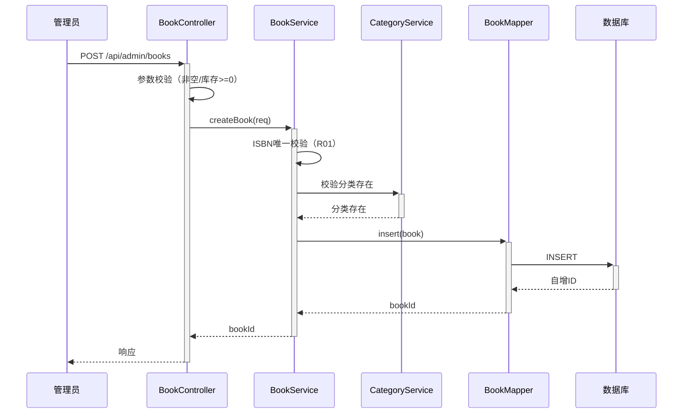

**业务规则：**
| 规则编号 | 规则描述 | 校验时机 | 不满足时的处理 |
|----------|----------|----------|--------------|
| R01 | ISBN全局唯一 | 创建时 | 返回 BOOK_001，提示"ISBN已存在" |
| R02 | 分类必须存在 | 创建时 | 返回 BOOK_002，提示"分类不存在" |
| R03 | 初始库存>=0 | 创建时 | 返回 BOOK_003 |
| R04 | 书名/作者/ISBN非空 | 创建时 | 返回参数校验错误 |

**异常场景：**
| 异常场景 | 处理方式 |
|----------|----------|
| 数据库唯一键冲突（并发新增同ISBN） | 捕获异常，返回 BOOK_001 |

**并发控制（如涉及数据写入）：**
- 并发场景：多管理员同时新增相同ISBN图书
- 控制策略：数据库唯一索引 uk_book_isbn 兜底 + Service层先查后插；并发时依赖唯一索引报错捕获

##### 5.2.3.2 库存维护（F05/F12/F13支撑）

**业务规则：**
| 规则编号 | 规则描述 | 校验时机 | 不满足时的处理 |
|----------|----------|----------|--------------|
| R01 | 扣减库存后 stock >= 0 | 借阅时 | 返回 BORROW_002，提示"库存不足" |
| R02 | 恢复库存后 stock 不超过原始上限 | 归还时 | 记录异常日志，以实际为准 |

**并发控制（如涉及数据写入）：**
- 并发场景：多读者同时借阅同一本图书导致超卖
- 控制策略：乐观锁 + version 字段 / UPDATE book SET stock = stock - 1 WHERE id = ? AND stock > 0 行级锁兜底防超卖

### 5.3 读者管理模块

#### 5.3.1 表结构设计

##### 5.3.1.1 reader（读者信息表）

| 字段名 | 数据类型 | 约束 | 默认值 | 说明 |
|--------|----------|------|--------|------|
| id | bigint | PK, 自增 | - | 系统自增主键 |
| user_id | bigint | NOT NULL | - | 关联sys_user.id |
| reader_no | varchar(32) | NOT NULL | - | 读者编号/学号 |
| phone | varchar(20) | NOT NULL | - | 联系电话 |
| name | varchar(64) | NOT NULL | - | 读者姓名 |
| is_deleted | tinyint | NOT NULL | 0 | 逻辑删除：0-未删除，1-已删除 |
| gmt_create | datetime | NOT NULL | CURRENT_TIMESTAMP | 创建时间 |
| gmt_modified | datetime | NOT NULL | CURRENT_TIMESTAMP | 修改时间 |

**索引：**
- UK: `uk_reader_user_id` (user_id)
- UK: `uk_reader_no` (reader_no)
- IDX: `idx_reader_name` (name)

##### 5.3.1.x 枚举与常量定义

| 枚举名称 | 取值 | 含义 | 关联字段 |
|----------|------|------|----------|
| ReaderDeleted | 0 | 未删除 | reader.is_deleted |
| ReaderDeleted | 1 | 已删除 | reader.is_deleted |
| MAX_BORROW_COUNT | 5 | 单读者最大在借数量 | 常量 |

#### 5.3.2 接口详细设计

##### W10 新增读者

- **URI**: POST /api/admin/readers
- **描述**: 管理员新增读者（同时创建sys_user账号和reader扩展信息）
- **入参**:

| 参数名称 | 类型 | 是否必填 | 描述 |
|----------|------|----------|------|
| username | String | 是 | 登录账号 |
| password | String | 是 | 初始密码 |
| readerNo | String | 是 | 读者编号 |
| name | String | 是 | 姓名 |
| phone | String | 是 | 联系电话 |

- **出参**:

| 参数名称 | 类型 | 描述 |
|----------|------|------|
| code | String | 结果code |
| msg | String | 提示信息 |
| data.id | Long | 新建读者ID |

- **错误码**:

| 错误码 | 说明 |
|--------|------|
| READER_001 | 用户名已存在 |
| READER_002 | 读者编号已存在 |

- **业务规则**: 新增读者需在事务中同时创建 sys_user（role=READER）和 reader 记录；username 和 readerNo 唯一。

- **请求示例**:
```json
{
  "username": "reader001",
  "password": "123456",
  "readerNo": "S2026001",
  "name": "张三",
  "phone": "13800138000"
}
```

- **响应示例**:
```json
{
  "code": "OK",
  "msg": "SUCCESS",
  "data": {
    "id": 2001
  }
}
```

#### 5.3.3 子功能详细设计

##### 5.3.3.1 新增读者（F07）

- 处理时序图
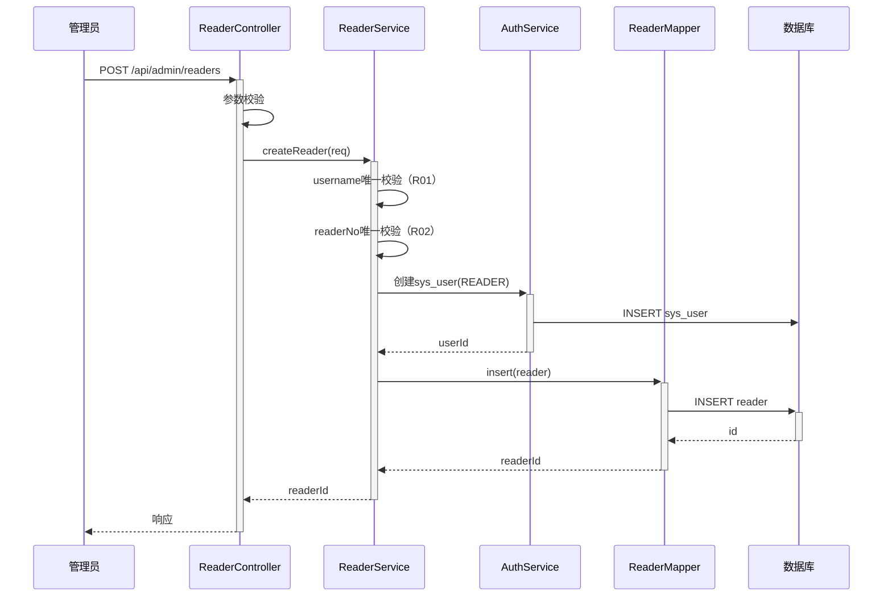

**业务规则：**
| 规则编号 | 规则描述 | 校验时机 | 不满足时的处理 |
|----------|----------|----------|--------------|
| R01 | username 全局唯一 | 创建时 | 返回 READER_001 |
| R02 | readerNo 全局唯一 | 创建时 | 返回 READER_002 |
| R03 | 创建sys_user和reader在同一事务 | 始终 | 失败时整体回滚 |

**异常场景：**
| 异常场景 | 处理方式 |
|----------|----------|
| 事务中途失败 | 回滚sys_user和reader插入，返回系统错误 |

**并发控制（如涉及数据写入）：**
- 并发场景：多管理员同时新增相同username的读者
- 控制策略：数据库唯一索引 uk_sys_user_username + uk_reader_no 兜底；先查后插 + 唯一索引报错捕获

### 5.4 借阅管理模块

#### 5.4.1 表结构设计

##### 5.4.1.1 borrow_record（借阅记录表）

| 字段名 | 数据类型 | 约束 | 默认值 | 说明 |
|--------|----------|------|--------|------|
| id | bigint | PK, 自增 | - | 系统自增主键 |
| book_id | bigint | NOT NULL | - | 关联book.id |
| user_id | bigint | NOT NULL | - | 读者关联sys_user.id |
| borrow_date | datetime | NOT NULL | - | 借阅时间 |
| due_date | datetime | NOT NULL | - | 应还时间（借阅+30天） |
| return_date | datetime | - | NULL | 实际归还时间 |
| status | varchar(16) | NOT NULL | 'BORROWING' | 状态：BORROWING/RETURNED/OVERDUE |
| gmt_create | datetime | NOT NULL | CURRENT_TIMESTAMP | 创建时间 |
| gmt_modified | datetime | NOT NULL | CURRENT_TIMESTAMP | 修改时间 |

**索引：**
- IDX: `idx_borrow_user` (user_id, status)
- IDX: `idx_borrow_book` (book_id)
- IDX: `idx_borrow_due` (due_date, status)

##### 5.4.1.x 枚举与常量定义

| 枚举名称 | 取值 | 含义 | 关联字段 |
|----------|------|------|----------|
| BorrowStatus | BORROWING | 在借中 | borrow_record.status |
| BorrowStatus | RETURNED | 已归还 | borrow_record.status |
| BorrowStatus | OVERDUE | 已逾期 | borrow_record.status |

#### 5.4.2 接口详细设计

##### W15 借阅图书

- **URI**: POST /api/borrow
- **描述**: 读者借阅图书，扣减库存并生成借阅记录
- **入参**:

| 参数名称 | 类型 | 是否必填 | 描述 |
|----------|------|----------|------|
| bookId | Long | 是 | 图书ID |

- **出参**:

| 参数名称 | 类型 | 描述 |
|----------|------|------|
| code | String | 结果code |
| msg | String | 提示信息 |
| data.recordId | Long | 借阅记录ID |
| data.dueDate | String | 应还日期 |

- **错误码**:

| 错误码 | 说明 |
|--------|------|
| BORROW_001 | 图书不存在或已删除 |
| BORROW_002 | 库存不足 |
| BORROW_003 | 读者存在逾期未归还记录 |
| BORROW_004 | 超过最大在借数量（5本） |

- **业务规则**: 校验图书存在→校验库存>0→校验读者无逾期→校验在借数<5→事务扣库存+生成借阅记录（期限30天）。

- **请求示例**:
```json
{
  "bookId": 1001
}
```

- **响应示例**:
```json
{
  "code": "OK",
  "msg": "SUCCESS",
  "data": {
    "recordId": 3001,
    "dueDate": "2026-08-28 10:00:00"
  }
}
```

##### W16 归还图书

- **URI**: POST /api/return
- **描述**: 读者归还图书，恢复库存并检测逾期
- **入参**:

| 参数名称 | 类型 | 是否必填 | 描述 |
|----------|------|----------|------|
| recordId | Long | 是 | 借阅记录ID |

- **出参**:

| 参数名称 | 类型 | 描述 |
|----------|------|------|
| code | String | 结果code |
| msg | String | 提示信息 |
| data.isOverdue | Boolean | 是否逾期 |
| data.overdueDays | Integer | 逾期天数（未逾期为0） |

- **错误码**:

| 错误码 | 说明 |
|--------|------|
| BORROW_005 | 借阅记录不存在 |
| BORROW_006 | 该记录非在借状态 |
| BORROW_007 | 无权操作他人借阅记录 |

- **业务规则**: 校验记录存在→校验归属当前读者→校验状态为BORROWING→事务恢复库存+更新记录状态(RETURNED/OVERDUE)+记录归还时间→计算逾期。

- **请求示例**:
```json
{
  "recordId": 3001
}
```

- **响应示例**:
```json
{
  "code": "OK",
  "msg": "SUCCESS",
  "data": {
    "isOverdue": true,
    "overdueDays": 3
  }
}
```

##### W17 查询我的借阅记录

- **URI**: GET /api/borrow/records
- **描述**: 读者查询自己的借阅记录
- **入参**:

| 参数名称 | 类型 | 是否必填 | 描述 |
|----------|------|----------|------|
| status | String | 否 | 状态筛选：BORROWING/RETURNED/OVERDUE |
| pageNum | Integer | 否 | 页码，默认1 |
| pageSize | Integer | 否 | 每页条数，默认10 |

- **出参**:

| 参数名称 | 类型 | 描述 |
|----------|------|------|
| code | String | 结果code |
| msg | String | 提示信息 |
| data.total | Long | 总记录数 |
| data.list | List | 借阅记录列表 |

- **错误码**: 无特定错误码

- **业务规则**: 仅查询当前登录读者的记录（水平权限校验，不可查询他人）。

#### 5.4.3 子功能详细设计

##### 5.4.3.1 借阅图书（F12）

- 处理时序图
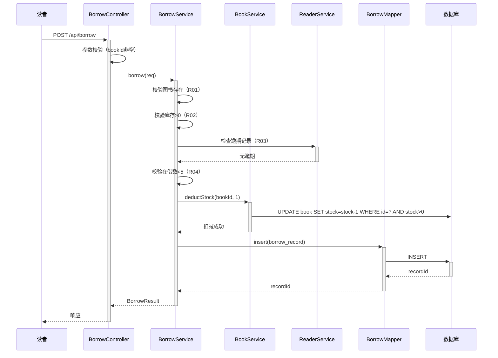

**业务规则：**
| 规则编号 | 规则描述 | 校验时机 | 不满足时的处理 |
|----------|----------|----------|--------------|
| R01 | 图书必须存在且未删除 | 借阅时 | 返回 BORROW_001 |
| R02 | 库存必须>0 | 借阅时 | 返回 BORROW_002，提示"库存不足" |
| R03 | 读者无逾期未归还记录 | 借阅时 | 返回 BORROW_003，提示"存在逾期未归还" |
| R04 | 在借数量<5 | 借阅时 | 返回 BORROW_004 |
| R05 | 扣库存与生成借阅记录在同一事务 | 始终 | 失败时整体回滚 |

**异常场景：**
| 异常场景 | 处理方式 |
|----------|----------|
| 库存扣减失败（并发导致stock=0） | 返回 BORROW_002，事务不生成记录 |
| 事务中途异常 | 回滚库存扣减和记录插入，返回系统错误 |

**并发控制（如涉及数据写入）：**
- 并发场景：多读者同时借阅同一本图书，库存不足导致超卖
- 控制策略：`UPDATE book SET stock = stock - 1 WHERE id = ? AND stock > 0` 行级锁兜底；影响行数=0 时判定库存不足，直接返回 BORROW_002

**状态机设计（借阅记录状态）：**
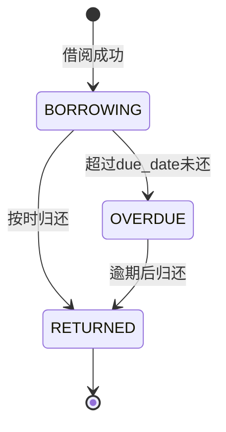

**状态流转规则：**
| 当前状态 | 目标状态 | 流转条件 | 前置校验 | 触发动作 |
|----------|----------|----------|----------|----------|
| - | BORROWING | 借阅成功 | 库存>0/无逾期/在借<5 | 扣减库存+生成记录 |
| BORROWING | RETURNED | 归还且当前时间<=due_date | 记录归属+状态为BORROWING | 恢复库存+更新状态+记录归还时间 |
| BORROWING | OVERDUE | 当前时间>due_date | - | 自动检测（查询时实时计算） |
| OVERDUE | RETURNED | 逾期后归还 | 记录归属+状态为OVERDUE | 恢复库存+更新状态+记录归还时间 |

##### 5.4.3.2 归还图书（F13）

- 处理时序图
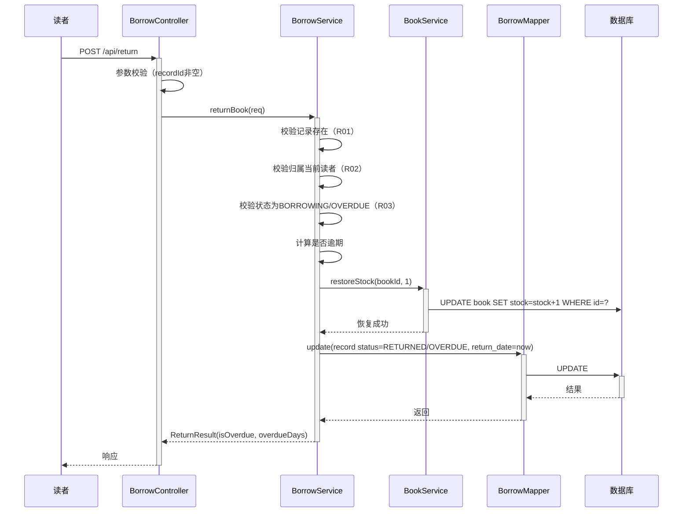

**业务规则：**
| 规则编号 | 规则描述 | 校验时机 | 不满足时的处理 |
|----------|----------|----------|--------------|
| R01 | 借阅记录必须存在 | 归还时 | 返回 BORROW_005 |
| R02 | 记录归属当前登录读者 | 归还时 | 返回 BORROW_007，提示"无权操作他人记录" |
| R03 | 记录状态为BORROWING或OVERDUE | 归还时 | 返回 BORROW_006，提示"该记录非在借状态" |
| R04 | 恢复库存与更新记录状态在同一事务 | 始终 | 失败时整体回滚 |
| R05 | 归还时间>due_date → 标记OVERDUE | 归还时 | 状态置为OVERDUE，返回逾期天数提示 |

**异常场景：**
| 异常场景 | 处理方式 |
|----------|----------|
| 事务中途异常 | 回滚库存恢复和记录更新，返回系统错误 |

**并发控制（如涉及数据写入）：**
- 并发场景：同一借阅记录被重复归还（幂等性）
- 控制策略：先查询记录状态，状态非BORROWING/OVERDUE时拒绝（幂等设计+状态前置校验）；UPDATE ... WHERE id=? AND status IN ('BORROWING','OVERDUE') 条件更新兜底

##### 5.4.3.3 逾期检测（F13支撑）

- 处理时序图
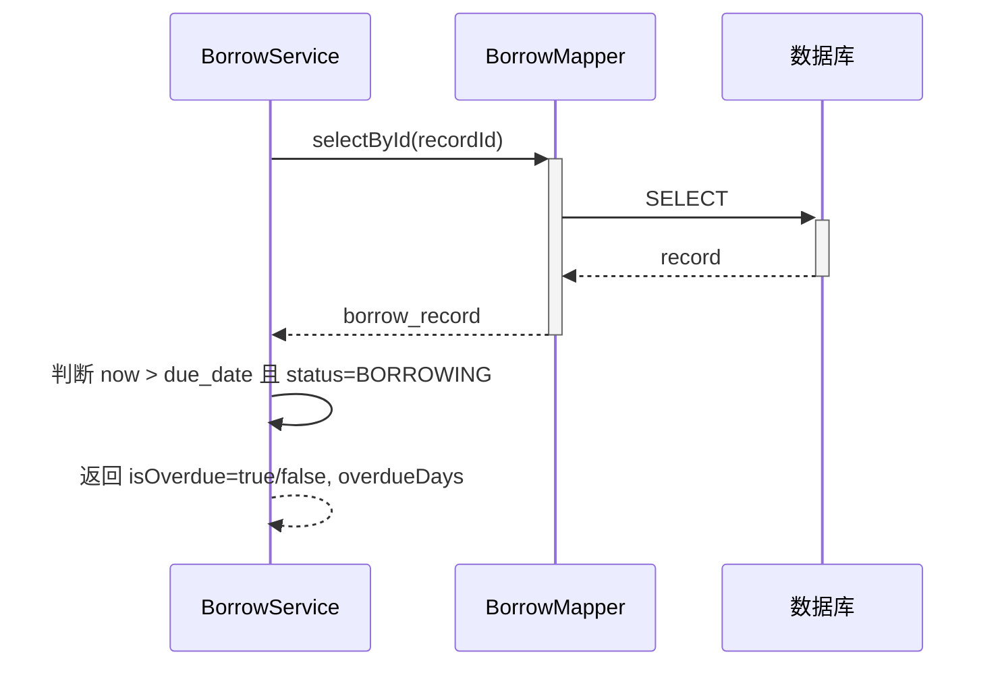

**业务规则：**
| 规则编号 | 规则描述 | 校验时机 | 不满足时的处理 |
|----------|----------|----------|--------------|
| R01 | 逾期=当前时间>due_date且未归还 | 查询/归还时 | 返回逾期标记 |
| R02 | 逾期天数=(now - due_date) 天 | 查询时 | 未逾期返回0 |

**异常场景：**
| 异常场景 | 处理方式 |
|----------|----------|
| 借阅记录不存在 | 返回 BORROW_005 |

**并发控制：** 无并发风险，逾期检测为只读计算。


## 6. 非功能性需求设计

### 6.1 高可用性

- library-backend 部署多实例（≥2副本），通过 Nginx 负载均衡；单实例故障不影响整体服务。
- Redis 缓存登录态，Redis 宕机时降级为数据库校验 Token（牺牲部分性能但保证可用性）。
- MySQL 主从架构，主库故障可切换从库（需运维预案）。
- 无外部第三方系统集成依赖，无三方服务不可用导致的降级场景。

### 6.2 可扩展性

- 水平扩缩容：library-backend 无状态（登录态存 Redis），支持横向扩容。
- 垂直扩容：可通过提升单实例 CPU/内存应对突发流量。
- 架构可扩展性：模块化设计（用户/图书/读者/借阅），后续新增模块（如统计报表）不影响现有模块。

### 6.3 稳定性/可靠性

- 借阅/归还操作使用数据库事务保证库存与借阅记录的一致性。
- 库存扣减使用 `WHERE stock > 0` 行级锁防超卖，边界场景（库存=0并发借阅）可靠返回失败。
- 逾期检测采用实时计算（now vs due_date），不依赖定时任务异步更新，保证查询时数据准确。
- 逻辑删除保证数据可追溯，物理删除禁用。

### 6.4 安全性设计

#### 6.4.1 账户系统方案

- 自实现登录认证：sys_user 表 + BCrypt 密码加密 + JWT Token 签发。
- 首次实现登录/认证功能，需安全评审确认密码策略、Token 签名密钥管理。

#### 6.4.2 授权&访问控制

##### 6.4.2.1 是否实现水平权限检查

- 是。读者查询借阅记录时，通过当前登录用户ID过滤，拦截器/Service层校验 record.user_id == 当前用户ID，不匹配返回 AUTH_005。
- 借阅记录查询仅返回当前用户的记录，不可查询他人。

##### 6.4.2.2 是否实现垂直权限检查

- 是。/api/admin/** 接口通过全局拦截器校验 role=ADMIN；读者角色调用管理接口返回 AUTH_004 无权限。
- 读者端接口（/api/books/search、/api/borrow、/api/return、/api/borrow/records）仅需登录态，无管理员特权操作。

##### 6.4.2.3 是否检查登录态

- 是。除 /api/auth/login 外所有接口通过全局拦截器校验 JWT Token 有效性。
- Token 无效/过期返回 AUTH_003，前端跳转登录页。

#### 6.4.3 数据防护方案

##### 6.4.3.1 是否对敏感数据加密存储

- 是。sys_user.password 使用 BCrypt 加密存储，不存储明文。
- JWT 签名密钥通过配置管理，不硬编码于源码。

##### 6.4.3.2 是否对敏感数据展示进行脱敏

- 是。读者手机号在列表展示时脱敏（如 138****8000）。
- 日志中不打印用户密码明文。

### 6.5 监控/统计/日志/告警

- 关键监控点：借阅/归还接口 QPS、成功率、平均耗时。
- 库存扣减失败率监控（BORROW_002 触发率），异常时告警排查库存数据。
- 登录失败率监控（AUTH_001 连续失败），异常时告警防暴力破解。
- 接口异常日志记录（非预期异常堆栈），便于排查。


## 7. 变更三板斧

### 7.1 可监控

- 借阅/归还核心接口埋点：调用次数、处理结果（成功/失败码）、处理耗时。
- 库存变更埋点：book_id + 变更前后库存，便于追踪库存异常。
- 登录埋点：登录成功/失败次数、账号冻结事件。

### 7.2 可灰度

- 本期为全新系统首次上线，无灰度切流需求（无旧逻辑）。
- 后续增量变更可按读者ID尾号灰度引流（如借阅期限调整可灰度验证）。

### 7.3 可应急

- 借阅期限配置（BORROW_PERIOD_DAYS）通过配置中心/配置文件管理，可动态调整无需发版。
- 逾期检测为实时计算，无异步任务数据需要修正，回滚无依赖关系。
- 如发生库存数据不一致，可通过 borrow_record 全量对账修复 book.stock。
- 应急回滚时关注：回滚不影响已有借阅记录（数据不可删），仅回滚代码逻辑。


## 8. 方案检查 Checklist

| 序号 | 检查项 | 结果 | 说明 |
|------|--------|------|------|
| 1 | 模块划分合理性检查（单一职责） | 通过 | 4模块各司其职，借阅依赖图书/读者，无循环依赖 |
| 2 | 接口路径规范性检查 | 通过 | oneapi 统一 /api 前缀，管理端 /api/admin，读者端 /api，RESTful 动词 |
| 3 | 数据库表命名规范检查 | 通过 | 表名小写下划线，同模块前缀一致（book_/reader_/borrow_/sys_） |
| 4 | 主键设计检查 | 通过 | 所有表 bigint 自增单列主键 |
| 5 | 索引设计检查 | 通过 | 唯一索引 uk_ 前缀，普通索引 idx_ 前缀，联合索引筛选性列在前 |
| 6 | 字段类型规范检查 | 通过 | 禁用 timestamp（用 datetime）、禁用 float/double（无金额字段）、禁用 enum（用 varchar） |
| 7 | 逻辑删除检查 | 通过 | book/reader 表含 is_deleted 字段，禁止物理删除 |
| 8 | 通用出参结构检查 | 通过 | 统一 {code, msg, data} |
| 9 | 错误码规范检查 | 通过 | {MODULE}_{SEQ} 格式，模块前缀映射表已定义 |
| 10 | 事务一致性检查 | 通过 | 借阅/归还/新增读者均事务保证，失败回滚 |
| 11 | 并发控制检查 | 通过 | 库存扣减 WHERE stock>0 行级锁防超卖，重复归还状态前置校验幂等 |
| 12 | 水平权限检查 | 通过 | 借阅记录按当前用户ID过滤，不可查他人 |
| 13 | 垂直权限检查 | 通过 | /api/admin/** 拦截器校验 ADMIN 角色 |
| 14 | 登录态检查 | 通过 | 全局拦截器校验 JWT，白名单仅 /api/auth/login |
| 15 | 敏感数据加密检查 | 通过 | 密码 BCrypt 加密，Token 密钥配置管理 |
| 16 | 状态机完整性检查 | 通过 | borrow_record 状态机覆盖 BORROWING→RETURNED/OVERDUE→RETURNED |
| 17 | 需求覆盖检查 | 通过 | F01-F16 全部对应接口与子功能，无遗漏 |
| 18 | 非功能需求检查 | 通过 | 高可用/扩展性/稳定性/安全/监控已覆盖 |
| 19 | 变更三板斧检查 | 通过 | 可监控/可灰度/可应急已设计 |
