> **文档元信息**
>
> | 项目 | 内容 |
> |------|------|
> | 文档版本 | v1.0 |
> | 作者 | DTCoder（系分生成） |
> | 创建日期 | 2026-07-30 |
> | 系统名称 | 图书管理系统 |
> | 设计模式 | 全量模式（新建系统，无历史基线） |

---

## 1. 背景与目标

### 1.1 背景

图书馆/图书借阅机构在日常运营中面临图书信息分散、借还流程手工记录、库存与逾期状态难以实时跟踪等问题。需建设一套线上化图书管理系统，将图书档案、读者档案、借阅归还流程统一纳管，提升运营效率与数据准确性。

### 1.2 目标

- 建立完整的图书档案与读者档案数字化管理能力。
- 实现借阅、归还核心业务的自动化流转，借阅自动扣减库存并设定借阅期限（默认 30 天），归还自动恢复库存。
- 提供逾期识别与提示能力。
- 区分管理员与读者两种角色，管理员负责图书与读者信息维护，读者可检索浏览图书并查看自身借阅记录。

### 1.3 核心功能

- 图书信息管理（管理员）：图书的增删改查，含书名、作者、ISBN、分类、库存等。
- 读者信息管理（管理员）：读者档案维护。
- 借阅（读者/管理员代操作）：扣减库存、记录借阅期限。
- 归还（读者/管理员代操作）：恢复库存、判定逾期并提示。
- 图书检索与浏览（读者）：按条件搜索图书、查看详情。
- 借阅记录查询（读者）：查看本人历史与在借记录。

### 1.4 约束与非功能要求

| 类别 | 要求 |
|------|------|
| 角色模型 | 管理员、读者两类角色，权限隔离 |
| 借阅期限 | 默认 30 天，可按规则覆盖 |
| 库存一致性 | 借还并发场景下库存不可超扣、不可负数 |
| 可用性 | 后端核心服务无单点，支持同城双机房 |
| 性能 | 图书检索 P95 < 500ms（10 万册数据量级） |
| 安全 | 敏感信息（读者手机号等）接口脱敏；读者仅可访问自身数据 |
| 兼容 | 对外接口 RESTful，字段新增向后兼容 |
| 数据保留 | 借阅记录长期保留，不做物理删除 |

### 1.5 排除范围

- 不含图书采购、入库验收、盘点等资产管理流程。
- 不含读者付费、押金、罚款收缴及对账能力（逾期仅做提示，不做金额计算）。
- 不含图书全文检索、电子书在线阅读。
- 不含与外部图书馆系统的联合目录互通。
- 不含短信/邮件通道自建（如需通知复用既有通道）。

### 1.6 需求功能清单与优先级

| 编号 | 功能点 | 优先级 | 原始描述追溯 |
|------|--------|--------|--------------|
| F01 | 管理员新增图书 | P0 | 管理员负责图书信息的增删改查（书名、作者、ISBN、分类、库存等） |
| F02 | 管理员删除图书 | P0 | 同上 |
| F03 | 管理员修改图书 | P0 | 同上 |
| F04 | 管理员查询图书列表/详情 | P0 | 同上 |
| F05 | 管理员新增读者 | P0 | 管理员负责读者信息管理 |
| F06 | 管理员修改读者 | P0 | 同上 |
| F07 | 管理员查询读者 | P0 | 同上 |
| F08 | 读者搜索浏览图书 | P0 | 读者可以搜索、浏览图书 |
| F09 | 读者查看图书详情 | P0 | 浏览图书 |
| F10 | 借阅图书 | P0 | 核心功能是借阅，借阅时扣减库存并记录借阅期限（默认 30 天） |
| F11 | 归还图书 | P0 | 归还时恢复库存，逾期给出提示 |
| F12 | 逾期提示 | P0 | 逾期给出提示 |
| F13 | 读者查看借阅记录 | P0 | 读者可以查看自己的借阅记录 |
| F14 | 管理员停用读者 | P1 | 读者信息管理（停用后不可借阅，为合理补全） |
| F15 | 图书上下架 | P1 | 图书信息管理（下架图书不可被借阅，为合理补全） |

### 1.7 假设与待确认项

| 编号 | 假设/待确认项 | 处理方式 |
|------|--------------|----------|
| A01 | 假设：每位读者同时在借上限为 5 册，避免无限借阅 | 设计假设（推荐默认值），可配置化 |
| A02 | 假设：逾期仅做状态提示，不产生罚款 | 需求明确"逾期给出提示"，金额逻辑排除范围 |
| A03 | 假设：归还时若已逾期，仍允许归还并恢复库存，仅提示逾期天数 | 取最合理解释，保留业务闭环 |
| A04 | 待确认：是否需要通知通道推送逾期提醒 | 默认仅在读者查询/归还时提示；通知通道列为后续增强，不影响本期核心 |
| A05 | 假设：ISBN 唯一，作为图书业务唯一标识之一 | 设计假设 |
| A06 | 假设：同一 ISBN 的图书以单条图书记录表示，库存为可借数量 | 简化模型，不做多副本独立编码管理 |
| A07 | 假设：管理员可为读者代办借还操作 | 取最合理解释，保障线下场景 |

---

## 2. 架构与模块划分

### 2.1 功能架构图

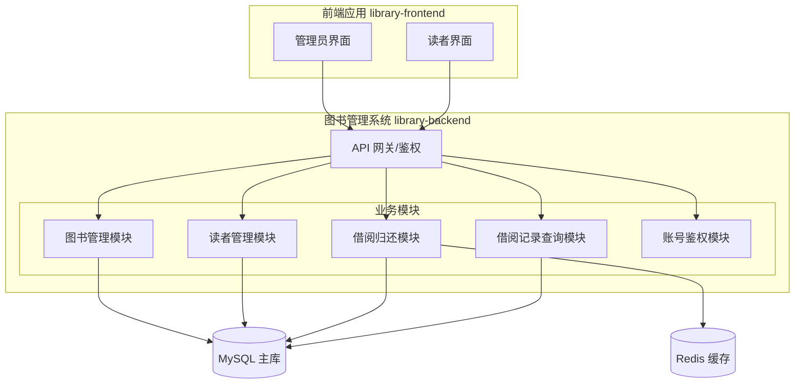

### 2.2 模块清单表

| 模块 | 职责 | 主要功能点 |
|------|------|-----------|
| 账号鉴权模块 | 登录、角色识别、权限校验 | 管理员/读者登录、接口鉴权 |
| 图书管理模块 | 图书档案 CRUD、上下架 | F01-F04、F15 |
| 读者管理模块 | 读者档案维护、停用 | F05-F07、F14 |
| 借阅归还模块 | 借阅、归还、库存扣减/恢复、逾期判定 | F10-F12 |
| 借阅记录查询模块 | 在借/历史记录查询 | F13 |

模块依赖拓扑（单向，无循环）：

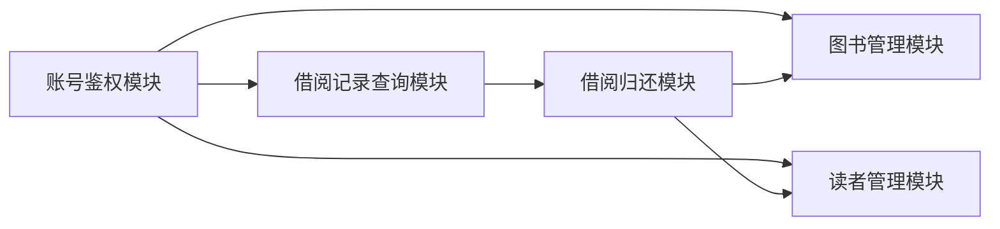

### 2.3 集成架构图与说明

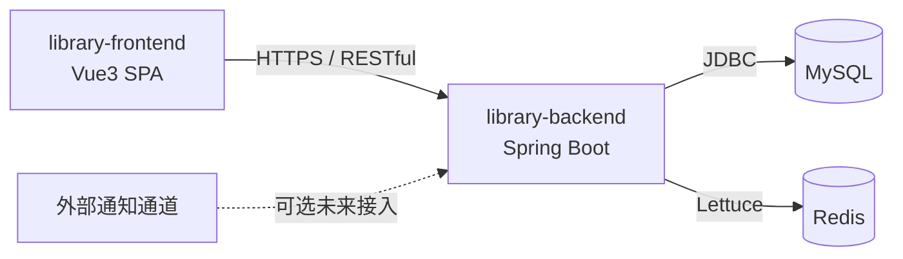

| 集成点 | 对端系统 | 协议 | 接口类型 | 说明 |
|--------|---------|------|---------|------|
| 前后端 | library-frontend | HTTPS | OpenAPI（RESTful JSON） | 前端调用后端 OpenAPI |
| 数据存储 | MySQL | JDBC | 内部 | 业务持久化 |
| 缓存 | Redis | RESP/Lettuce | 内部 | 热点图书缓存、防超借 |
| 通知通道 | 外部通知服务（可选） | HTTP | 集成接口 | 未来逾期推送，本期不强制 |

### 2.4 部署架构图与说明

```mermaid
flowchart TB
    subgraph DC1[机房A]
        LB1[负载均衡]
        BE1[library-backend 实例1]
        MySQLM[(MySQL 主)]
    end
    subgraph DC2[机房B]
        LB2[负载均衡]
        BE2[library-backend 实例2]
        MySQLS[(MySQL 从]
    end
    LB1 --> BE1
    LB2 --> BE2
    BE1 --> MySQLM
    BE2 --> MySQLS
    MySQLM -. 同步 .-> MySQLS
    FE[library-frontend 静态资源] --> CDN
```

部署说明：
- 后端采用容器化部署，同城双机房多实例，前置负载均衡，无单点。
- MySQL 采用主从架构，主机房写、从机房读，借还写操作走主库保证一致性。
- Redis 采用主从/哨兵模式，保障缓存可用。
- 前端为静态资源，经 CDN 分发。
- 假设：本部署形态为公有云同城双机房云原生方案；如私有化则容器化部署，单机房多实例。

---

## 3. 数据模型与存储

### 3.1 实体清单表

| 实体 | 说明 | 所属模块 | 关系 |
|------|------|---------|------|
| 图书（Book） | 图书档案，含书名、作者、ISBN、分类、库存 | 图书管理模块 | 一对多 借阅记录 |
| 读者（Reader） | 读者档案，含姓名、联系方式、状态 | 读者管理模块 | 一对多 借阅记录 |
| 借阅记录（BorrowRecord） | 一次借阅行为及归还状态 | 借阅归还模块 | 多对一 图书、多对一 读者 |
| 账号（Account） | 登录账号，关联角色 | 账号鉴权模块 | 一对一 读者（读者账号）/一管理员 |
| 分类字典（Category） | 图书分类字典 | 图书管理模块 | 一对多 图书 |

### 3.2 实体关系图

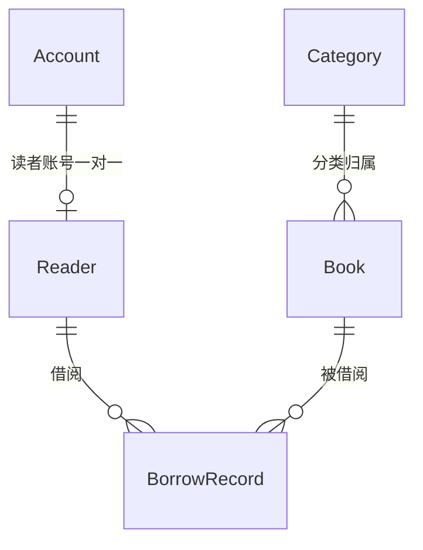

### 3.3 缓存说明

| 缓存 | 用途 | 数据形态 |
|------|------|---------|
| Redis - 图书详情缓存 | 热门图书详情查询加速 | String/Hash，key=`book:detail:{id}` |
| Redis - 借阅库存原子扣减 | 并发借阅防超扣 | 借阅时对图书可用库存做分布式锁/原子计数 |

---

## 4. 接口设计（总体接口列表）

| 编号 | 名称 | 方法 | 路径/签名 | 所属模块 |
|------|------|------|----------|---------|
| API01 | 管理员登录 | POST | /openapi/auth/admin/login | 账号鉴权 |
| API02 | 读者登录 | POST | /openapi/auth/reader/login | 账号鉴权 |
| API03 | 新增图书 | POST | /openapi/admin/books | 图书管理 |
| API04 | 删除图书 | DELETE | /openapi/admin/books/{id} | 图书管理 |
| API05 | 修改图书 | PUT | /openapi/admin/books/{id} | 图书管理 |
| API06 | 分页查询图书（管理） | GET | /openapi/admin/books | 图书管理 |
| API07 | 图书详情（管理） | GET | /openapi/admin/books/{id} | 图书管理 |
| API08 | 图书上下架 | PUT | /openapi/admin/books/{id}/status | 图书管理 |
| API09 | 新增读者 | POST | /openapi/admin/readers | 读者管理 |
| API10 | 修改读者 | PUT | /openapi/admin/readers/{id} | 读者管理 |
| API11 | 分页查询读者 | GET | /openapi/admin/readers | 读者管理 |
| API12 | 读者停用/启用 | PUT | /openapi/admin/readers/{id}/status | 读者管理 |
| API13 | 读者搜索图书 | GET | /openapi/books/search | 借阅/图书检索 |
| API14 | 读者查看图书详情 | GET | /openapi/books/{id} | 借阅/图书检索 |
| API15 | 借阅图书 | POST | /openapi/borrows | 借阅归还 |
| API16 | 归还图书 | POST | /openapi/borrows/{id}/return | 借阅归还 |
| API17 | 查询本人借阅记录 | GET | /openapi/borrow-records/mine | 借阅记录查询 |
| API18 | 查询本人当前在借 | GET | /openapi/borrow-records/mine/active | 借阅记录查询 |

> 对外接口形式不确定时默认 OpenAPI（RESTful），统一 `/openapi` 前缀。内部 Service 间接口见各模块详细设计。

---

## 5. 功能模块设计

### 5.0 全局约定

| 约定项 | 规则 |
|--------|------|
| 错误码格式 | `{MODULE}_{SEQ}`，MODULE 大写，如 `BOOK_001` |
| 通用出参结构 | `{ "code": "0"或错误码, "msg": "描述", "data": {} }`，code=0 表示成功 |
| 分页请求 | `pageNum`（页码，从1）、`pageSize`（每页条数，默认10） |
| 分页响应 | `{ "list": [], "total": 0, "pageNum": 1, "pageSize": 10 }` |
| 时间格式 | ISO8601 / `yyyy-MM-dd HH:mm:ss` |
| ID 类型 | 数值型主键，自增 |
| 鉴权 | 除登录外接口需携带 Bearer Token，读者接口校验身份与数据归属 |

模块映射表：

| 模块 | 错误码前缀 | 对应实体 |
|------|-----------|---------|
| 账号鉴权 | AUTH | Account |
| 图书管理 | BOOK | Book, Category |
| 读者管理 | READER | Reader |
| 借阅归还 | BORROW | BorrowRecord |
| 借阅记录 | RECORD | BorrowRecord（查询） |

---

### 5.1 账号鉴权模块

#### 5.1.1 表结构设计：account

| 字段名 | 类型 | 可空 | 默认 | 说明 |
|--------|------|------|------|------|
| id | bigint | 否 | - | 主键，自增 |
| username | varchar(64) | 否 | - | 登录用户名，唯一 |
| password_hash | varchar(128) | 否 | - | 密码哈希（bcrypt），敏感 |
| role | varchar(16) | 否 | - | 角色：ADMIN/READER |
| reader_id | bigint | 是 | NULL | 关联读者ID，READER 角色必填 |
| status | tinyint | 否 | 1 | 状态：1启用 0停用 |
| create_time | datetime | 否 | CURRENT_TIMESTAMP | 创建时间 |
| update_time | datetime | 否 | CURRENT_TIMESTAMP ON UPDATE | 更新时间 |

索引：
- `uk_username` UNIQUE(username)
- `idx_reader_id` (reader_id)

#### 5.1.2 枚举与常量

| 枚举 | 取值 |
|------|------|
| AccountRole | ADMIN（管理员）、READER（读者） |
| AccountStatus | 1（启用）、0（停用） |

#### 5.1.3 接口详细设计

##### API01 管理员登录

- URI：`POST /openapi/auth/admin/login`
- 入参：

| 参数 | 类型 | 必填 | 说明 |
|------|------|------|------|
| username | string | 是 | 用户名 |
| password | string | 是 | 密码（明文传输经 HTTPS，后端哈希校验） |

- 出参：

| 参数 | 类型 | 说明 |
|------|------|------|
| token | string | 访问令牌 |
| role | string | ADMIN |
| expireTime | string | 过期时间 |

- 错误码：`AUTH_001` 用户名或密码错误；`AUTH_002` 账号已停用
- 请求示例：
```json
{"username":"admin01","password":"***"}
```
- 响应示例：
```json
{"code":"0","msg":"success","data":{"token":"xxx","role":"ADMIN","expireTime":"2026-07-31T10:00:00"}}
```

##### API02 读者登录

- URI：`POST /openapi/auth/reader/login`
- 入参/出参同 API01，role=READER，额外返回 readerId。

#### 5.1.4 业务规则

| 规则编号 | 规则 |
|---------|------|
| AUTH-R1 | 登录失败连续 5 次锁定该账号 30 分钟（基于 Redis 计数） |
| AUTH-R2 | Token 默认有效期 2 小时，支持续期 |

#### 5.1.5 异常场景

| 场景 | 处理 |
|------|------|
| 账号停用 | 返回 AUTH_002，拒绝登录 |
| 密码错误 | 返回 AUTH_001，累计失败次数 |

#### 5.1.6 状态机：account.status

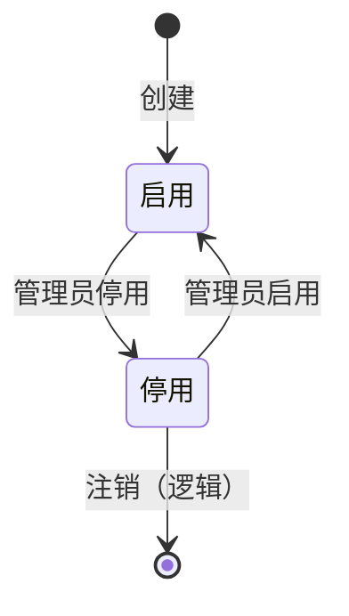

---

### 5.2 图书管理模块

#### 5.2.1 表结构设计：book

| 字段名 | 类型 | 可空 | 默认 | 说明 |
|--------|------|------|------|------|
| id | bigint | 否 | - | 主键，自增 |
| title | varchar(255) | 否 | - | 书名 |
| author | varchar(128) | 否 | - | 作者 |
| isbn | varchar(32) | 否 | - | ISBN，业务唯一 |
| category_id | bigint | 否 | - | 分类ID |
| stock | int | 否 | 0 | 可借库存（可借数量） |
| total_count | int | 否 | 0 | 总册数（含在借） |
| status | tinyint | 否 | 1 | 上下架：1上架 0下架 |
| description | varchar(512) | 是 | NULL | 简介 |
| create_time | datetime | 否 | CURRENT_TIMESTAMP | 创建时间 |
| update_time | datetime | 否 | CURRENT_TIMESTAMP ON UPDATE | 更新时间 |

索引：
- `uk_isbn` UNIQUE(isbn)
- `idx_category_id` (category_id)
- `idx_title_author` (title, author)

> 设计说明：`stock` 为当前可借数量，`total_count` 为总册数。借阅 stock-1，归还 stock+1，二者关系恒满足 `stock = total_count - 在借数量`，作为一致性校验。

#### 5.2.1b 表结构设计：category

| 字段名 | 类型 | 可空 | 默认 | 说明 |
|--------|------|------|------|------|
| id | bigint | 否 | - | 主键，自增 |
| name | varchar(64) | 否 | - | 分类名称，唯一 |
| create_time | datetime | 否 | CURRENT_TIMESTAMP | 创建时间 |

索引：`uk_name` UNIQUE(name)

#### 5.2.2 枚举与常量

| 枚举 | 取值 |
|------|------|
| BookStatus | 1（上架）、0（下架） |

#### 5.2.3 接口详细设计

##### API03 新增图书

- URI：`POST /openapi/admin/books`
- 入参：

| 参数 | 类型 | 必填 | 说明 |
|------|------|------|------|
| title | string | 是 | 书名 |
| author | string | 是 | 作者 |
| isbn | string | 是 | ISBN |
| categoryId | long | 是 | 分类ID |
| totalCount | int | 是 | 总册数，≥0 |
| description | string | 否 | 简介 |

- 出参：

| 参数 | 类型 | 说明 |
|------|------|------|
| id | long | 新图书ID |

- 错误码：`BOOK_001` ISBN 已存在；`BOOK_002` 分类不存在；`BOOK_003` 总册数非法
- 请求示例：
```json
{"title":"深入理解Java","author":"某作者","isbn":"9787111111111","categoryId":1,"totalCount":5}
```
- 响应示例：
```json
{"code":"0","msg":"success","data":{"id":1001}}
```

##### API04 删除图书

- URI：`DELETE /openapi/admin/books/{id}`
- 入参：path 参数 id
- 出参：无 data
- 错误码：`BOOK_004` 图书不存在；`BOOK_005` 存在在借记录，禁止删除
- 规则：存在未归还借阅记录时禁止物理删除，改用下架（status=0）。

##### API05 修改图书

- URI：`PUT /openapi/admin/books/{id}`
- 入参：title/author/isbn/categoryId/description（可选更新）
- 错误码：`BOOK_004` 不存在；`BOOK_001` ISBN 冲突（若改 ISBN）
- 规则：修改 ISBN 需校验全局唯一；库存字段不在此接口修改。

##### API06 分页查询图书（管理）

- URI：`GET /openapi/admin/books`
- 入参：pageNum、pageSize、title(模糊)、author(模糊)、categoryId、status
- 出参：分页 list

##### API07 图书详情（管理）

- URI：`GET /openapi/admin/books/{id}`
- 出参：图书全字段 + 在借数量

##### API08 图书上下架

- URI：`PUT /openapi/admin/books/{id}/status`
- 入参：status（0/1）
- 规则：下架后不可被新借阅；已借出的归还不受影响。

#### 5.2.4 子功能：新增图书时序

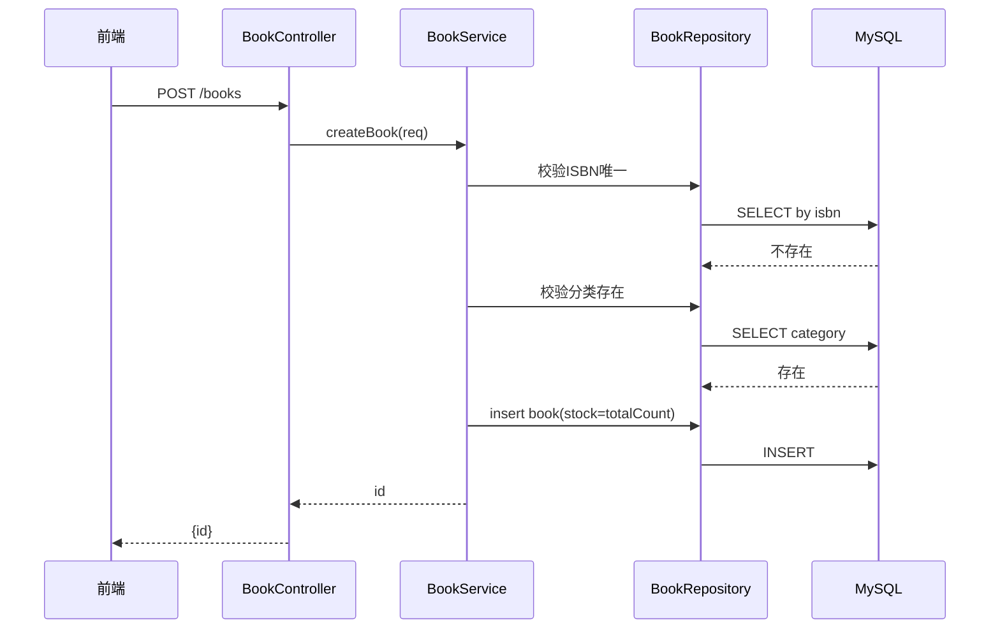

#### 5.2.5 业务规则

| 规则编号 | 规则 |
|---------|------|
| BOOK-R1 | ISBN 全局唯一 |
| BOOK-R2 | 新增时 stock=total_count |
| BOOK-R3 | 删除前校验无在借记录 |
| BOOK-R4 | 下架图书不可借阅 |

#### 5.2.6 异常场景

| 场景 | 处理 |
|------|------|
| ISBN 重复 | 返回 BOOK_001 |
| 删除时存在在借 | 返回 BOOK_005，提示先下架 |

#### 5.2.7 状态机：book.status

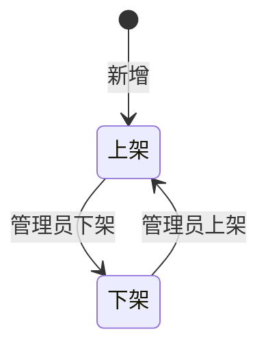

#### 5.2.8 技术选型

| 方案 | 优劣 | 推荐 |
|------|------|------|
| A：单表 + 复合索引 | 简单，10万册级查询足够 | ✅ 推荐 |
| B：引入 ES 做全文检索 | 检索更强，但运维复杂、本期排除范围 | 不采用 |

---

### 5.3 读者管理模块

#### 5.3.1 表结构设计：reader

| 字段名 | 类型 | 可空 | 默认 | 说明 |
|--------|------|------|------|------|
| id | bigint | 否 | - | 主键，自增 |
| name | varchar(64) | 否 | - | 姓名 |
| phone | varchar(20) | 否 | - | 手机号，敏感 |
| status | tinyint | 否 | 1 | 状态：1正常 0停用 |
| create_time | datetime | 否 | CURRENT_TIMESTAMP | 创建时间 |
| update_time | datetime | 否 | CURRENT_TIMESTAMP ON UPDATE | 更新时间 |

索引：`uk_phone` UNIQUE(phone)

#### 5.3.2 枚举与常量

| 枚举 | 取值 |
|------|------|
| ReaderStatus | 1（正常）、0（停用） |

#### 5.3.3 接口详细设计

##### API09 新增读者

- URI：`POST /openapi/admin/readers`
- 入参：name、phone、（可选 username/password 同步建账号）
- 出参：readerId
- 错误码：`READER_001` 手机号已存在

##### API10 修改读者

- URI：`PUT /openapi/admin/readers/{id}`
- 入参：name、phone
- 错误码：`READER_002` 不存在；`READER_001` 手机号冲突

##### API11 分页查询读者

- URI：`GET /openapi/admin/readers`
- 入参：pageNum、pageSize、name(模糊)、phone(精确)
- 出参：分页 list，phone 脱敏显示

##### API12 读者停用/启用

- URI：`PUT /openapi/admin/readers/{id}/status`
- 入参：status
- 规则：停用后禁止新借阅。

#### 5.3.4 业务规则

| 规则 | 说明 |
|------|------|
| READER-R1 | 手机号唯一 |
| READER-R2 | 停用读者不可新借阅 |
| READER-R3 | phone 在列表/详情接口中脱敏（保留前3后4） |

#### 5.3.5 状态机：reader.status

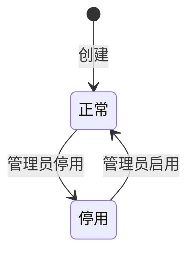

---

### 5.4 借阅归还模块

#### 5.4.1 表结构设计：borrow_record

| 字段名 | 类型 | 可空 | 默认 | 说明 |
|--------|------|------|------|------|
| id | bigint | 否 | - | 主键，自增 |
| book_id | bigint | 否 | - | 图书ID |
| reader_id | bigint | 否 | - | 读者ID |
| borrow_time | datetime | 否 | CURRENT_TIMESTAMP | 借阅时间 |
| due_date | date | 否 | - | 应还日期（borrow_time+30天） |
| return_time | datetime | 是 | NULL | 实际归还时间 |
| status | tinyint | 否 | 1 | 状态：1在借 2已归还 3已逾期归还 |
| overdue_days | int | 是 | NULL | 逾期天数（归还时计算） |
| create_time | datetime | 否 | CURRENT_TIMESTAMP | 创建时间 |
| update_time | datetime | 否 | CURRENT_TIMESTAMP ON UPDATE | 更新时间 |

索引：
- `idx_reader_status` (reader_id, status)
- `idx_book_status` (book_id, status)
- `idx_due_date` (due_date)（用于逾期扫描）

#### 5.4.2 枚举与常量

| 枚举 | 取值 |
|------|------|
| BorrowStatus | 1（在借）、2（已归还）、3（已逾期归还） |
| 借阅期限 | 默认 30 天 |
| 单读者在借上限 | 默认 5 册（可配置） |

#### 5.4.3 接口详细设计

##### API15 借阅图书

- URI：`POST /openapi/borrows`
- 入参：

| 参数 | 类型 | 必填 | 说明 |
|------|------|------|------|
| bookId | long | 是 | 图书ID |
| readerId | long | 是 | 读者ID（读者自助时取 token 中的） |

- 出参：

| 参数 | 类型 | 说明 |
|------|------|------|
| recordId | long | 借阅记录ID |
| dueDate | string | 应还日期 |

- 错误码：`BORROW_001` 图书不存在/已下架；`BORROW_002` 库存不足；`BORROW_003` 读者已停用；`BORROW_004` 超出在借上限
- 请求示例：
```json
{"bookId":1001,"readerId":2001}
```
- 响应示例：
```json
{"code":"0","msg":"success","data":{"recordId":30001,"dueDate":"2026-08-29"}}
```

##### API16 归还图书

- URI：`POST /openapi/borrows/{id}/return`
- 入参：path id
- 出参：

| 参数 | 类型 | 说明 |
|------|------|------|
| overdue | boolean | 是否逾期 |
| overdueDays | int | 逾期天数 |

- 错误码：`BORROW_005` 记录不存在；`BORROW_006` 记录非在借状态
- 响应示例（逾期）：
```json
{"code":"0","msg":"success","data":{"overdue":true,"overdueDays":3}}
```

#### 5.4.4 子功能：借阅时序图

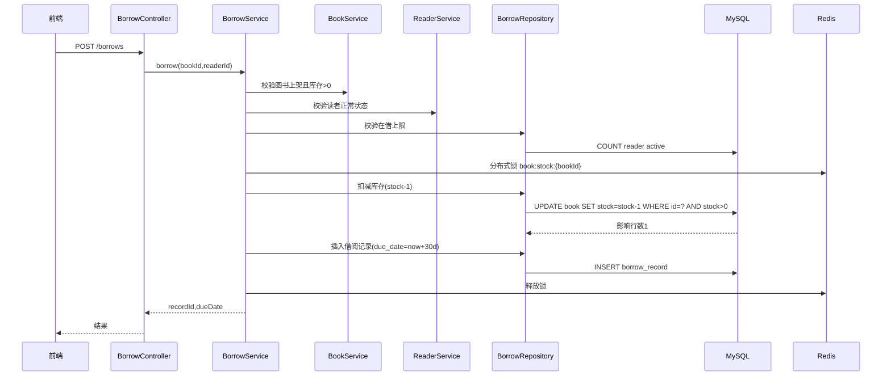

#### 5.4.5 子功能：归还时序图

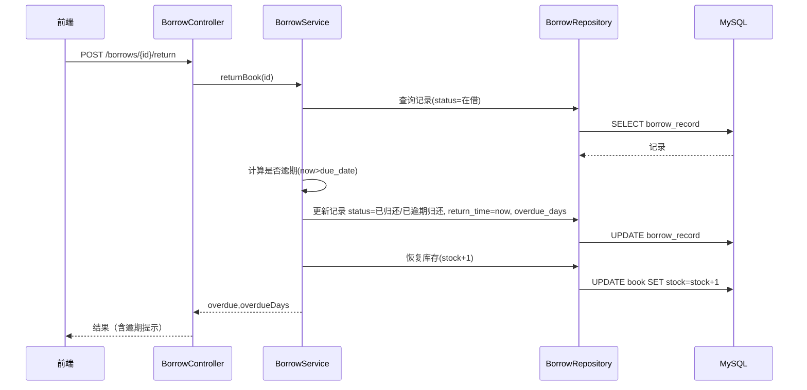

#### 5.4.6 业务规则

| 规则编号 | 规则 |
|---------|------|
| BORROW-R1 | 借阅期限默认 30 天（due_date=borrow_time+30） |
| BORROW-R2 | 借阅时库存原子扣减，`UPDATE ... WHERE stock>0`，影响 0 行则库存不足 |
| BORROW-R3 | 单读者在借上限默认 5 册 |
| BORROW-R4 | 读者停用不可新借阅 |
| BORROW-R5 | 下架图书不可借阅 |
| BORROW-R6 | 归还时若 now>due_date，标记逾期归还，计算 overdue_days，返回提示 |
| BORROW-R7 | 已归还记录不可重复归还 |

#### 5.4.7 异常场景

| 场景 | 处理 |
|------|------|
| 并发借阅致库存为 0 | 库存扣减 SQL 影响行数为 0，返回 BORROW_002 |
| 重复归还 | 返回 BORROW_006 |
| 读者停用仍借阅 | 返回 BORROW_003 |

#### 5.4.8 状态机：borrow_record.status

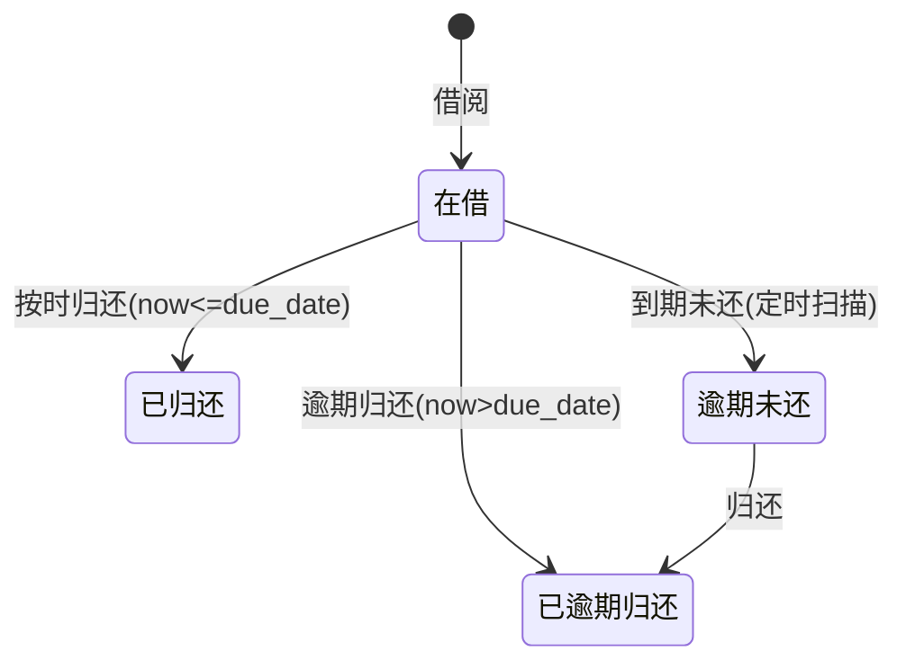

> 注：状态枚举对外输出为 1/2/3，"逾期未还"为定时任务扫描时的在借态延伸标记，存储上仍为 status=1 + due_date<now，通过查询计算，避免冗余状态值。

#### 5.4.9 并发控制

| 方案 | 优劣 | 推荐 |
|------|------|------|
| A：DB 行锁/条件更新 `UPDATE book SET stock=stock-1 WHERE id=? AND stock>0` | 简单可靠，原子性由 DB 保证 | ✅ 推荐（核心手段） |
| B：Redis 分布式锁串行化 | 防超借更彻底，但增加复杂度与故障点 | 作为补充，可选 |
| C：乐观锁版本号 | 需额外 version 字段，冲突重试成本 | 不采用 |

采用 A 为核心，B 作为热点图书可选增强。

---

### 5.5 借阅记录查询模块

#### 5.5.1 接口详细设计

##### API17 查询本人借阅记录

- URI：`GET /openapi/borrow-records/mine`
- 入参：pageNum、pageSize、status（可选：在借/已归还/逾期未还）
- 出参：分页 list（recordId、bookTitle、author、borrowTime、dueDate、returnTime、status、overdueDays）
- 鉴权：仅返回当前登录读者的记录

##### API18 查询本人当前在借

- URI：`GET /openapi/borrow-records/mine/active`
- 出参：在借记录列表（含是否已逾期标识）

#### 5.5.2 业务规则

| 规则 | 说明 |
|------|------|
| RECORD-R1 | 读者仅能查自身记录，按 token 中 readerId 过滤 |
| RECORD-R2 | 列表返回图书冗余信息（书名/作者），避免多次查图书表（可在 SQL join） |

#### 5.5.3 异常场景

| 场景 | 处理 |
|------|------|
| 越权查询他人记录 | 服务层强制按 token readerId 过滤，忽略入参 readerId |

---

### 5.6 跨模块时序图

借阅链路跨图书/读者/借阅模块，见 5.4.4；归还链路见 5.4.5。

---

## 6. 非功能性设计

### 6.1 性能

- 图书检索：建立 `(title,author)`、`category_id` 索引；热门图书详情 Redis 缓存。
- 分页查询强制 limit，避免大结果集。
- 借阅记录按 `reader_id+status`、`due_date` 索引。

### 6.2 可用性

- 后端多实例同城双机房，前置 LB；MySQL 主从；Redis 主从哨兵。
- 依赖降级：Redis 不可用时退化为 DB 条件更新，借阅主流程不阻断（仅缓存失效）。

### 6.3 安全

- 密码 bcrypt 哈希存储，不明文。
- 手机号接口脱敏（前3后4）。
- 读者数据隔离：服务层强制按 token 身份过滤。
- 接口鉴权：除登录外全部需 Token + 角色校验；管理员接口仅 ADMIN 可访问。

### 6.4 可监控

- 关键指标埋点：借阅成功率、归还成功率、库存扣减失败次数、逾期数量。
- 请求链路 traceId 贯穿前端-后端-DB。

### 6.5 定时任务

| 任务 | 频率 | 用途 |
|------|------|------|
| 逾期扫描 | 每日 01:00 | 扫描 due_date<now 且 status=在借 的记录，标记逾期未还状态/触发提示 |

---

## 7. 变更三板斧

### 7.1 可监控

- 关键业务接口（借阅/归还）接入调用监控与成功率告警。
- 库存一致性巡检：定时校验 `stock = total_count - 在借数量`，不一致告警。

### 7.2 可灰度

| 方案 | 优劣 | 推荐 |
|------|------|------|
| A：按读者ID取模灰度 | 粒度细，可按读者比例放量 | ✅ 推荐 |
| B：按机房灰度 | 简单，但读者跨机房体验不一 | 不单独采用 |

### 7.3 可应急

- 借阅/归还故障应急：回滚后端发布版本即可，数据无破坏性变更（库存均为增量更新，可对账修复）。
- 库存不一致应急：以 `total_count - 当前在借数量` 重新计算 stock 修复，脚本幂等。
- 上下游影响小：本期无外部强依赖，回滚不波及其他系统。

---

## 8. 方案检查 Checklist

| 检查项 | 结果 | 说明 |
|--------|------|------|
| 模块划分合理性检查 | 通过 | 5 模块单一职责，依赖单向无循环，无功能点超 50% 的模块 |
| 依赖关系合理性检查 | 通过 | 无外部强依赖；Redis 故障降级不阻断借阅 |
| 单点问题检查（部署层面） | 通过 | 后端多实例+LB，MySQL/Redis 主从，无单点 |
| 表模型设计范式检查 | 通过 | 满足 3NF；borrow_record 冗余书名/作者仅为查询性能（反范式），已说明 |
| 隐私安全检查 | 通过 | password_hash、phone 已标识敏感并脱敏；读者数据隔离 |
| 兼容性检查（接口） | 通过 | 新建系统，接口均为新增，向后兼容 |
| 兼容性检查（表） | 通过 | 新建表，新旧版本均可运行 |
| 数据迁移检查 | 通过 | 新增表初始化数据：需初始化管理员账号、图书分类字典；无变更表迁移 |
| 一致性检查（功能点） | 通过 | F01-F15 均有对应模块设计（F01-F08 图书、F05-F07/F14 读者、F10-F12 借还、F13 记录、F15 上下架、F08/F09 检索） |
| 一致性检查（表） | 通过 | Step3 实体（Book/Reader/BorrowRecord/Account/Category）在 Step5 均有完整表结构 |
| 一致性检查（接口） | 通过 | API01-API18 在 Step5 均有详细定义 |
| 一致性检查（枚举） | 通过 | AccountRole/AccountStatus/BookStatus/ReaderStatus/BorrowStatus 与字段说明一致 |
| 状态机完整性检查 | 通过 | account/book/reader/borrow_record 含状态字段实体均有状态机，无孤岛状态 |
| 并发风险检查 | 通过 | 借阅并发以 DB 条件更新防超扣（方案对比已记录，采用推荐方案） |
| 单点问题检查（定时任务层面） | 通过 | 逾期扫描单实例执行（分布式锁选主），横向扩容以锁竞争保证不重复执行 |
| 非功能性设计可行性检查 | 通过 | Step6 性能/可用/安全/监控/定时设计可落地 |
| 变更三板斧（可监控） | 通过 | 关键接口埋点 + 库存一致性巡检可落地 |
| 变更三板斧（可灰度） | 通过 | 按读者ID取模灰度方案已对比推荐 |
| 变更三板斧（可应急） | 通过 | 回滚+库存幂等修复，无跨系统回滚依赖 |

---

## 9. 附录

### 9.1 错误码汇总

| 错误码 | 含义 |
|--------|------|
| AUTH_001 | 用户名或密码错误 |
| AUTH_002 | 账号已停用 |
| BOOK_001 | ISBN 已存在 |
| BOOK_002 | 分类不存在 |
| BOOK_003 | 总册数非法 |
| BOOK_004 | 图书不存在 |
| BOOK_005 | 存在在借记录，禁止删除 |
| READER_001 | 手机号已存在 |
| READER_002 | 读者不存在 |
| BORROW_001 | 图书不存在/已下架 |
| BORROW_002 | 库存不足 |
| BORROW_003 | 读者已停用 |
| BORROW_004 | 超出在借上限 |
| BORROW_005 | 借阅记录不存在 |
| BORROW_006 | 记录非在借状态 |

### 9.2 核心假设摘要

- 读者同时在借上限默认 5 册（A01，可配置）。
- 逾期仅提示不罚款（A02/A03）。
- ISBN 唯一、单条图书记录表示库存数量（A05/A06）。
- 管理员可代办借还（A07）。
- 通知通道为可选未来增强，本期不强制（A04）。
