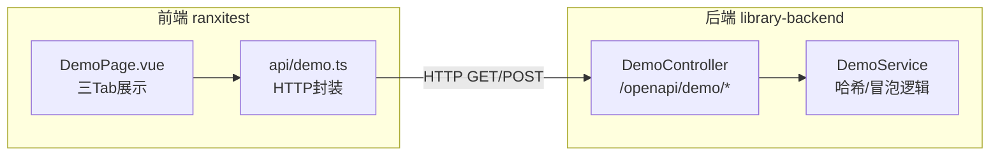
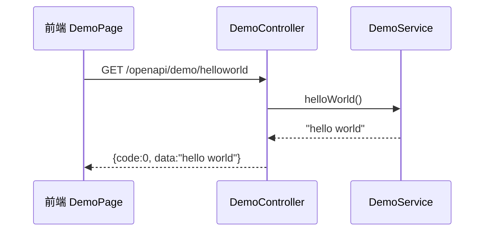
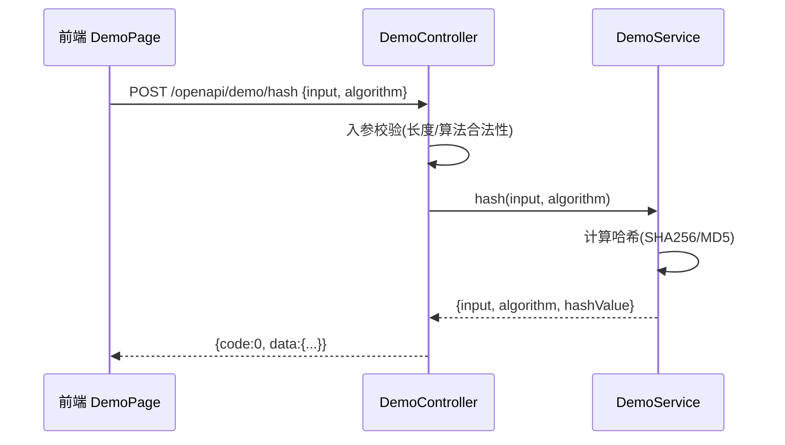
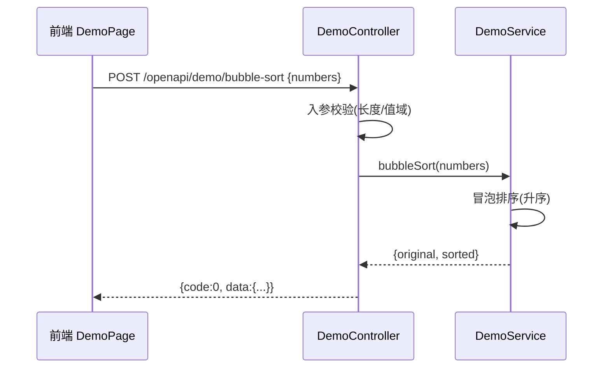
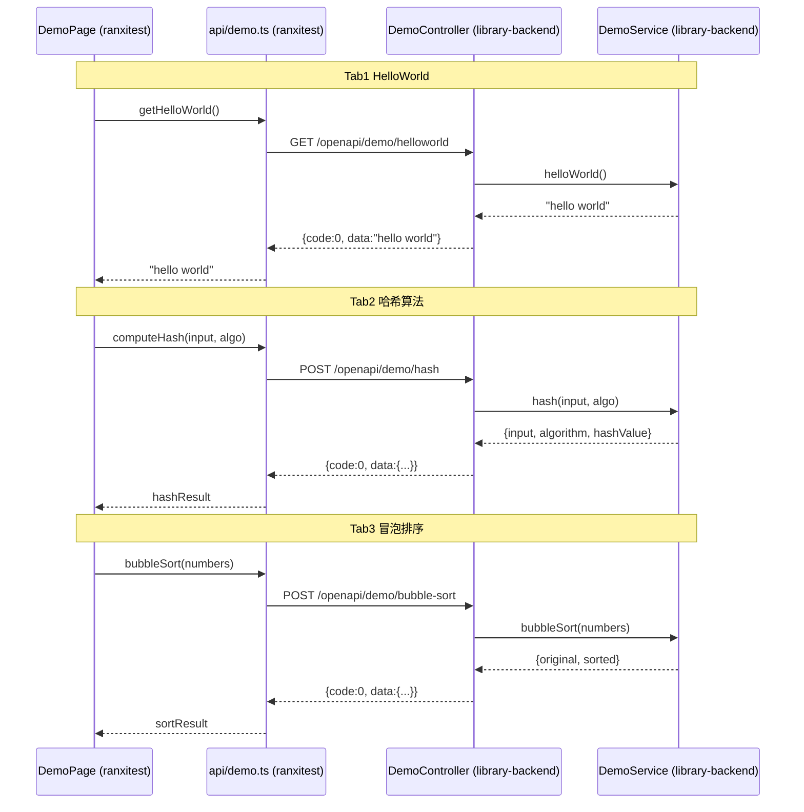

# 系统分析设计文档 — HelloWorld / 哈希算法 / 冒泡排序 重跑

> **文档元信息**
>
> | 项目 | 内容 |
> |------|------|
> | 文档版本 | v1.0 |
> | 作者 | DTCoder（系分技能自动产出） |
> | 创建日期 | 2026-07-31 |
> | 需求来源 | hello world-1.0T2重跑 |
> | 涉及仓库 | library-backend（后端）、ranxitest（前端）、ykstest（预留） |
> | 设计模式 | 全量模式（三仓均为空仓库，无既有架构） |

---

## Step 1: 需求与范围分析

### 1.1 需求提炼

- **做什么**：后端新增三个接口（helloworld、哈希算法、冒泡排序）；前端新增一个页面，通过三个 Tab 分别展示三个接口的执行结果。
- **给谁用**：开发自测 / 演示验证场景。
- **边界在哪**：本次仅涉及接口与展示页面的新增，不涉及持久化存储、用户体系、鉴权。

### 1.2 核心功能列表

| 编号 | 功能点 | 优先级 | 描述 |
|------|--------|--------|------|
| F01 | HelloWorld 接口 | P0 | 后端提供接口，返回 `hello world` 字符串 |
| F02 | 哈希算法接口 | P0 | 后端提供接口，对输入字符串计算哈希值（支持 MD5 / SHA-256，默认 SHA-256） |
| F03 | 冒泡排序接口 | P0 | 后端提供接口，对输入整数数组执行冒泡排序（升序） |
| F04 | 前端演示页面 | P0 | 前端新增页面，含三个 Tab，分别调用上述接口并展示结果 |

### 1.3 非功能要求

| 维度 | 要求 |
|------|------|
| 性能 | 单接口响应 < 200ms（本地计算，无 IO） |
| 可用性 | 接口幂等，无状态 |
| 安全性 | 输入长度限制，防止超大数组/字符串导致 CPU 耗尽 |
| 兼容性 | 接口纯新增，向后兼容 |

### 1.4 排除范围

- 不涉及数据库持久化。
- 不涉及用户登录 / 鉴权 / 权限。
- 不涉及 MQ / 缓存 / 定时任务。
- 不涉及灰度发布（演示性质）。

### 1.5 需求追溯矩阵

| 功能编号 | 原始描述 |
|----------|----------|
| F01 | "写三个接口helloworld" |
| F02 | "哈希算法" |
| F03 | "冒泡排序" |
| F04 | "前端新增一个页面，有三个tab分别展示不同的执行结果" |

### 1.6 待确认项与假设

| 编号 | 待确认项 | 假设（自动决策） | 理由 |
|------|----------|------------------|------|
| A01 | 哈希算法具体算法类型 | 默认 SHA-256，可选 MD5 | SHA-256 安全性更高，MD5 仅作兼容选项 |
| A02 | 冒泡排序方向 | 升序（从小到大） | 通用默认 |
| A03 | 前端技术栈 | Vue 3 + Vite | 数科前端常用栈，轻量 |
| A04 | 后端技术栈 | Java + Spring Boot | library-backend 定位为后端，数科业务标准栈 |
| A05 | 前端仓库归属 | ranxitest | ranxitest 非后端库，作为前端仓库 |
| A06 | 接口前缀 | /openapi（RESTful） | 技能默认对外接口形式 |

---

## Step 2: 架构与模块划分

### 2.1 架构定型

- **单体架构**，分层边界：Controller → Service。
- 无 Repository 层（无持久化）。
- 前后端分离：前端（ranxitest）通过 HTTP 调用后端（library-backend）OpenAPI。

### 2.2 模块划分

| 模块 | 职责 | 所属仓库 | 功能点 |
|------|------|----------|--------|
| demo-controller | 接口暴露、入参校验、统一出参封装 | library-backend | F01, F02, F03 |
| demo-service | 哈希计算、冒泡排序核心逻辑 | library-backend | F02, F03 |
| demo-page | 前端页面、Tab 切换、接口调用展示 | ranxitest | F04 |
| demo-api | 前端 API 封装层 | ranxitest | F04 |

### 2.3 集成架构图



### 2.4 跨仓依赖关系

| 上游 | 下游 | 协议 | 接口类型 |
|------|------|------|----------|
| ranxitest (前端) | library-backend (后端) | HTTP/JSON | OpenAPI（RESTful） |

---

## Step 3: 数据模型与存储

### 3.1 实体清单

本次需求为纯计算/展示类，**无持久化实体**。所有数据在请求-响应周期内完成计算并返回，不落库。

| 实体 | 说明 | 所属模块 | 关系 |
|------|------|----------|------|
| （无） | 无持久化存储需求 | — | — |

### 3.2 实体关系图

```mermaid
erDiagram
    %% 本次设计无持久化实体，erDiagram 为空
    EmptyPlaceholder |||o-- None : "无持久化实体"
```

### 3.3 缓存 / MQ

不涉及。

### 3.4 租户隔离

不涉及（演示性质，无多租户）。

---

## Step 4: 接口设计

### 4.1 接口总览

| 编号 | 名称 | 方法 | 路径 | 所属模块 | 类型 |
|------|------|------|------|----------|------|
| API-01 | HelloWorld | GET | /openapi/demo/helloworld | demo-controller | OpenAPI |
| API-02 | 哈希算法 | POST | /openapi/demo/hash | demo-controller | OpenAPI |
| API-03 | 冒泡排序 | POST | /openapi/demo/bubble-sort | demo-controller | OpenAPI |

---

## Step 5: 功能模块设计

### 5.0 全局约定

| 约定项 | 值 |
|--------|----|
| 错误码格式 | `DEMO_{SEQ}`（如 `DEMO_0001`） |
| 通用出参结构 | `{code: int, msg: string, data: object}` |
| 成功 code | `0` |
| HTTP 成功状态码 | `200` |

#### 模块映射表

| 模块名 | 错误码前缀 | 仓库 |
|--------|------------|------|
| demo | DEMO | library-backend |

### 5.1 模块：demo（后端）

#### 5.1.1 表结构设计

无持久化表结构。

#### 5.1.2 枚举与常量定义

| 枚举/常量 | 取值 | 说明 |
|-----------|------|------|
| HashAlgorithm | `SHA256` | 默认哈希算法 |
| HashAlgorithm | `MD5` | 可选哈希算法 |
| MAX_INPUT_LENGTH | `10000` | 哈希输入最大字符数 |
| MAX_ARRAY_SIZE | `1000` | 冒泡排序数组最大长度 |
| MAX_ELEMENT_VALUE | `1000000` | 数组元素最大绝对值 |

#### 5.1.3 接口详细设计

##### API-01: HelloWorld

| 项 | 内容 |
|----|------|
| URI | `GET /openapi/demo/helloworld` |
| 入参 | 无 |
| 出参 data | `string`（值为 `hello world`） |

请求示例：
```
GET /openapi/demo/helloworld
```

响应示例：
```json
{
  "code": 0,
  "msg": "success",
  "data": "hello world"
}
```

错误码：

| 错误码 | 说明 |
|--------|------|
| DEMO_0001 | 系统内部异常 |

##### API-02: 哈希算法

| 项 | 内容 |
|----|------|
| URI | `POST /openapi/demo/hash` |
| Content-Type | `application/json` |

入参：

| 参数 | 类型 | 必填 | 说明 |
|------|------|------|------|
| input | string | 是 | 待计算哈希的原始字符串，长度 ≤ 10000 |
| algorithm | string | 否 | 哈希算法，`SHA256`（默认）/ `MD5` |

出参 data：

| 参数 | 类型 | 说明 |
|------|------|------|
| input | string | 原始输入 |
| algorithm | string | 实际使用的算法 |
| hashValue | string | 哈希结果（十六进制小写） |

请求示例：
```json
{
  "input": "hello",
  "algorithm": "SHA256"
}
```

响应示例：
```json
{
  "code": 0,
  "msg": "success",
  "data": {
    "input": "hello",
    "algorithm": "SHA256",
    "hashValue": "2cf24dba5fb0a30e26e83b2ac5b9e29e1b161e5c1fa7425e73043362938b9824"
  }
}
```

错误码：

| 错误码 | 说明 |
|--------|------|
| DEMO_0002 | input 为空 |
| DEMO_0003 | input 超过最大长度限制 |
| DEMO_0004 | 不支持的 algorithm 值 |

##### API-03: 冒泡排序

| 项 | 内容 |
|----|------|
| URI | `POST /openapi/demo/bubble-sort` |
| Content-Type | `application/json` |

入参：

| 参数 | 类型 | 必填 | 说明 |
|------|------|------|------|
| numbers | int[] | 是 | 待排序整数数组，长度 ≤ 1000，元素绝对值 ≤ 1000000 |

出参 data：

| 参数 | 类型 | 说明 |
|------|------|------|
| original | int[] | 原始输入数组 |
| sorted | int[] | 排序后数组（升序） |

请求示例：
```json
{
  "numbers": [5, 3, 8, 1, 9, 2]
}
```

响应示例：
```json
{
  "code": 0,
  "msg": "success",
  "data": {
    "original": [5, 3, 8, 1, 9, 2],
    "sorted": [1, 2, 3, 5, 8, 9]
  }
}
```

错误码：

| 错误码 | 说明 |
|--------|------|
| DEMO_0005 | numbers 为空或非数组 |
| DEMO_0006 | 数组长度超过限制 |
| DEMO_0007 | 数组元素超出值域 |

#### 5.1.4 调用时序图

##### HelloWorld 时序



##### 哈希算法时序



##### 冒泡排序时序



#### 5.1.5 业务规则表

| 规则编号 | 规则描述 |
|----------|----------|
| BR-01 | algorithm 参数缺省时默认使用 SHA-256 |
| BR-02 | algorithm 大小写不敏感，统一转大写处理 |
| BR-03 | 冒泡排序固定升序（从小到大） |
| BR-04 | 原始数组与排序后数组同时返回，便于前端对比展示 |
| BR-05 | 哈希结果统一输出小写十六进制字符串 |

#### 5.1.6 异常场景表

| 场景 | 触发条件 | 处理方式 | 错误码 |
|------|----------|----------|--------|
| 哈希输入为空 | input 为 null 或空串 | 返回错误 | DEMO_0002 |
| 哈希输入超长 | input.length > 10000 | 返回错误 | DEMO_0003 |
| 不支持的算法 | algorithm 非 SHA256/MD5 | 返回错误 | DEMO_0004 |
| 排序数组为空 | numbers 为 null 或空数组 | 返回错误 | DEMO_0005 |
| 数组超长 | numbers.length > 1000 | 返回错误 | DEMO_0006 |
| 元素超值域 | 任一元素绝对值 > 1000000 | 返回错误 | DEMO_0007 |
| 系统异常 | 未捕获异常 | 返回通用错误 | DEMO_0001 |

#### 5.1.7 状态机

本次无状态字段实体，不适用状态机。

#### 5.1.8 技术选型方案对比

##### 哈希算法选型

| 方案 | 优点 | 缺点 |
|------|------|------|
| SHA-256 | 安全性高，抗碰撞 | 计算略慢（演示场景可忽略） |
| MD5 | 计算快 | 已不安全，易碰撞 |
| **推荐：SHA-256 默认 + MD5 可选** | 兼顾安全与兼容 | — |

##### 冒泡排序实现选型

| 方案 | 优点 | 缺点 |
|------|------|------|
| 标准冒泡排序 O(n²) | 实现简单，符合需求"冒泡排序"语义 | 大数组性能差 |
| 优化冒泡（提前终止） | 有序时 O(n) | 略增复杂度 |
| **推荐：优化冒泡排序** | 性能更好且仍为冒泡语义 | — |

##### 前端 Tab 实现选型

| 方案 | 优点 | 缺点 |
|------|------|------|
| Vue 3 原生 Tab（手写） | 无额外依赖，可控 | 需自行管理状态 |
| Element Plus Tabs 组件 | 开箱即用 | 引入 UI 库 |
| **推荐：Vue 3 原生 Tab** | 演示项目，避免重依赖 | — |

#### 5.1.9 模块自检

| 检查项 | 结果 |
|--------|------|
| F01 是否有接口设计 | ✅ API-01 |
| F02 是否有接口设计 | ✅ API-02 |
| F03 是否有接口设计 | ✅ API-03 |
| 是否过度设计 | 否，仅三个接口 + 一个页面，无冗余模块 |

### 5.2 模块：demo-page（前端）

#### 5.2.1 页面结构

```
DemoPage.vue
├── Tab 栏（三个 Tab 按钮）
│   ├── Tab 1: HelloWorld
│   ├── Tab 2: 哈希算法
│   └── Tab 3: 冒泡排序
├── Tab 内容区
│   ├── HelloWorld Tab → 展示接口返回字符串
│   ├── 哈希算法 Tab → 输入框 + 算法选择 + 结果展示
│   └── 冒泡排序 Tab → 数组输入 + 结果展示（原序 vs 排序后）
```

#### 5.2.2 前端 API 封装

| 方法 | 对应接口 | 说明 |
|------|----------|------|
| `getHelloWorld()` | API-01 | GET helloworld |
| `computeHash(input, algorithm)` | API-02 | POST hash |
| `bubbleSort(numbers)` | API-03 | POST bubble-sort |

#### 5.2.3 前端交互规则

| 规则 | 描述 |
|------|------|
| Tab 切换不自动请求 | 进入 Tab 后点击"执行"按钮才触发请求 |
| 加载态 | 请求期间展示 loading |
| 错误展示 | 接口返回非 code=0 时展示 msg |
| 哈希算法 Tab | 算法下拉默认 SHA-256 |

---

## Step 6: 非功能性需求设计

| 维度 | 设计 |
|------|------|
| 稳定性 | 接口无状态，可水平扩容；输入限制防止 CPU 打满 |
| 高可用 | 单体部署，演示场景不强制多副本 |
| 安全性 | 输入长度/数组大小/元素值域限制，防止资源耗尽型攻击；无敏感数据 |
| 性能 | 本地计算无 IO，单次响应 < 200ms；数组上限 1000 保证 O(n²) 可控 |
| 扩展性 | demo 模块独立，后续可新增接口不影响现有 |

---

## Step 7: 变更三板斧

| 维度 | 设计 |
|------|------|
| 可监控 | 接口调用日志（入参摘要、处理结果、耗时）；无第三方调用 |
| 可灰度 | 演示性质，不强制灰度；如需可按流量比例灰度新接口 |
| 可应急 | 三个接口纯新增，回滚即下线接口，无下游依赖，回滚零风险 |

---

## 跨仓对齐点

| 对齐点 | 前端 (ranxitest) | 后端 (library-backend) | 一致性 |
|--------|------------------|------------------------|--------|
| 接口路径 | api/demo.ts 定义 | DemoController 暴露 | ✅ /openapi/demo/* |
| 请求方法 | GET / POST | GET / POST | ✅ 一致 |
| 出参结构 | 解析 code/msg/data | 返回 code/msg/data | ✅ 一致 |
| 哈希算法枚举 | 下拉 SHA256/MD5 | 支持 SHA256/MD5 | ✅ 一致 |
| 排序方向 | 展示升序 | 升序返回 | ✅ 一致 |



---

## Step 9: 方案检查 Checklist

| # | 检查项 | 结果 | 说明 |
|---|--------|------|------|
| 1 | 模块划分合理性 | ✅ 通过 | demo-controller/demo-service/demo-page 职责单一，无循环依赖，无超 50% 功能点模块 |
| 2 | 依赖关系合理性 | ✅ 通过 | 前端→后端单向依赖，后端异常时前端展示错误提示 |
| 3 | 单点问题（部署层面） | ✅ 不适用 | 演示场景单体部署，无强制高可用要求 |
| 4 | 表模型设计范式 | ✅ 不适用 | 无持久化表 |
| 5 | 隐私安全检查 | ✅ 通过 | 无敏感信息，输入有长度限制 |
| 6 | 兼容性（接口） | ✅ 通过 | 纯新增接口，不影响旧调用方 |
| 7 | 兼容性（表） | ✅ 不适用 | 无表变更 |
| 8 | 数据迁移 | ✅ 不适用 | 无表 |
| 9 | 一致性（功能点） | ✅ 通过 | F01→API-01, F02→API-02, F03→API-03, F04→demo-page 全覆盖 |
| 10 | 一致性（表） | ✅ 不适用 | 无实体 |
| 11 | 一致性（接口） | ✅ 通过 | Step 4 三个接口在 Step 5 均有详细定义 |
| 12 | 一致性（枚举） | ✅ 通过 | HashAlgorithm 枚举与接口参数说明一致 |
| 13 | 状态机完整性 | ✅ 不适用 | 无状态字段实体 |
| 14 | 并发风险 | ✅ 通过 | 接口无状态、无共享可变数据，无并发风险 |
| 15 | 单点问题（定时任务） | ✅ 不适用 | 无定时任务 |
| 16 | 非功能性设计可行性 | ✅ 通过 | 输入限制可落地，性能可控 |
| 17 | 变更三板斧（可监控） | ✅ 通过 | 接口调用日志可行 |
| 18 | 变更三板斧（可灰度） | ✅ 不适用 | 演示性质，不强制灰度 |
| 19 | 变更三板斧（可应急） | ✅ 通过 | 纯新增接口，回滚下线零风险 |

---

## 决策记录

| 决策项 | 决策内容 | 理由 |
|--------|----------|------|
| 后端技术栈 | Java + Spring Boot | library-backend 定位为后端，数科标准栈 |
| 前端技术栈 | Vue 3 + Vite | 轻量，数科前端常用 |
| 哈希默认算法 | SHA-256 | 安全性优于 MD5 |
| 冒泡排序方向 | 升序 | 通用默认 |
| 前端仓库 | ranxitest | 非后端库，作前端承载 |
| 接口前缀 | /openapi | 技能默认 RESTful 对外接口 |
| 无持久化 | 不建表 | 纯计算展示，无存储需求 |

---

## 仓库改动清单（设计层面，非代码）

| 仓库 | 改动范围 | 功能点 |
|------|----------|--------|
| library-backend | 新增 DemoController、DemoService、通用出参封装 | F01, F02, F03 |
| ranxitest | 新增 DemoPage.vue、api/demo.ts、路由注册 | F04 |
| ykstest | 无改动 | — |

> **阶段说明**：本文档为「系分生成」阶段产物，仅包含设计内容，不涉及代码文件修改。代码实现将在「编码实现」阶段执行。
