> **文档元信息**
>
> | 项目 | 内容 |
> |------|------|
> | 文档版本 | v1.0 |
> | 作者 | DTCoder |
> | 创建日期 | 2026-07-31 |
> | 需求来源 | "实现一个简单的图书管理系统" |
> | 评审状态 | 待评审 |

# 图书管理系统 系分设计

## 1. 需求与范围

- 背景与目标：构建一个简单的图书管理系统，支持图书信息维护、读者管理、借阅与归还等核心流程。系统采用前后端分离架构，后端提供 RESTful API，前端提供 Web 管理界面。目标是实现图书全生命周期管理，覆盖从图书入库、读者注册到借阅归还的完整业务闭环。
- 核心功能：图书信息管理（增删改查）、读者信息管理（增删改查）、借阅管理（借书、还书、借阅记录查询）。
- 约束与非功能要求：系统为单体应用，部署轻量；接口遵循 RESTful 规范；数据持久化使用 MySQL；前端采用 SPA 架构。
- 排除范围：不涉及支付、会员等级、图书推荐、电子书在线阅读、多租户等高级功能。

### 需求功能清单与优先级

| 编号 | 功能点 | 优先级 | PRD 原始描述/章节 | 备注 |
|------|--------|--------|-------------------|------|
| F01 | 图书信息录入 | P0 | "实现一个简单的图书管理系统" - 图书管理 | 支持书名、作者、ISBN、出版社、分类、库存等 |
| F02 | 图书信息查询 | P0 | "实现一个简单的图书管理系统" - 图书管理 | 支持列表分页、按书名/作者/ISBN 检索 |
| F03 | 图书信息修改 | P0 | "实现一个简单的图书管理系统" - 图书管理 | 可修改图书基本信息与库存 |
| F04 | 图书信息删除 | P1 | "实现一个简单的图书管理系统" - 图书管理 | 逻辑删除，保留历史借阅记录引用 |
| F05 | 读者信息录入 | P0 | "实现一个简单的图书管理系统" - 读者管理 | 支持姓名、手机号、读者类型 |
| F06 | 读者信息查询 | P0 | "实现一个简单的图书管理系统" - 读者管理 | 支持列表分页、按姓名/手机号检索 |
| F07 | 读者信息修改 | P0 | "实现一个简单的图书管理系统" - 读者管理 | 可修改读者基本信息 |
| F08 | 读者信息删除 | P1 | "实现一个简单的图书管理系统" - 读者管理 | 逻辑删除，有未归还图书时禁止删除 |
| F09 | 借书 | P0 | "实现一个简单的图书管理系统" - 借阅管理 | 校验库存、读者借阅上限、读者状态 |
| F10 | 还书 | P0 | "实现一个简单的图书管理系统" - 借阅管理 | 更新借阅记录状态、恢复库存、计算逾期 |
| F11 | 借阅记录查询 | P0 | "实现一个简单的图书管理系统" - 借阅管理 | 按读者/图书/状态查询借阅记录 |

### 假设与待确认项

| 编号 | 假设/待确认内容 | 当前假设 | 确认状态 |
|------|-----------------|----------|----------|
| A01 | 图书分类是否需要独立管理 | 假设：图书分类作为图书表中的分类字段，不单独建表管理 | 待确认 |
| A02 | 读者类型与借阅上限关系 | 假设：读者类型字段为字符串（如"学生"/"教师"），借阅上限统一为5本 | 待确认 |
| A03 | 借阅期限与逾期处理 | 假设：借阅期限30天，逾期仅标记不产生罚金 | 待确认 |
| A04 | 是否需要用户登录鉴权 | 假设：简单系统暂不实现登录鉴权，所有接口公开访问 | 待确认 |
| A05 | 前端技术栈选型 | 假设：前端采用 Vue 3 + Element Plus | 待确认 |
| A06 | 后端技术栈选型 | 假设：后端采用 Spring Boot + MyBatis | 待确认 |

## 2. 架构与模块

### 功能架构

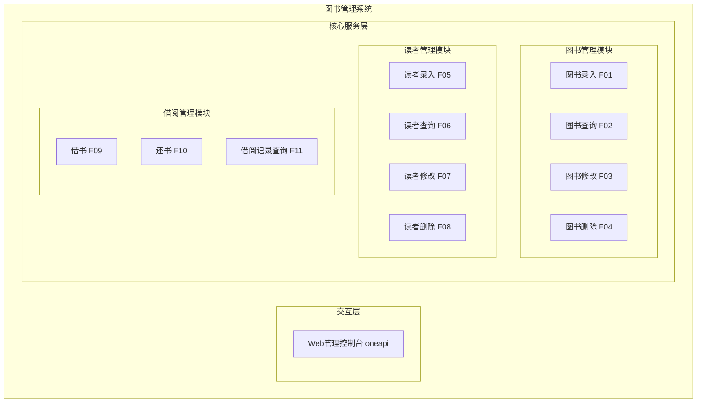
```mermaid
graph TB
    subgraph libraryApp[图书管理系统]

        subgraph interactionLayer[交互层]
            WebConsole[Web管理控制台 oneapi]
        end

        subgraph coreServiceLayer[核心服务层]

            subgraph bookModule[图书管理模块]
                FuncBookAdd[图书录入 F01]
                FuncBookQuery[图书查询 F02]
                FuncBookUpdate[图书修改 F03]
                FuncBookDelete[图书删除 F04]
            end

            subgraph readerModule[读者管理模块]
                FuncReaderAdd[读者录入 F05]
                FuncReaderQuery[读者查询 F06]
                FuncReaderUpdate[读者修改 F07]
                FuncReaderDelete[读者删除 F08]
            end

            subgraph borrowModule[借阅管理模块]
                FuncBorrow[借书 F09]
                FuncReturn[还书 F10]
                FuncBorrowQuery[借阅记录查询 F11]
            end

        end
    end
```

- 交互层说明：Web 管理控制台通过 oneapi（/api 前缀）与后端交互，提供图书、读者、借阅管理界面。
- 核心服务层说明：图书管理模块负责图书信息 CRUD；读者管理模块负责读者信息 CRUD；借阅管理模块负责借还书流程及借阅记录查询，依赖图书和读者模块。
- 扩展/集成层说明：本系统无外部系统集成，不涉及扩展/集成层。

**模块清单**

| 模块 | 职责 | 依赖 |
|------|------|------|
| 图书管理模块 | 图书信息的增删改查，维护图书库存数据 | 无 |
| 读者管理模块 | 读者信息的增删改查，维护读者状态 | 无 |
| 借阅管理模块 | 借书、还书流程管理及借阅记录查询 | 图书管理模块、读者管理模块 |

### 应用集成架构

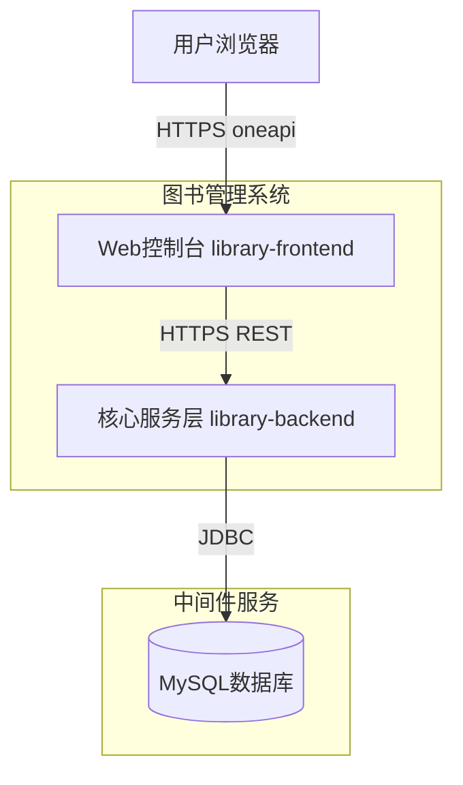
```mermaid
flowchart TB
    user[用户浏览器]

    subgraph app[图书管理系统]
        WebConsole[Web控制台 library-frontend]
        CoreServices[核心服务层 library-backend]
    end

    subgraph middleware[中间件服务]
        DB[(MySQL数据库)]
    end

    user -->|HTTPS oneapi| WebConsole
    WebConsole -->|HTTPS REST| CoreServices
    CoreServices -->|JDBC| DB
```

**集成关系说明：**

| 调用方 | 被调用方 | 协议 | 接口类型 | 说明 |
|--------|----------|------|----------|------|
| 用户浏览器 | library-frontend Web控制台 | HTTPS | HTTP | 前端页面访问 |
| library-frontend | library-backend 核心服务层 | HTTPS | oneapi REST | 前端调用后端 RESTful API |
| library-backend 核心服务层 | MySQL 数据库 | JDBC | SQL | 数据持久化 |

### 部署架构

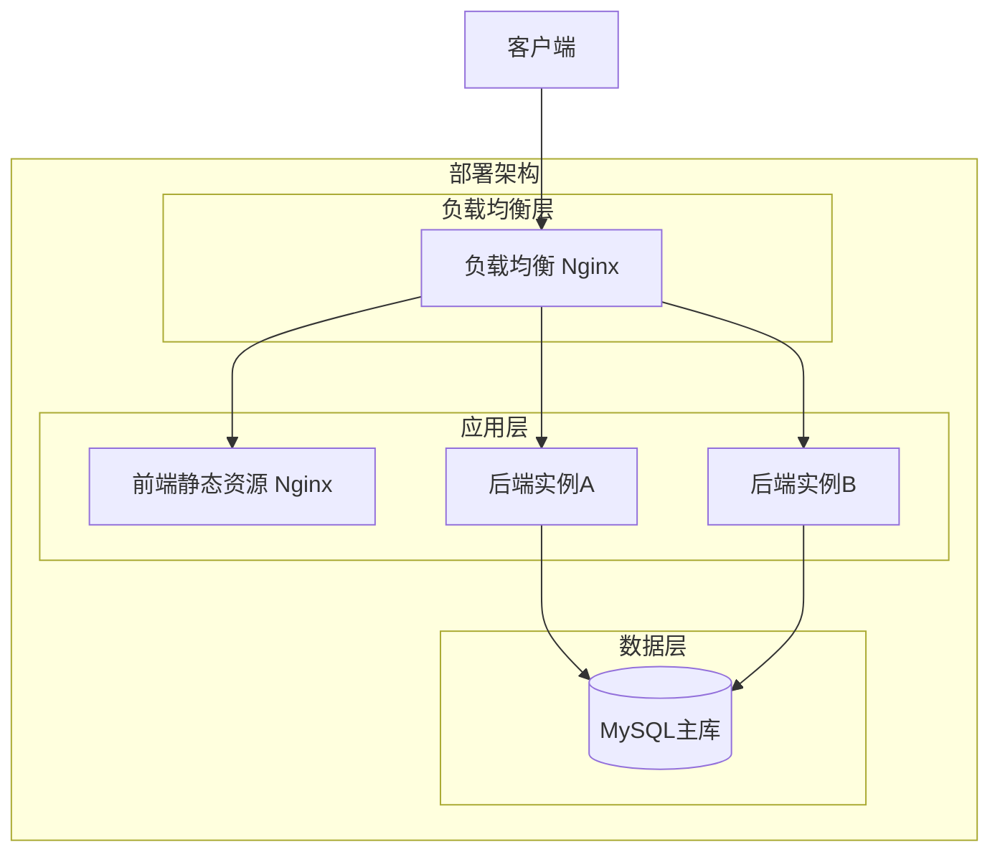
```mermaid
graph TB
    subgraph deployment[部署架构]
        subgraph lbLayer[负载均衡层]
            LB[负载均衡 Nginx]
        end

        subgraph appLayer[应用层]
            Frontend[前端静态资源 Nginx]
            Backend1[后端实例A]
            Backend2[后端实例B]
        end

        subgraph dataLayer[数据层]
            DBMaster[(MySQL主库)]
        end
    end

    Client[客户端] --> LB
    LB --> Frontend
    LB --> Backend1
    LB --> Backend2
    Backend1 --> DBMaster
    Backend2 --> DBMaster
```

**部署说明：**
- **负载均衡层**：Nginx 作为反向代理，前端静态资源与后端 API 统一入口。
- **应用层**：前端打包为静态资源由 Nginx 托管；后端 Spring Boot 应用多实例部署（假设2实例），无状态可水平扩展。
- **数据层**：MySQL 单主库，满足简单系统数据量需求；后续数据量增大可扩展主从架构。

## 3. 数据模型与存储

### 实体清单

| 实体名称 | 实体说明 | 所属模块 | 与其他实体的关系 |
|----------|----------|----------|-----------------|
| book | 图书信息实体，记录图书基本信息与库存 | 图书管理模块 | 一对多关联 borrow_record（一本图书可被多次借阅） |
| reader | 读者信息实体，记录读者基本信息与状态 | 读者管理模块 | 一对多关联 borrow_record（一个读者可有多条借阅记录） |
| borrow_record | 借阅记录实体，记录单次借阅行为与归还状态 | 借阅管理模块 | 多对一关联 book 和 reader |

### 实体关系图

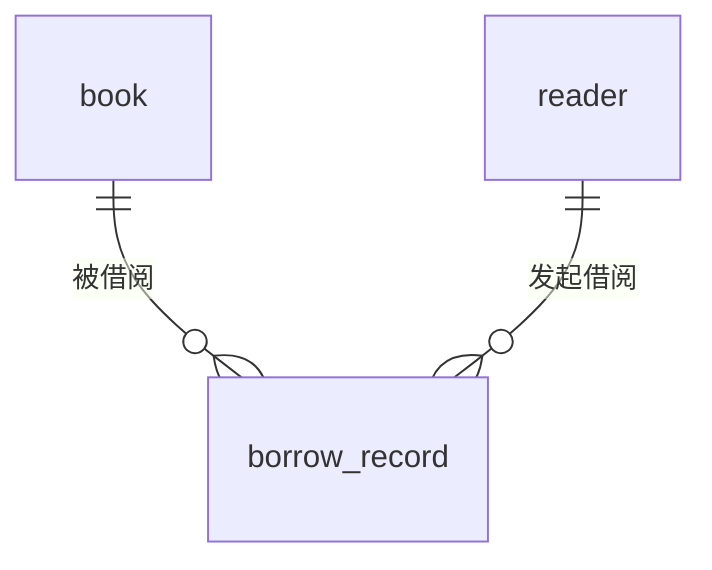
```mermaid
erDiagram
    book ||--o{ borrow_record : "被借阅"
    reader ||--o{ borrow_record : "发起借阅"
```

**模型说明：**
- 一本图书（book）可对应多条借阅记录（borrow_record），通过 borrow_record.book_id 关联。
- 一个读者（reader）可对应多条借阅记录（borrow_record），通过 borrow_record.reader_id 关联。
- borrow_record 同时持有 book_id 和 reader_id，表示某读者在某时间借阅了某图书的具体行为。
- 图书的可用库存通过 book.stock 字段维护，借阅时扣减库存，归还时恢复库存。

## 4. 接口设计

### 4.1 oneapi（Web 控制台接口）

| 编号 | 接口名称 | 方法 | 路径 | 模块 |
|------|----------|------|------|------|
| W01 | 图书分页查询 | GET | /api/books | 图书管理模块 |
| W02 | 图书详情查询 | GET | /api/books/{id} | 图书管理模块 |
| W03 | 新增图书 | POST | /api/books | 图书管理模块 |
| W04 | 修改图书 | PUT | /api/books/{id} | 图书管理模块 |
| W05 | 删除图书 | DELETE | /api/books/{id} | 图书管理模块 |
| W06 | 读者分页查询 | GET | /api/readers | 读者管理模块 |
| W07 | 读者详情查询 | GET | /api/readers/{id} | 读者管理模块 |
| W08 | 新增读者 | POST | /api/readers | 读者管理模块 |
| W09 | 修改读者 | PUT | /api/readers/{id} | 读者管理模块 |
| W10 | 删除读者 | DELETE | /api/readers/{id} | 读者管理模块 |
| W11 | 借阅记录分页查询 | GET | /api/borrow-records | 借阅管理模块 |
| W12 | 借书 | POST | /api/borrow-records/borrow | 借阅管理模块 |
| W13 | 还书 | PUT | /api/borrow-records/{id}/return | 借阅管理模块 |

### 4.2 OpenAPI（对外接口）

本系统为内部管理系统，不提供对外 OpenAPI 接口。本项不适用，原因：简单图书管理系统无外部系统集成需求。

### 4.3 内部接口（Service 层）

| 编号 | 接口名称 | 类 | 方法签名 |
|------|----------|------|----------|
| S01 | 图书分页查询 | BookService | PageResult<BookVO> queryBooks(BookQueryRequest request) |
| S02 | 图书详情查询 | BookService | BookVO getBookById(Long id) |
| S03 | 新增图书 | BookService | Long createBook(BookCreateRequest request) |
| S04 | 修改图书 | BookService | void updateBook(Long id, BookUpdateRequest request) |
| S05 | 删除图书 | BookService | void deleteBook(Long id) |
| S06 | 扣减图书库存 | BookService | void deductStock(Long bookId, int quantity) |
| S07 | 恢复图书库存 | BookService | void restoreStock(Long bookId, int quantity) |
| S08 | 查询图书 | BookService | Book getBookEntity(Long id) |
| S09 | 读者分页查询 | ReaderService | PageResult<ReaderVO> queryReaders(ReaderQueryRequest request) |
| S10 | 读者详情查询 | ReaderService | ReaderVO getReaderById(Long id) |
| S11 | 新增读者 | ReaderService | Long createReader(ReaderCreateRequest request) |
| S12 | 修改读者 | ReaderService | void updateReader(Long id, ReaderUpdateRequest request) |
| S13 | 删除读者 | ReaderService | void deleteReader(Long id) |
| S14 | 查询读者未归还数量 | ReaderService | int countUnreturned(Long readerId) |
| S15 | 查询读者 | ReaderService | Reader getReaderEntity(Long id) |
| S16 | 借阅记录分页查询 | BorrowRecordService | PageResult<BorrowRecordVO> queryRecords(BorrowRecordQueryRequest request) |
| S17 | 借书 | BorrowRecordService | Long borrowBook(BorrowRequest request) |
| S18 | 还书 | BorrowRecordService | void returnBook(Long recordId) |

### 4.4 集成接口（Integration 层）

本系统无外部系统集成，不涉及集成接口。本项不适用，原因：简单图书管理系统不依赖外部服务。

## 5. 功能模块设计

### 5.0 全局约定

#### 5.0.1 通用出参结构

| 参数名称 | 类型 | 描述 |
|----------|------|------|
| code | String | 结果code，"OK"表示成功 |
| msg | String | 提示信息 |
| data | Object | 业务数据 |

#### 5.0.2 错误码格式

错误码格式为 {MODULE}_{SEQ}，其中 MODULE 为模块大写缩写，SEQ 为三位数字序号。

| 模块 | MODULE 前缀 | 说明 |
|------|------------|------|
| 图书管理模块 | BOOK | 图书相关错误码 |
| 读者管理模块 | READER | 读者相关错误码 |
| 借阅管理模块 | BORROW | 借阅相关错误码 |
| 公共 | COMMON | 参数校验等公共错误码 |

#### 5.0.3 模块映射表

| 模块 | Service类 | Mapper类 | 主要实体 |
|------|----------|----------|----------|
| 图书管理模块 | BookService | BookMapper | book |
| 读者管理模块 | ReaderService | ReaderMapper | reader |
| 借阅管理模块 | BorrowRecordService | BorrowRecordMapper | borrow_record |

### 5.1 图书管理模块

#### 5.1.1 表结构设计
##### 5.1.1.1 book（图书信息表）

| 字段名 | 数据类型 | 约束 | 默认值 | 说明 |
|--------|----------|------|--------|------|
| id | bigint | PK, 自增 | - | 系统自增主键 |
| title | varchar(200) | NOT NULL | - | 书名 |
| author | varchar(100) | NOT NULL | - | 作者 |
| isbn | varchar(20) | NOT NULL | - | ISBN编号 |
| publisher | varchar(100) | NULL | - | 出版社 |
| category | varchar(50) | NULL | - | 图书分类 |
| stock | int | NOT NULL | 0 | 当前可借库存 |
| total_stock | int | NOT NULL | 0 | 总馆藏数量 |
| description | varchar(500) | NULL | - | 图书简介 |
| is_deleted | tinyint | NOT NULL | 0 | 是否逻辑删除：0-否，1-是 |
| gmt_create | datetime | NOT NULL | CURRENT_TIMESTAMP | 创建时间 |
| gmt_modified | datetime | NOT NULL | CURRENT_TIMESTAMP | 修改时间 |

**索引：**
- UK: `uk_book_isbn` (isbn)
- IDX: `idx_book_title` (title)
- IDX: `idx_book_author` (author)

##### 5.1.1.2 枚举与常量定义

| 枚举名称 | 取值 | 含义 | 关联字段 |
|----------|------|------|----------|
| BookDeleteFlag | 0 | 未删除 | book.is_deleted |
| BookDeleteFlag | 1 | 已删除 | book.is_deleted |

#### 5.1.2 接口详细设计
##### W01 图书分页查询

- **URI**: GET /api/books
- **描述**: 分页查询图书列表，支持按书名、作者、ISBN模糊检索
- **入参**:

| 参数名称 | 类型 | 是否必填 | 描述 |
|----------|------|----------|------|
| pageNum | int | 否 | 页码，默认1 |
| pageSize | int | 否 | 每页条数，默认10 |
| title | String | 否 | 书名模糊检索关键词 |
| author | String | 否 | 作者模糊检索关键词 |
| isbn | String | 否 | ISBN精确检索关键词 |

- **出参**:

| 参数名称 | 类型 | 描述 |
|----------|------|------|
| code | String | 结果code |
| msg | String | 提示信息 |
| data.total | long | 总记录数 |
| data.pageNum | int | 当前页码 |
| data.pageSize | int | 每页条数 |
| data.list | List | 图书列表 |
| data.list[].id | Long | 图书ID |
| data.list[].title | String | 书名 |
| data.list[].author | String | 作者 |
| data.list[].isbn | String | ISBN |
| data.list[].publisher | String | 出版社 |
| data.list[].category | String | 分类 |
| data.list[].stock | int | 可借库存 |
| data.list[].totalStock | int | 总馆藏 |

- **错误码**:

| 错误码 | 说明 |
|--------|------|
| COMMON_001 | 参数校验失败 |

- **业务规则**: 分页参数校验，pageNum>=1且pageSize在1~100之间

- **请求示例**:
```json
GET /api/books?pageNum=1&pageSize=10&title=Java
```

- **响应示例**:
```json
{
  "code": "OK",
  "msg": "SUCCESS",
  "data": {
    "total": 25,
    "pageNum": 1,
    "pageSize": 10,
    "list": [
      {
        "id": 1,
        "title": "Java编程思想",
        "author": "Bruce Eckel",
        "isbn": "9787111213826",
        "publisher": "机械工业出版社",
        "category": "编程",
        "stock": 3,
        "totalStock": 5
      }
    ]
  }
}
```

##### W02 图书详情查询

- **URI**: GET /api/books/{id}
- **描述**: 根据图书ID查询图书详细信息
- **入参**:

| 参数名称 | 类型 | 是否必填 | 描述 |
|----------|------|----------|------|
| id | Long | 是 | 图书ID（路径参数） |

- **出参**:

| 参数名称 | 类型 | 描述 |
|----------|------|------|
| code | String | 结果code |
| msg | String | 提示信息 |
| data.id | Long | 图书ID |
| data.title | String | 书名 |
| data.author | String | 作者 |
| data.isbn | String | ISBN |
| data.publisher | String | 出版社 |
| data.category | String | 分类 |
| data.stock | int | 可借库存 |
| data.totalStock | int | 总馆藏 |
| data.description | String | 图书简介 |

- **错误码**:

| 错误码 | 说明 |
|--------|------|
| BOOK_001 | 图书不存在 |

- **业务规则**: 查询时排除逻辑删除记录

- **请求示例**:
```json
GET /api/books/1
```

- **响应示例**:
```json
{
  "code": "OK",
  "msg": "SUCCESS",
  "data": {
    "id": 1,
    "title": "Java编程思想",
    "author": "Bruce Eckel",
    "isbn": "9787111213826",
    "publisher": "机械工业出版社",
    "category": "编程",
    "stock": 3,
    "totalStock": 5,
    "description": "Java经典入门书籍"
  }
}
```

##### W03 新增图书

- **URI**: POST /api/books
- **描述**: 新增图书记录
- **入参**:

| 参数名称 | 类型 | 是否必填 | 描述 |
|----------|------|----------|------|
| title | String | 是 | 书名 |
| author | String | 是 | 作者 |
| isbn | String | 是 | ISBN编号 |
| publisher | String | 否 | 出版社 |
| category | String | 否 | 图书分类 |
| stock | int | 是 | 初始库存 |
| description | String | 否 | 图书简介 |

- **出参**:

| 参数名称 | 类型 | 描述 |
|----------|------|------|
| code | String | 结果code |
| msg | String | 提示信息 |
| data | Long | 新增图书ID |

- **错误码**:

| 错误码 | 说明 |
|--------|------|
| BOOK_002 | ISBN已存在 |
| COMMON_001 | 参数校验失败 |

- **业务规则**: ISBN唯一校验；stock与totalStock初始值一致

- **请求示例**:
```json
{
  "title": "Java编程思想",
  "author": "Bruce Eckel",
  "isbn": "9787111213826",
  "publisher": "机械工业出版社",
  "category": "编程",
  "stock": 5,
  "description": "Java经典入门书籍"
}
```

- **响应示例**:
```json
{
  "code": "OK",
  "msg": "SUCCESS",
  "data": 1
}
```

##### W04 修改图书

- **URI**: PUT /api/books/{id}
- **描述**: 修改图书基本信息
- **入参**:

| 参数名称 | 类型 | 是否必填 | 描述 |
|----------|------|----------|------|
| id | Long | 是 | 图书ID（路径参数） |
| title | String | 否 | 书名 |
| author | String | 否 | 作者 |
| isbn | String | 否 | ISBN编号 |
| publisher | String | 否 | 出版社 |
| category | String | 否 | 图书分类 |
| description | String | 否 | 图书简介 |

- **出参**:

| 参数名称 | 类型 | 描述 |
|----------|------|------|
| code | String | 结果code |
| msg | String | 提示信息 |
| data | Object | 无返回数据 |

- **错误码**:

| 错误码 | 说明 |
|--------|------|
| BOOK_001 | 图书不存在 |
| BOOK_002 | ISBN已存在 |
| BOOK_003 | 图书有未归还借阅记录，禁止修改ISBN |

- **业务规则**: 修改ISBN时校验该图书是否存在未归还的借阅记录；stock/totalStock不通过此接口修改

- **请求示例**:
```json
{
  "title": "Java编程思想（第4版）",
  "publisher": "机械工业出版社"
}
```

- **响应示例**:
```json
{
  "code": "OK",
  "msg": "SUCCESS",
  "data": null
}
```

##### W05 删除图书

- **URI**: DELETE /api/books/{id}
- **描述**: 逻辑删除图书记录
- **入参**:

| 参数名称 | 类型 | 是否必填 | 描述 |
|----------|------|----------|------|
| id | Long | 是 | 图书ID（路径参数） |

- **出参**:

| 参数名称 | 类型 | 描述 |
|----------|------|------|
| code | String | 结果code |
| msg | String | 提示信息 |
| data | Object | 无返回数据 |

- **错误码**:

| 错误码 | 说明 |
|--------|------|
| BOOK_001 | 图书不存在 |
| BOOK_004 | 图书有未归还借阅记录，禁止删除 |

- **业务规则**: 存在未归还借阅记录时禁止删除

- **请求示例**:
```json
DELETE /api/books/1
```

- **响应示例**:
```json
{
  "code": "OK",
  "msg": "SUCCESS",
  "data": null
}
```

#### 5.1.3 子功能详细设计
##### 5.1.3.1 图书信息录入（F01）

- 处理时序图
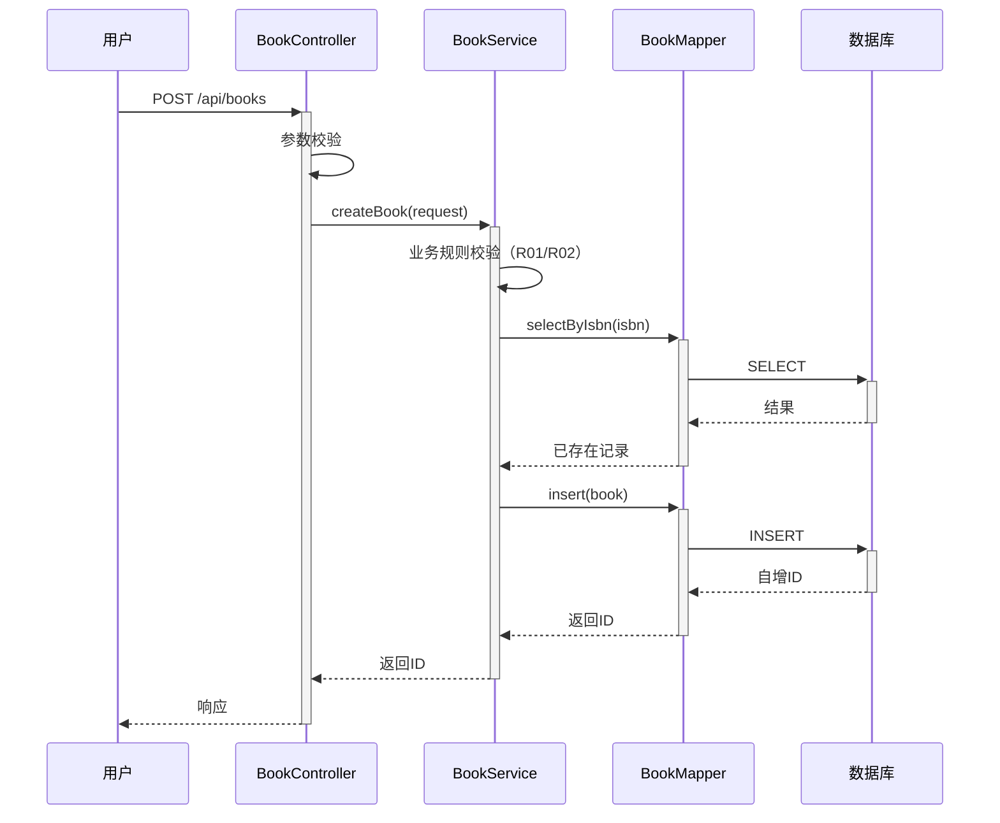
```mermaid
sequenceDiagram
    participant C as 用户
    participant Ctrl as BookController
    participant Svc as BookService
    participant Mapper as BookMapper
    participant DB as 数据库

    C->>+Ctrl: POST /api/books
    Ctrl->>Ctrl: 参数校验
    Ctrl->>+Svc: createBook(request)
    Svc->>Svc: 业务规则校验（R01/R02）
    Svc->>+Mapper: selectByIsbn(isbn)
    Mapper->>+DB: SELECT
    DB-->>-Mapper: 结果
    Mapper-->>-Svc: 已存在记录
    Svc->>+Mapper: insert(book)
    Mapper->>+DB: INSERT
    DB-->>-Mapper: 自增ID
    Mapper-->>-Svc: 返回ID
    Svc-->>-Ctrl: 返回ID
    Ctrl-->>-C: 响应
```

**业务规则：**
| 规则编号 | 规则描述 | 校验时机 | 不满足时的处理 |
|----------|----------|----------|--------------|
| R01 | 书名不能为空 | 创建时 | 返回错误码 COMMON_001，提示"书名不能为空" |
| R02 | ISBN不能重复 | 创建时 | 返回错误码 BOOK_002，提示"ISBN已存在" |

**异常场景：**
| 异常场景 | 处理方式 |
|----------|----------|
| 数据库唯一约束冲突 | 捕获异常，返回 BOOK_002 提示ISBN已存在 |
| 数据库连接异常 | 返回 COMMON_999 提示系统异常 |

**并发控制（如涉及数据写入）：**
- 并发场景：同一ISBN的图书被并发创建
- 控制策略：数据库唯一索引 `uk_book_isbn` 兜底 + Service层先查询校验，双重保障

##### 5.1.3.2 图书信息查询（F02）

- 处理时序图
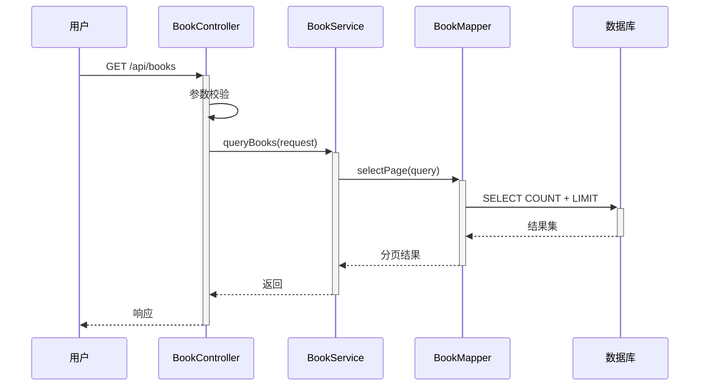
```mermaid
sequenceDiagram
    participant C as 用户
    participant Ctrl as BookController
    participant Svc as BookService
    participant Mapper as BookMapper
    participant DB as 数据库

    C->>+Ctrl: GET /api/books
    Ctrl->>Ctrl: 参数校验
    Ctrl->>+Svc: queryBooks(request)
    Svc->>+Mapper: selectPage(query)
    Mapper->>+DB: SELECT COUNT + LIMIT
    DB-->>-Mapper: 结果集
    Mapper-->>-Svc: 分页结果
    Svc-->>-Ctrl: 返回
    Ctrl-->>-C: 响应
```

**业务规则：**
| 规则编号 | 规则描述 | 校验时机 | 不满足时的处理 |
|----------|----------|----------|--------------|
| R03 | 分页参数合法 | 查询时 | pageNum<1时默认为1，pageSize超出范围时取默认值 |

**异常场景：**
| 异常场景 | 处理方式 |
|----------|----------|
| 查询条件全为空 | 返回全量分页数据，不做强制限制 |

**并发控制：**
- 并发场景：无并发风险，原因：查询为只读操作

##### 5.1.3.3 图书信息修改（F03）

- 处理时序图
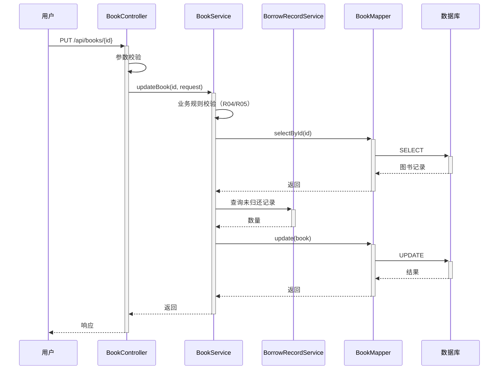
```mermaid
sequenceDiagram
    participant C as 用户
    participant Ctrl as BookController
    participant Svc as BookService
    participant BorrowSvc as BorrowRecordService
    participant Mapper as BookMapper
    participant DB as 数据库

    C->>+Ctrl: PUT /api/books/{id}
    Ctrl->>Ctrl: 参数校验
    Ctrl->>+Svc: updateBook(id, request)
    Svc->>Svc: 业务规则校验（R04/R05）
    Svc->>+Mapper: selectById(id)
    Mapper->>+DB: SELECT
    DB-->>-Mapper: 图书记录
    Mapper-->>-Svc: 返回
    Svc->>+BorrowSvc: 查询未归还记录
    BorrowSvc-->>-Svc: 数量
    Svc->>+Mapper: update(book)
    Mapper->>+DB: UPDATE
    DB-->>-Mapper: 结果
    Mapper-->>-Svc: 返回
    Svc-->>-Ctrl: 返回
    Ctrl-->>-C: 响应
```

**业务规则：**
| 规则编号 | 规则描述 | 校验时机 | 不满足时的处理 |
|----------|----------|----------|--------------|
| R04 | 图书必须存在 | 更新时 | 返回错误码 BOOK_001，提示"图书不存在" |
| R05 | 修改ISBN时无未归还记录 | 更新时 | 返回错误码 BOOK_003，提示"图书有未归还借阅记录，禁止修改ISBN" |

**异常场景：**
| 异常场景 | 处理方式 |
|----------|----------|
| 图书不存在 | 返回 BOOK_001 |
| 更新记录数为0 | 返回 BOOK_001，提示图书可能已被删除 |

**并发控制（如涉及数据写入）：**
- 并发场景：同一图书被并发修改基本信息
- 控制策略：无严重并发风险，原因：图书基本信息修改频率低，即使并发修改以最后写入为准可接受

##### 5.1.3.4 图书信息删除（F04）

- 处理时序图
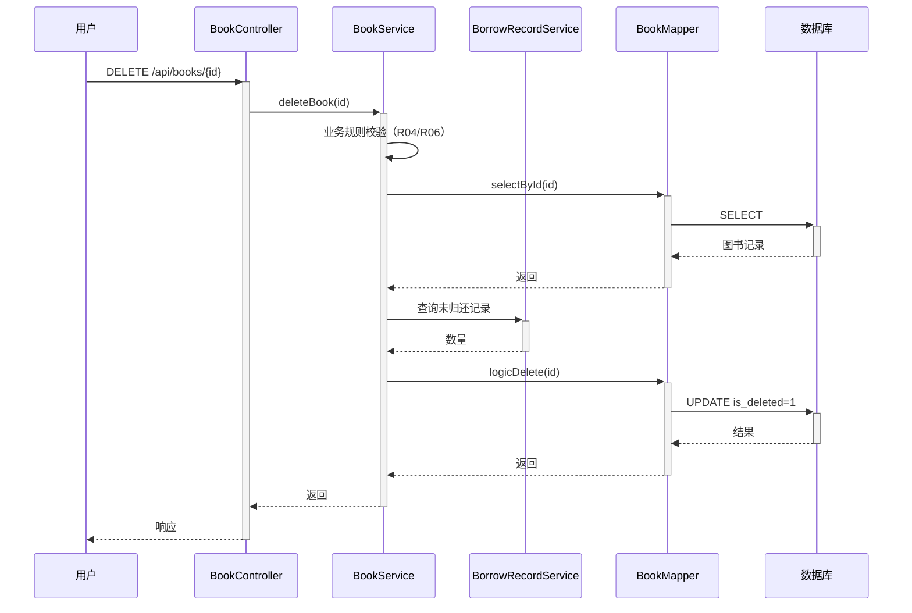
```mermaid
sequenceDiagram
    participant C as 用户
    participant Ctrl as BookController
    participant Svc as BookService
    participant BorrowSvc as BorrowRecordService
    participant Mapper as BookMapper
    participant DB as 数据库

    C->>+Ctrl: DELETE /api/books/{id}
    Ctrl->>+Svc: deleteBook(id)
    Svc->>Svc: 业务规则校验（R04/R06）
    Svc->>+Mapper: selectById(id)
    Mapper->>+DB: SELECT
    DB-->>-Mapper: 图书记录
    Mapper-->>-Svc: 返回
    Svc->>+BorrowSvc: 查询未归还记录
    BorrowSvc-->>-Svc: 数量
    Svc->>+Mapper: logicDelete(id)
    Mapper->>+DB: UPDATE is_deleted=1
    DB-->>-Mapper: 结果
    Mapper-->>-Svc: 返回
    Svc-->>-Ctrl: 返回
    Ctrl-->>-C: 响应
```

**业务规则：**
| 规则编号 | 规则描述 | 校验时机 | 不满足时的处理 |
|----------|----------|----------|--------------|
| R04 | 图书必须存在 | 删除前 | 返回错误码 BOOK_001，提示"图书不存在" |
| R06 | 无未归还借阅记录 | 删除前 | 返回错误码 BOOK_004，提示"图书有未归还借阅记录，禁止删除" |

**异常场景：**
| 异常场景 | 处理方式 |
|----------|----------|
| 图书不存在 | 返回 BOOK_001 |

**并发控制（如涉及数据写入）：**
- 并发场景：删除图书的同时有借书操作进行
- 控制策略：借书流程会校验图书is_deleted状态，逻辑删除后借书将返回 BOOK_001，确保数据一致性

### 5.2 读者管理模块

#### 5.2.1 表结构设计
##### 5.2.1.1 reader（读者信息表）

| 字段名 | 数据类型 | 约束 | 默认值 | 说明 |
|--------|----------|------|--------|------|
| id | bigint | PK, 自增 | - | 系统自增主键 |
| name | varchar(50) | NOT NULL | - | 读者姓名 |
| phone | varchar(20) | NOT NULL | - | 手机号 |
| reader_type | varchar(20) | NOT NULL | - | 读者类型（如：学生/教师） |
| status | varchar(20) | NOT NULL | ACTIVE | 读者状态 |
| is_deleted | tinyint | NOT NULL | 0 | 是否逻辑删除：0-否，1-是 |
| gmt_create | datetime | NOT NULL | CURRENT_TIMESTAMP | 创建时间 |
| gmt_modified | datetime | NOT NULL | CURRENT_TIMESTAMP | 修改时间 |

**索引：**
- UK: `uk_reader_phone` (phone)
- IDX: `idx_reader_name` (name)

##### 5.2.1.2 枚举与常量定义

| 枚举名称 | 取值 | 含义 | 关联字段 |
|----------|------|------|----------|
| ReaderStatus | ACTIVE | 正常 | reader.status |
| ReaderStatus | SUSPENDED | 停用 | reader.status |
| ReaderDeleteFlag | 0 | 未删除 | reader.is_deleted |
| ReaderDeleteFlag | 1 | 已删除 | reader.is_deleted |

##### 5.2.1.3 读者状态机设计

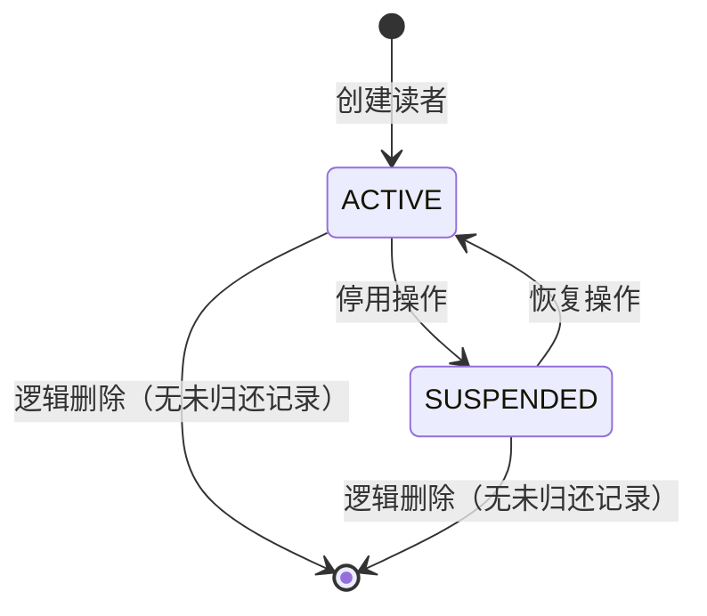
```mermaid
stateDiagram-v2
    [*] --> ACTIVE : 创建读者
    ACTIVE --> SUSPENDED : 停用操作
    SUSPENDED --> ACTIVE : 恢复操作
    ACTIVE --> [*] : 逻辑删除（无未归还记录）
    SUSPENDED --> [*] : 逻辑删除（无未归还记录）
```

**状态流转规则：**
| 当前状态 | 目标状态 | 流转条件 | 前置校验 | 触发动作 |
|----------|----------|----------|----------|----------|
| 初始 | ACTIVE | 创建读者 | 手机号唯一 | 插入读者记录 |
| ACTIVE | SUSPENDED | 停用操作 | 无 | 无 |
| SUSPENDED | ACTIVE | 恢复操作 | 无 | 无 |
| ACTIVE | 已删除 | 逻辑删除 | 无未归还借阅记录 | is_deleted置为1 |
| SUSPENDED | 已删除 | 逻辑删除 | 无未归还借阅记录 | is_deleted置为1 |

#### 5.2.2 接口详细设计
##### W06 读者分页查询

- **URI**: GET /api/readers
- **描述**: 分页查询读者列表，支持按姓名、手机号检索
- **入参**:

| 参数名称 | 类型 | 是否必填 | 描述 |
|----------|------|----------|------|
| pageNum | int | 否 | 页码，默认1 |
| pageSize | int | 否 | 每页条数，默认10 |
| name | String | 否 | 姓名模糊检索关键词 |
| phone | String | 否 | 手机号精确检索关键词 |

- **出参**:

| 参数名称 | 类型 | 描述 |
|----------|------|------|
| code | String | 结果code |
| msg | String | 提示信息 |
| data.total | long | 总记录数 |
| data.pageNum | int | 当前页码 |
| data.pageSize | int | 每页条数 |
| data.list | List | 读者列表 |
| data.list[].id | Long | 读者ID |
| data.list[].name | String | 姓名 |
| data.list[].phone | String | 手机号 |
| data.list[].readerType | String | 读者类型 |
| data.list[].status | String | 读者状态 |

- **错误码**:

| 错误码 | 说明 |
|--------|------|
| COMMON_001 | 参数校验失败 |

- **业务规则**: 分页参数校验，查询排除逻辑删除记录

- **请求示例**:
```json
GET /api/readers?pageNum=1&pageSize=10&name=张
```

- **响应示例**:
```json
{
  "code": "OK",
  "msg": "SUCCESS",
  "data": {
    "total": 10,
    "pageNum": 1,
    "pageSize": 10,
    "list": [
      {
        "id": 1,
        "name": "张三",
        "phone": "13800138000",
        "readerType": "学生",
        "status": "ACTIVE"
      }
    ]
  }
}
```

##### W07 读者详情查询

- **URI**: GET /api/readers/{id}
- **描述**: 根据读者ID查询读者详细信息
- **入参**:

| 参数名称 | 类型 | 是否必填 | 描述 |
|----------|------|----------|------|
| id | Long | 是 | 读者ID（路径参数） |

- **出参**:

| 参数名称 | 类型 | 描述 |
|----------|------|------|
| code | String | 结果code |
| msg | String | 提示信息 |
| data.id | Long | 读者ID |
| data.name | String | 姓名 |
| data.phone | String | 手机号 |
| data.readerType | String | 读者类型 |
| data.status | String | 读者状态 |

- **错误码**:

| 错误码 | 说明 |
|--------|------|
| READER_001 | 读者不存在 |

- **业务规则**: 查询时排除逻辑删除记录

- **请求示例**:
```json
GET /api/readers/1
```

- **响应示例**:
```json
{
  "code": "OK",
  "msg": "SUCCESS",
  "data": {
    "id": 1,
    "name": "张三",
    "phone": "13800138000",
    "readerType": "学生",
    "status": "ACTIVE"
  }
}
```

##### W08 新增读者

- **URI**: POST /api/readers
- **描述**: 新增读者记录
- **入参**:

| 参数名称 | 类型 | 是否必填 | 描述 |
|----------|------|----------|------|
| name | String | 是 | 姓名 |
| phone | String | 是 | 手机号 |
| readerType | String | 是 | 读者类型 |

- **出参**:

| 参数名称 | 类型 | 描述 |
|----------|------|------|
| code | String | 结果code |
| msg | String | 提示信息 |
| data | Long | 新增读者ID |

- **错误码**:

| 错误码 | 说明 |
|--------|------|
| READER_002 | 手机号已存在 |
| COMMON_001 | 参数校验失败 |

- **业务规则**: 手机号唯一校验；新增读者状态默认为ACTIVE

- **请求示例**:
```json
{
  "name": "张三",
  "phone": "13800138000",
  "readerType": "学生"
}
```

- **响应示例**:
```json
{
  "code": "OK",
  "msg": "SUCCESS",
  "data": 1
}
```

##### W09 修改读者

- **URI**: PUT /api/readers/{id}
- **描述**: 修改读者基本信息
- **入参**:

| 参数名称 | 类型 | 是否必填 | 描述 |
|----------|------|----------|------|
| id | Long | 是 | 读者ID（路径参数） |
| name | String | 否 | 姓名 |
| phone | String | 否 | 手机号 |
| readerType | String | 否 | 读者类型 |
| status | String | 否 | 读者状态 |

- **出参**:

| 参数名称 | 类型 | 描述 |
|----------|------|------|
| code | String | 结果code |
| msg | String | 提示信息 |
| data | Object | 无返回数据 |

- **错误码**:

| 错误码 | 说明 |
|--------|------|
| READER_001 | 读者不存在 |
| READER_002 | 手机号已存在 |
| READER_003 | 读者状态不合法 |

- **业务规则**: 修改手机号时校验唯一性；修改状态时校验状态值合法性

- **请求示例**:
```json
{
  "name": "张三丰",
  "readerType": "教师"
}
```

- **响应示例**:
```json
{
  "code": "OK",
  "msg": "SUCCESS",
  "data": null
}
```

##### W10 删除读者

- **URI**: DELETE /api/readers/{id}
- **描述**: 逻辑删除读者记录
- **入参**:

| 参数名称 | 类型 | 是否必填 | 描述 |
|----------|------|----------|------|
| id | Long | 是 | 读者ID（路径参数） |

- **出参**:

| 参数名称 | 类型 | 描述 |
|----------|------|------|
| code | String | 结果code |
| msg | String | 提示信息 |
| data | Object | 无返回数据 |

- **错误码**:

| 错误码 | 说明 |
|--------|------|
| READER_001 | 读者不存在 |
| READER_004 | 读者有未归还借阅记录，禁止删除 |

- **业务规则**: 存在未归还借阅记录时禁止删除

- **请求示例**:
```json
DELETE /api/readers/1
```

- **响应示例**:
```json
{
  "code": "OK",
  "msg": "SUCCESS",
  "data": null
}
```

#### 5.2.3 子功能详细设计
##### 5.2.3.1 读者信息录入（F05）

- 处理时序图
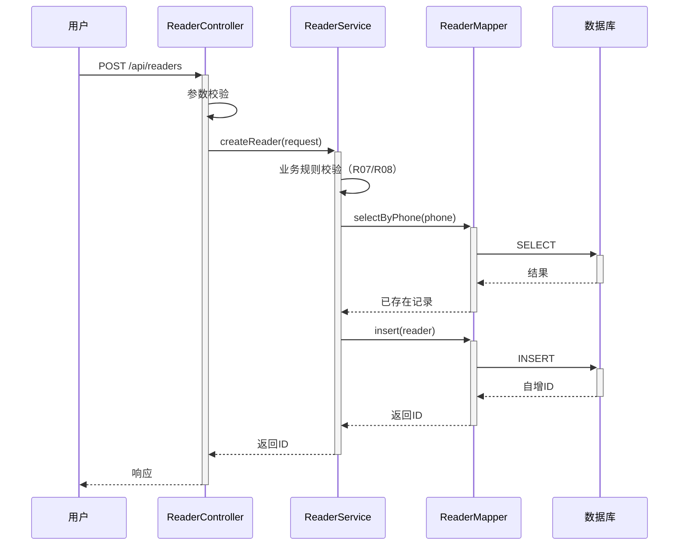
```mermaid
sequenceDiagram
    participant C as 用户
    participant Ctrl as ReaderController
    participant Svc as ReaderService
    participant Mapper as ReaderMapper
    participant DB as 数据库

    C->>+Ctrl: POST /api/readers
    Ctrl->>Ctrl: 参数校验
    Ctrl->>+Svc: createReader(request)
    Svc->>Svc: 业务规则校验（R07/R08）
    Svc->>+Mapper: selectByPhone(phone)
    Mapper->>+DB: SELECT
    DB-->>-Mapper: 结果
    Mapper-->>-Svc: 已存在记录
    Svc->>+Mapper: insert(reader)
    Mapper->>+DB: INSERT
    DB-->>-Mapper: 自增ID
    Mapper-->>-Svc: 返回ID
    Svc-->>-Ctrl: 返回ID
    Ctrl-->>-C: 响应
```

**业务规则：**
| 规则编号 | 规则描述 | 校验时机 | 不满足时的处理 |
|----------|----------|----------|--------------|
| R07 | 姓名不能为空 | 创建时 | 返回错误码 COMMON_001，提示"姓名不能为空" |
| R08 | 手机号不能重复 | 创建时 | 返回错误码 READER_002，提示"手机号已存在" |

**异常场景：**
| 异常场景 | 处理方式 |
|----------|----------|
| 数据库唯一约束冲突 | 捕获异常，返回 READER_002 提示手机号已存在 |
| 数据库连接异常 | 返回 COMMON_999 提示系统异常 |

**并发控制（如涉及数据写入）：**
- 并发场景：同一手机号的读者被并发创建
- 控制策略：数据库唯一索引 `uk_reader_phone` 兜底 + Service层先查询校验，双重保障

##### 5.2.3.2 读者信息查询（F06）

- 处理时序图
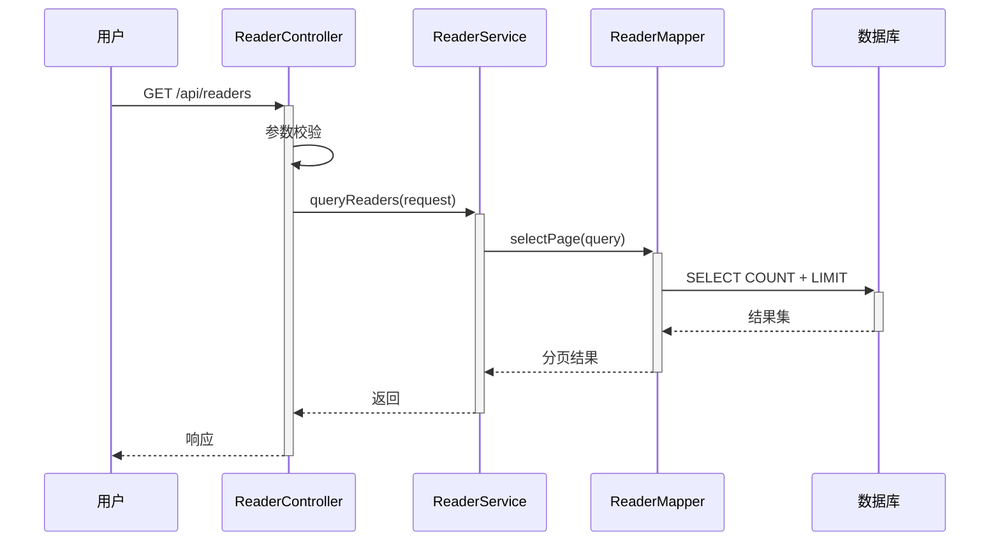
```mermaid
sequenceDiagram
    participant C as 用户
    participant Ctrl as ReaderController
    participant Svc as ReaderService
    participant Mapper as ReaderMapper
    participant DB as 数据库

    C->>+Ctrl: GET /api/readers
    Ctrl->>Ctrl: 参数校验
    Ctrl->>+Svc: queryReaders(request)
    Svc->>+Mapper: selectPage(query)
    Mapper->>+DB: SELECT COUNT + LIMIT
    DB-->>-Mapper: 结果集
    Mapper-->>-Svc: 分页结果
    Svc-->>-Ctrl: 返回
    Ctrl-->>-C: 响应
```

**业务规则：**
| 规则编号 | 规则描述 | 校验时机 | 不满足时的处理 |
|----------|----------|----------|--------------|
| R09 | 分页参数合法 | 查询时 | pageNum<1时默认为1，pageSize超出范围时取默认值 |

**异常场景：**
| 异常场景 | 处理方式 |
|----------|----------|
| 查询条件全为空 | 返回全量分页数据 |

**并发控制：**
- 并发场景：无并发风险，原因：查询为只读操作

##### 5.2.3.3 读者信息修改（F07）

- 处理时序图
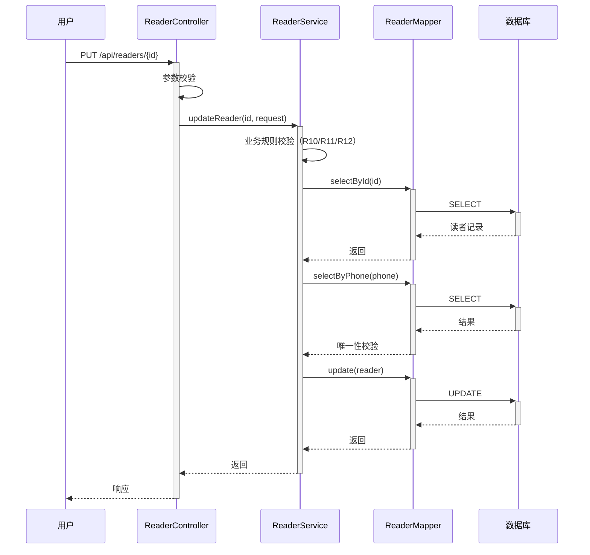
```mermaid
sequenceDiagram
    participant C as 用户
    participant Ctrl as ReaderController
    participant Svc as ReaderService
    participant Mapper as ReaderMapper
    participant DB as 数据库

    C->>+Ctrl: PUT /api/readers/{id}
    Ctrl->>Ctrl: 参数校验
    Ctrl->>+Svc: updateReader(id, request)
    Svc->>Svc: 业务规则校验（R10/R11/R12）
    Svc->>+Mapper: selectById(id)
    Mapper->>+DB: SELECT
    DB-->>-Mapper: 读者记录
    Mapper-->>-Svc: 返回
    Svc->>+Mapper: selectByPhone(phone)
    Mapper->>+DB: SELECT
    DB-->>-Mapper: 结果
    Mapper-->>-Svc: 唯一性校验
    Svc->>+Mapper: update(reader)
    Mapper->>+DB: UPDATE
    DB-->>-Mapper: 结果
    Mapper-->>-Svc: 返回
    Svc-->>-Ctrl: 返回
    Ctrl-->>-C: 响应
```

**业务规则：**
| 规则编号 | 规则描述 | 校验时机 | 不满足时的处理 |
|----------|----------|----------|--------------|
| R10 | 读者必须存在 | 更新时 | 返回错误码 READER_001，提示"读者不存在" |
| R11 | 修改手机号时需唯一 | 更新时 | 返回错误码 READER_002，提示"手机号已存在" |
| R12 | 修改状态时值必须合法 | 更新时 | 返回错误码 READER_003，提示"读者状态不合法" |

**异常场景：**
| 异常场景 | 处理方式 |
|----------|----------|
| 读者不存在 | 返回 READER_001 |
| 更新记录数为0 | 返回 READER_001，提示读者可能已被删除 |

**并发控制（如涉及数据写入）：**
- 并发场景：同一读者被并发修改基本信息
- 控制策略：无严重并发风险，原因：读者基本信息修改频率低，以最后写入为准可接受

##### 5.2.3.4 读者信息删除（F08）

- 处理时序图
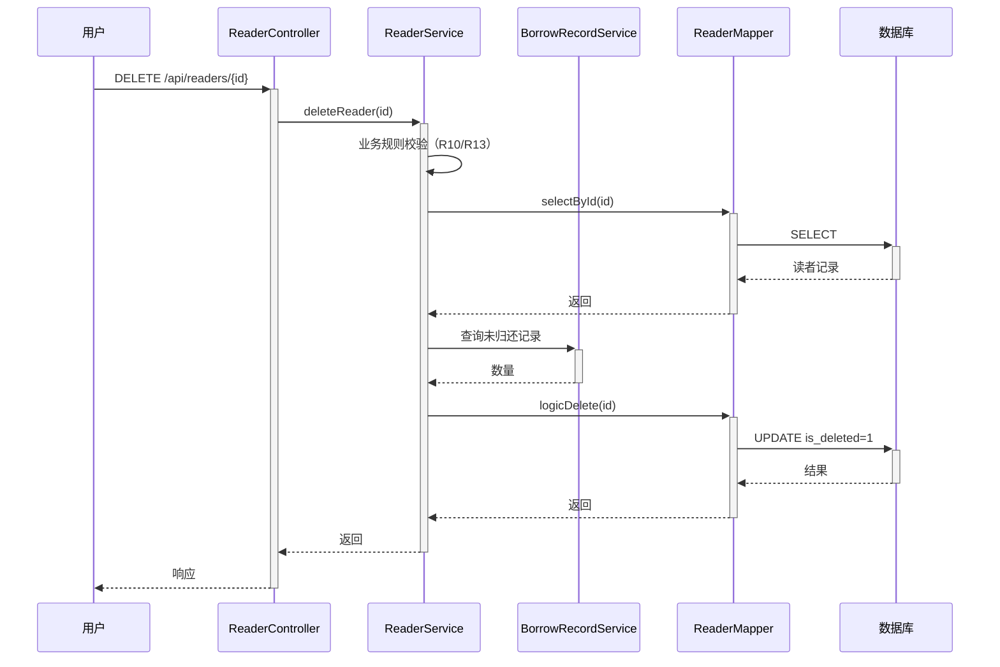
```mermaid
sequenceDiagram
    participant C as 用户
    participant Ctrl as ReaderController
    participant Svc as ReaderService
    participant BorrowSvc as BorrowRecordService
    participant Mapper as ReaderMapper
    participant DB as 数据库

    C->>+Ctrl: DELETE /api/readers/{id}
    Ctrl->>+Svc: deleteReader(id)
    Svc->>Svc: 业务规则校验（R10/R13）
    Svc->>+Mapper: selectById(id)
    Mapper->>+DB: SELECT
    DB-->>-Mapper: 读者记录
    Mapper-->>-Svc: 返回
    Svc->>+BorrowSvc: 查询未归还记录
    BorrowSvc-->>-Svc: 数量
    Svc->>+Mapper: logicDelete(id)
    Mapper->>+DB: UPDATE is_deleted=1
    DB-->>-Mapper: 结果
    Mapper-->>-Svc: 返回
    Svc-->>-Ctrl: 返回
    Ctrl-->>-C: 响应
```

**业务规则：**
| 规则编号 | 规则描述 | 校验时机 | 不满足时的处理 |
|----------|----------|----------|--------------|
| R10 | 读者必须存在 | 删除前 | 返回错误码 READER_001，提示"读者不存在" |
| R13 | 无未归还借阅记录 | 删除前 | 返回错误码 READER_004，提示"读者有未归还借阅记录，禁止删除" |

**异常场景：**
| 异常场景 | 处理方式 |
|----------|----------|
| 读者不存在 | 返回 READER_001 |

**并发控制（如涉及数据写入）：**
- 并发场景：删除读者的同时有借书操作进行
- 控制策略：借书流程会校验读者is_deleted状态，逻辑删除后借书将返回 READER_001，确保数据一致性

### 5.3 借阅管理模块

#### 5.3.1 表结构设计
##### 5.3.1.1 borrow_record（借阅记录表）

| 字段名 | 数据类型 | 约束 | 默认值 | 说明 |
|--------|----------|------|--------|------|
| id | bigint | PK, 自增 | - | 系统自增主键 |
| book_id | bigint | NOT NULL | - | 图书ID |
| reader_id | bigint | NOT NULL | - | 读者ID |
| borrow_time | datetime | NOT NULL | - | 借阅时间 |
| due_time | datetime | NOT NULL | - | 应还时间（借阅时间+30天） |
| return_time | datetime | NULL | - | 实际归还时间 |
| status | varchar(20) | NOT NULL | BORROWING | 借阅状态 |
| is_overdue | tinyint | NOT NULL | 0 | 是否逾期：0-否，1-是 |
| is_deleted | tinyint | NOT NULL | 0 | 是否逻辑删除：0-否，1-是 |
| gmt_create | datetime | NOT NULL | CURRENT_TIMESTAMP | 创建时间 |
| gmt_modified | datetime | NOT NULL | CURRENT_TIMESTAMP | 修改时间 |

**索引：**
- IDX: `idx_borrow_record_book_id` (book_id)
- IDX: `idx_borrow_record_reader_id` (reader_id)
- IDX: `idx_borrow_record_status` (status)

##### 5.3.1.2 枚举与常量定义

| 枚举名称 | 取值 | 含义 | 关联字段 |
|----------|------|------|----------|
| BorrowStatus | BORROWING | 借阅中 | borrow_record.status |
| BorrowStatus | RETURNED | 已归还 | borrow_record.status |
| BorrowStatus | OVERDUE | 逾期中 | borrow_record.status |
| OverdueFlag | 0 | 未逾期 | borrow_record.is_overdue |
| OverdueFlag | 1 | 已逾期 | borrow_record.is_overdue |
| BorrowDeleteFlag | 0 | 未删除 | borrow_record.is_deleted |
| BorrowDeleteFlag | 1 | 已删除 | borrow_record.is_deleted |

##### 5.3.1.3 借阅状态机设计

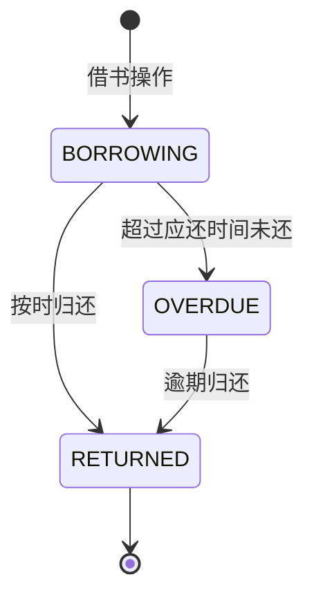
```mermaid
stateDiagram-v2
    [*] --> BORROWING : 借书操作
    BORROWING --> RETURNED : 按时归还
    BORROWING --> OVERDUE : 超过应还时间未还
    OVERDUE --> RETURNED : 逾期归还
    RETURNED --> [*]
```

**状态流转规则：**
| 当前状态 | 目标状态 | 流转条件 | 前置校验 | 触发动作 |
|----------|----------|----------|----------|----------|
| 初始 | BORROWING | 借书操作 | 图书库存>0、读者状态正常、读者未达借阅上限 | 创建记录、扣减库存 |
| BORROWING | RETURNED | 按时归还 | 借阅记录存在且状态为BORROWING | 更新return_time、status、恢复库存 |
| BORROWING | OVERDUE | 超过应还时间未还 | 定时检测或还书时判断 | 更新is_overdue=1、status=OVERDUE |
| OVERDUE | RETURNED | 逾期归还 | 借阅记录存在且状态为OVERDUE | 更新return_time、status、恢复库存 |

#### 5.3.2 接口详细设计
##### W11 借阅记录分页查询

- **URI**: GET /api/borrow-records
- **描述**: 分页查询借阅记录，支持按读者ID、图书ID、状态检索
- **入参**:

| 参数名称 | 类型 | 是否必填 | 描述 |
|----------|------|----------|------|
| pageNum | int | 否 | 页码，默认1 |
| pageSize | int | 否 | 每页条数，默认10 |
| readerId | Long | 否 | 读者ID精确筛选 |
| bookId | Long | 否 | 图书ID精确筛选 |
| status | String | 否 | 借阅状态筛选 |

- **出参**:

| 参数名称 | 类型 | 描述 |
|----------|------|------|
| code | String | 结果code |
| msg | String | 提示信息 |
| data.total | long | 总记录数 |
| data.pageNum | int | 当前页码 |
| data.pageSize | int | 每页条数 |
| data.list | List | 借阅记录列表 |
| data.list[].id | Long | 记录ID |
| data.list[].bookId | Long | 图书ID |
| data.list[].bookTitle | String | 图书名称（冗余） |
| data.list[].readerId | Long | 读者ID |
| data.list[].readerName | String | 读者姓名（冗余） |
| data.list[].borrowTime | String | 借阅时间 |
| data.list[].dueTime | String | 应还时间 |
| data.list[].returnTime | String | 实际归还时间 |
| data.list[].status | String | 借阅状态 |
| data.list[].isOverdue | int | 是否逾期 |

- **错误码**:

| 错误码 | 说明 |
|--------|------|
| COMMON_001 | 参数校验失败 |

- **业务规则**: 查询排除逻辑删除记录；列表返回图书名称和读者姓名冗余字段

- **请求示例**:
```json
GET /api/borrow-records?pageNum=1&pageSize=10&readerId=1&status=BORROWING
```

- **响应示例**:
```json
{
  "code": "OK",
  "msg": "SUCCESS",
  "data": {
    "total": 5,
    "pageNum": 1,
    "pageSize": 10,
    "list": [
      {
        "id": 1,
        "bookId": 1,
        "bookTitle": "Java编程思想",
        "readerId": 1,
        "readerName": "张三",
        "borrowTime": "2026-07-31 10:00:00",
        "dueTime": "2026-08-30 10:00:00",
        "returnTime": null,
        "status": "BORROWING",
        "isOverdue": 0
      }
    ]
  }
}
```

##### W12 借书

- **URI**: POST /api/borrow-records/borrow
- **描述**: 读者借阅图书，创建借阅记录并扣减库存
- **入参**:

| 参数名称 | 类型 | 是否必填 | 描述 |
|----------|------|----------|------|
| bookId | Long | 是 | 图书ID |
| readerId | Long | 是 | 读者ID |

- **出参**:

| 参数名称 | 类型 | 描述 |
|----------|------|------|
| code | String | 结果code |
| msg | String | 提示信息 |
| data | Long | 借阅记录ID |

- **错误码**:

| 错误码 | 说明 |
|--------|------|
| BOOK_001 | 图书不存在 |
| BOOK_005 | 图书库存不足 |
| READER_001 | 读者不存在 |
| READER_005 | 读者状态异常（非ACTIVE） |
| BORROW_001 | 读者已达借阅上限（5本） |
| COMMON_001 | 参数校验失败 |

- **业务规则**: 校验图书存在且有库存；校验读者存在且状态为ACTIVE；校验读者未归还借阅数量未达上限5本；创建借阅记录，应还时间为借阅时间+30天

- **请求示例**:
```json
{
  "bookId": 1,
  "readerId": 1
}
```

- **响应示例**:
```json
{
  "code": "OK",
  "msg": "SUCCESS",
  "data": 1
}
```

##### W13 还书

- **URI**: PUT /api/borrow-records/{id}/return
- **描述**: 归还图书，更新借阅记录状态并恢复库存
- **入参**:

| 参数名称 | 类型 | 是否必填 | 描述 |
|----------|------|----------|------|
| id | Long | 是 | 借阅记录ID（路径参数） |

- **出参**:

| 参数名称 | 类型 | 描述 |
|----------|------|------|
| code | String | 结果code |
| msg | String | 提示信息 |
| data | Object | 无返回数据 |

- **错误码**:

| 错误码 | 说明 |
|--------|------|
| BORROW_002 | 借阅记录不存在 |
| BORROW_003 | 借阅记录状态非借阅中/逾期，无法归还 |

- **业务规则**: 校验借阅记录存在且状态为BORROWING或OVERDUE；更新return_time为当前时间、status为RETURNED；若已超过due_time则更新is_overdue=1；恢复图书库存

- **请求示例**:
```json
PUT /api/borrow-records/1/return
```

- **响应示例**:
```json
{
  "code": "OK",
  "msg": "SUCCESS",
  "data": null
}
```

#### 5.3.3 子功能详细设计
##### 5.3.3.1 借书（F09）

- 处理时序图
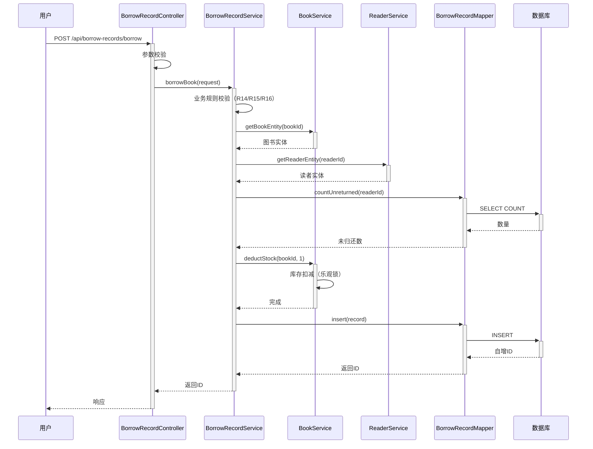
```mermaid
sequenceDiagram
    participant C as 用户
    participant Ctrl as BorrowRecordController
    participant Svc as BorrowRecordService
    participant BookSvc as BookService
    participant ReaderSvc as ReaderService
    participant Mapper as BorrowRecordMapper
    participant DB as 数据库

    C->>+Ctrl: POST /api/borrow-records/borrow
    Ctrl->>Ctrl: 参数校验
    Ctrl->>+Svc: borrowBook(request)
    Svc->>Svc: 业务规则校验（R14/R15/R16）
    Svc->>+BookSvc: getBookEntity(bookId)
    BookSvc-->>-Svc: 图书实体
    Svc->>+ReaderSvc: getReaderEntity(readerId)
    ReaderSvc-->>-Svc: 读者实体
    Svc->>+Mapper: countUnreturned(readerId)
    Mapper->>+DB: SELECT COUNT
    DB-->>-Mapper: 数量
    Mapper-->>-Svc: 未归还数
    Svc->>+BookSvc: deductStock(bookId, 1)
    BookSvc->>BookSvc: 库存扣减（乐观锁）
    BookSvc-->>-Svc: 完成
    Svc->>+Mapper: insert(record)
    Mapper->>+DB: INSERT
    DB-->>-Mapper: 自增ID
    Mapper-->>-Svc: 返回ID
    Svc-->>-Ctrl: 返回ID
    Ctrl-->>-C: 响应
```

**业务规则：**
| 规则编号 | 规则描述 | 校验时机 | 不满足时的处理 |
|----------|----------|----------|--------------|
| R14 | 图书必须存在且有库存 | 借书时 | 不存在返回 BOOK_001；库存不足返回 BOOK_005 |
| R15 | 读者必须存在且状态为ACTIVE | 借书时 | 不存在返回 READER_001；状态异常返回 READER_005 |
| R16 | 读者未归还借阅数量不超过5本 | 借书时 | 超限返回 BORROW_001，提示"读者已达借阅上限" |

**异常场景：**
| 异常场景 | 处理方式 |
|----------|----------|
| 图书库存扣减失败（并发导致库存不足） | 事务回滚，返回 BOOK_005 提示库存不足 |
| 数据库连接异常 | 事务回滚，返回 COMMON_999 提示系统异常 |

**并发控制（如涉及数据写入）：**
- 并发场景：多读者同时借阅同一图书导致库存超扣
- 控制策略：乐观锁方案。book表库存扣减使用 UPDATE book SET stock = stock - 1 WHERE id = ? AND stock > 0，通过数据库行锁保证原子性，库存不足时返回0行更新，Service层据此回滚并返回 BOOK_005

| 方案 | 机制 | 优点 | 缺点 | 推荐度 |
|------|------|------|------|--------|
| 方案A：乐观锁SQL | UPDATE...WHERE stock>0 | 实现简单，无额外依赖 | 高并发下可能少量重试 | ★★★ |
| 方案B：分布式锁 | 对bookId加锁后扣减 | 强一致 | 引入Redis依赖，简单系统过重 | ★ |
| 方案C：无并发控制 | 直接扣减 | 最简单 | 存在超扣风险 | ✗ |

推荐方案A，理由：简单图书管理系统并发量低，乐观锁SQL方案兼顾正确性与实现成本。

##### 5.3.3.2 还书（F10）

- 处理时序图
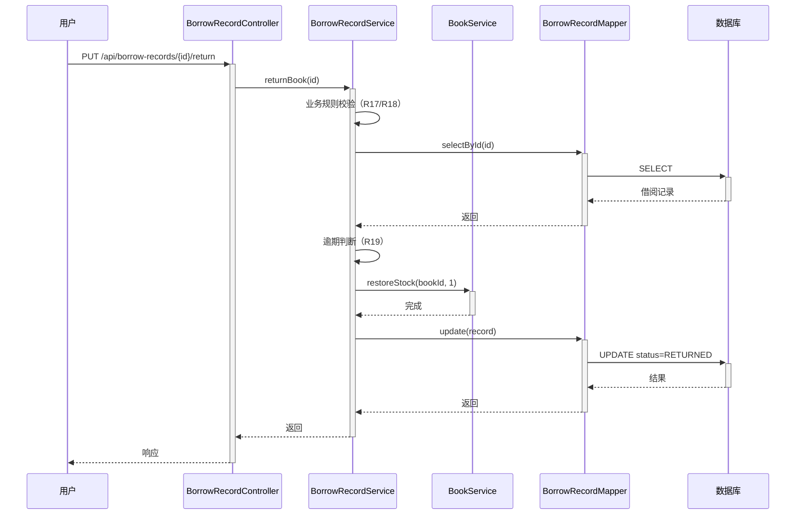
```mermaid
sequenceDiagram
    participant C as 用户
    participant Ctrl as BorrowRecordController
    participant Svc as BorrowRecordService
    participant BookSvc as BookService
    participant Mapper as BorrowRecordMapper
    participant DB as 数据库

    C->>+Ctrl: PUT /api/borrow-records/{id}/return
    Ctrl->>+Svc: returnBook(id)
    Svc->>Svc: 业务规则校验（R17/R18）
    Svc->>+Mapper: selectById(id)
    Mapper->>+DB: SELECT
    DB-->>-Mapper: 借阅记录
    Mapper-->>-Svc: 返回
    Svc->>Svc: 逾期判断（R19）
    Svc->>+BookSvc: restoreStock(bookId, 1)
    BookSvc-->>-Svc: 完成
    Svc->>+Mapper: update(record)
    Mapper->>+DB: UPDATE status=RETURNED
    DB-->>-Mapper: 结果
    Mapper-->>-Svc: 返回
    Svc-->>-Ctrl: 返回
    Ctrl-->>-C: 响应
```

**业务规则：**
| 规则编号 | 规则描述 | 校验时机 | 不满足时的处理 |
|----------|----------|----------|--------------|
| R17 | 借阅记录必须存在 | 还书时 | 返回错误码 BORROW_002，提示"借阅记录不存在" |
| R18 | 借阅记录状态必须为BORROWING或OVERDUE | 还书时 | 返回错误码 BORROW_003，提示"借阅记录状态非借阅中/逾期，无法归还" |
| R19 | 超过应还时间则标记逾期 | 还书时 | 若return_time>due_time，更新is_overdue=1 |

**异常场景：**
| 异常场景 | 处理方式 |
|----------|----------|
| 借阅记录不存在 | 返回 BORROW_002 |
| 借阅记录已被删除 | 返回 BORROW_002 |
| 库存恢复失败 | 事务回滚，返回 COMMON_999 |

**并发控制（如涉及数据写入）：**
- 并发场景：同一借阅记录被并发还书
- 控制策略：状态校验防重。UPDATE borrow_record SET status='RETURNED', return_time=NOW() WHERE id=? AND status IN ('BORROWING','OVERDUE')，通过状态条件保证只更新一次，重复还书返回0行更新

##### 5.3.3.3 借阅记录查询（F11）

- 处理时序图
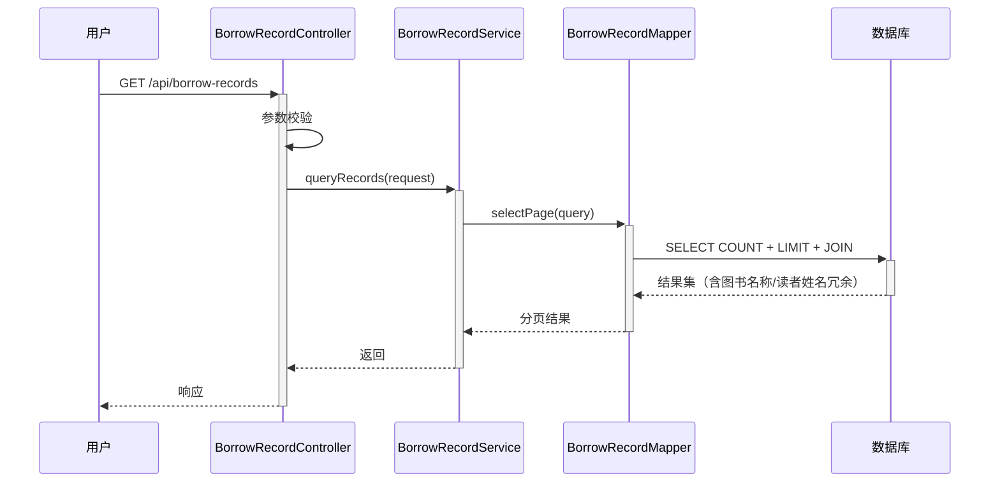
```mermaid
sequenceDiagram
    participant C as 用户
    participant Ctrl as BorrowRecordController
    participant Svc as BorrowRecordService
    participant Mapper as BorrowRecordMapper
    participant DB as 数据库

    C->>+Ctrl: GET /api/borrow-records
    Ctrl->>Ctrl: 参数校验
    Ctrl->>+Svc: queryRecords(request)
    Svc->>+Mapper: selectPage(query)
    Mapper->>+DB: SELECT COUNT + LIMIT + JOIN
    DB-->>-Mapper: 结果集（含图书名称/读者姓名冗余）
    Mapper-->>-Svc: 分页结果
    Svc-->>-Ctrl: 返回
    Ctrl-->>-C: 响应
```

**业务规则：**
| 规则编号 | 规则描述 | 校验时机 | 不满足时的处理 |
|----------|----------|----------|--------------|
| R20 | 分页参数合法 | 查询时 | pageNum<1时默认为1，pageSize超出范围时取默认值 |

**异常场景：**
| 异常场景 | 处理方式 |
|----------|----------|
| 查询条件全为空 | 返回全量分页数据 |

**并发控制：**
- 并发场景：无并发风险，原因：查询为只读操作

#### 5.3.4 跨模块调用时序图

借书流程涉及借阅管理模块调用图书管理模块（扣减库存）和读者管理模块（校验读者），跨模块调用时序如下：

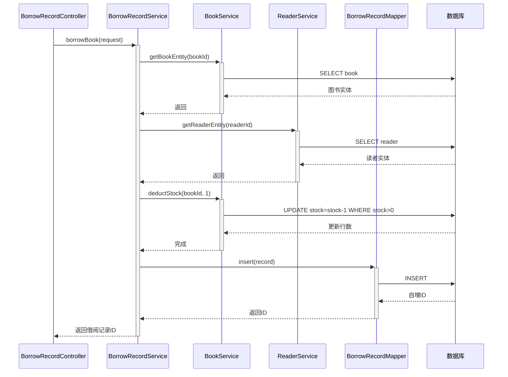
```mermaid
sequenceDiagram
    participant Ctrl as BorrowRecordController
    participant BorrowSvc as BorrowRecordService
    participant BookSvc as BookService
    participant ReaderSvc as ReaderService
    participant BorrowMapper as BorrowRecordMapper
    participant DB as 数据库

    Ctrl->>+BorrowSvc: borrowBook(request)
    BorrowSvc->>+BookSvc: getBookEntity(bookId)
    BookSvc->>DB: SELECT book
    DB-->>BookSvc: 图书实体
    BookSvc-->>-BorrowSvc: 返回
    BorrowSvc->>+ReaderSvc: getReaderEntity(readerId)
    ReaderSvc->>DB: SELECT reader
    DB-->>ReaderSvc: 读者实体
    ReaderSvc-->>-BorrowSvc: 返回
    BorrowSvc->>+BookSvc: deductStock(bookId, 1)
    BookSvc->>DB: UPDATE stock=stock-1 WHERE stock>0
    DB-->>BookSvc: 更新行数
    BookSvc-->>-BorrowSvc: 完成
    BorrowSvc->>+BorrowMapper: insert(record)
    BorrowMapper->>DB: INSERT
    DB-->>BorrowMapper: 自增ID
    BorrowMapper-->>-BorrowSvc: 返回ID
    BorrowSvc-->>-Ctrl: 返回借阅记录ID
```

## 6. 非功能性需求设计

### 6.1 高可用性
本系统为简单图书管理系统，无外部依赖服务。后端 Spring Boot 应用多实例部署（2实例），无状态可水平扩展。MySQL 单主库部署，数据库异常时系统不可用。本系统对高可用要求较低，不引入额外容错切换机制。数据库异常时应用返回系统异常提示，运维介入恢复。

### 6.2 可扩展性
- 水平扩缩容：后端应用无状态，可通过增加实例数量水平扩展。
- 垂直扩缩容：可通过调整应用容器 CPU/内存资源垂直扩展。
- 数据库扩展：当前单库单表，数据量增大后可扩展主从架构读写分离。

### 6.3 稳定性/可靠性
- 边界场景：借书时库存为0、读者达借阅上限、重复还书等场景均有业务规则和错误码覆盖。
- 数据一致性：借书和还书流程通过数据库事务保证，库存扣减/恢复与借阅记录创建/更新在同一事务内，失败时整体回滚。

### 6.4 安全性设计
#### 6.4.1 账户系统方案
本系统暂不实现登录鉴权（假设A04），所有接口公开访问。假设：简单系统暂不涉及账户系统，后续如需接入账户系统建议使用统一公共服务。

#### 6.4.2 授权&访问控制
##### 6.4.2.1 是否实现水平权限检查
本项不适用，原因：简单系统无用户登录体系，暂不涉及水平权限检查。所有管理操作为公共管理操作。

##### 6.4.2.2 是否实现垂直权限检查
本项不适用，原因：简单系统无角色体系，暂不涉及垂直权限检查。

##### 6.4.2.3 是否检查登录态
本项不适用，原因：简单系统暂不实现登录鉴权，接口无登录态校验。

#### 6.4.3 数据防护方案
##### 6.4.3.1 是否对敏感数据加密存储
本项不适用，原因：系统不存储身份证、银行卡等高敏感信息。读者手机号以明文存储，后续如需可加密存储。

##### 6.4.3.2 是否对敏感数据展示进行脱敏
读者手机号在接口返回时考虑脱敏展示（中间4位以*替代），日志打印时手机号同样脱敏。

### 6.5 监控/统计/日志/告警
- 关键监控点：借书/还书接口调用量、成功率、平均耗时。
- 告警点：借书失败率异常升高、数据库连接异常。
- 日志：关键操作（借书、还书）记录操作日志，包含读者ID、图书ID、操作时间、操作结果。

## 7. 变更三板斧

### 7.1 可监控
针对借书和还书两个核心流程进行服务埋点设计：
- 调用服务埋点：记录借书/还书接口调用次数、成功/失败次数。
- 处理结果埋点：记录库存扣减/恢复成功/失败次数、借阅上限校验拦截次数。
- 处理耗时埋点：记录借书/还书接口平均处理耗时。
- 异常埋点：数据库异常、库存不足异常、读者状态异常等分类计数。

### 7.2 可灰度
本系统为全新系统首次发布，不涉及灰度引流。假设：首次发布全量上线，后续如有迭代变更可通过接口路径版本区分（如 /api/v2/books）实现灰度。简单系统暂不引入租户级灰度能力。

### 7.3 可应急
- 关键功能开关：借书/还书流程保留功能开关（borrow.enabled），紧急情况下可关闭借书功能，禁止新增借阅但保留还书和查询能力。
- 应急策略：优先采用开关降级而非回滚，避免回滚导致数据库 schema 不兼容问题。
- 数据库异常应急：准备数据库备份恢复方案，RPO控制在每日备份。

## 8. 方案检查（Step 9 Checklist）

| 序号 | 检查项 | 检查结果 | 说明 |
|------|--------|----------|------|
| 1 | 模块划分合理性检查 | 通过 | 三个模块职责单一（图书/读者/借阅），无循环依赖，借阅模块依赖图书和读者模块，无功能点超50%的模块 |
| 2 | 依赖关系合理性 | 通过 | 借阅模块→图书模块、借阅模块→读者模块，依赖方向单向无环；图书/读者模块无外部依赖，下游异常（如库存扣减失败）时借阅流程事务回滚保证可用 |
| 3 | 单点问题检查（部署层面） | 不适用 | 简单系统MySQL单主库为已知单点，受限于系统规模不做主从；后端多实例无状态 |
| 4 | 表模型设计范式检查 | 通过 | 三张表满足第三范式：book/reader/borrow_record 各表字段均依赖主键，无传递依赖；borrow_record通过book_id和reader_id外键引用（逻辑外键，不建物理外键） |
| 5 | 隐私安全检查 | 通过 | 读者手机号为敏感信息已在6.4.3.2标记需脱敏展示和日志脱敏 |
| 6 | 兼容性检查（接口） | 不适用 | 全新系统首次设计，无旧调用方需兼容 |
| 7 | 兼容性检查（表） | 不适用 | 全新系统首次设计，无旧表结构需兼容 |
| 8 | 数据迁移检查 | 不适用 | 全新系统首次设计，无历史数据需迁移 |
| 9 | 一致性检查（功能点） | 通过 | F01-F04对应图书管理模块5.1设计；F05-F08对应读者管理模块5.2设计；F09-F11对应借阅管理模块5.3设计，11个功能点全部覆盖 |
| 10 | 一致性检查（表） | 通过 | Step3三个实体book/reader/borrow_record在Step5均有完整表结构定义（5.1.1.1、5.2.1.1、5.3.1.1） |
| 11 | 一致性检查（接口） | 通过 | Step4的W01-W13接口在Step5均有详细定义（5.1.2、5.2.2、5.3.2），含URI/入参/出参/错误码/请求响应示例 |
| 12 | 一致性检查（枚举） | 通过 | 枚举定义（BookDeleteFlag/ReaderStatus/ReaderDeleteFlag/BorrowStatus/OverdueFlag/BorrowDeleteFlag）与表结构字段说明一致 |
| 13 | 状态机完整性检查 | 通过 | reader有状态机图（5.2.1.3）；borrow_record有状态机图（5.3.1.3），状态流转完整无孤岛状态 |
| 14 | 并发风险检查 | 通过 | 借书库存扣减采用乐观锁SQL方案（方案A推荐），还书采用状态条件防重，已给出多方案对比及推荐理由 |
| 15 | 单点问题检查（定时任务层面） | 不适用 | 本系统无定时任务，逾期状态在还书时即时判断 |
| 16 | 非功能性设计可行性检查 | 通过 | 高可用/扩展性/安全性设计均基于简单系统定位，落地可行 |
| 17 | 变更三板斧设计可行性检查（可监控） | 通过 | 借书/还书核心流程埋点设计可行 |
| 18 | 变更三板斧设计可行性检查（可灰度） | 通过 | 首次发布全量上线，后续可通过API版本区分灰度，方案合理 |
| 19 | 变更三板斧设计可行性检查（可应急） | 通过 | borrow.enabled功能开关+数据库备份方案，从自身角度可行，避免回滚依赖问题 |

**检查结论：** 19项检查中16项通过、3项不适用（均为全新系统首次设计场景），无不通过项。设计文档完整覆盖需求功能点F01-F11，数据模型、接口设计、模块详细设计、非功能需求和变更三板斧均已产出。
