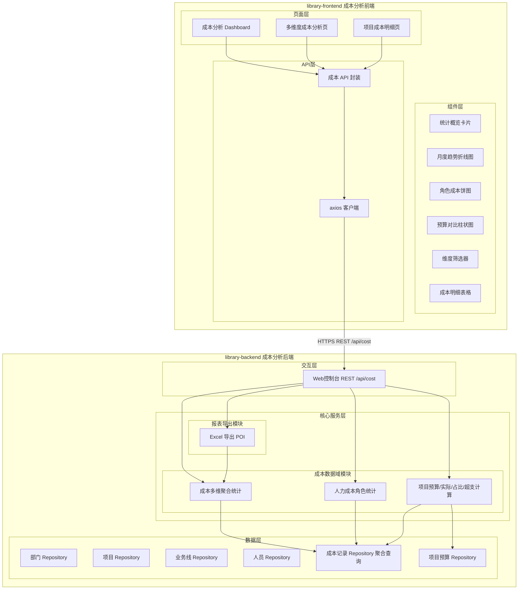
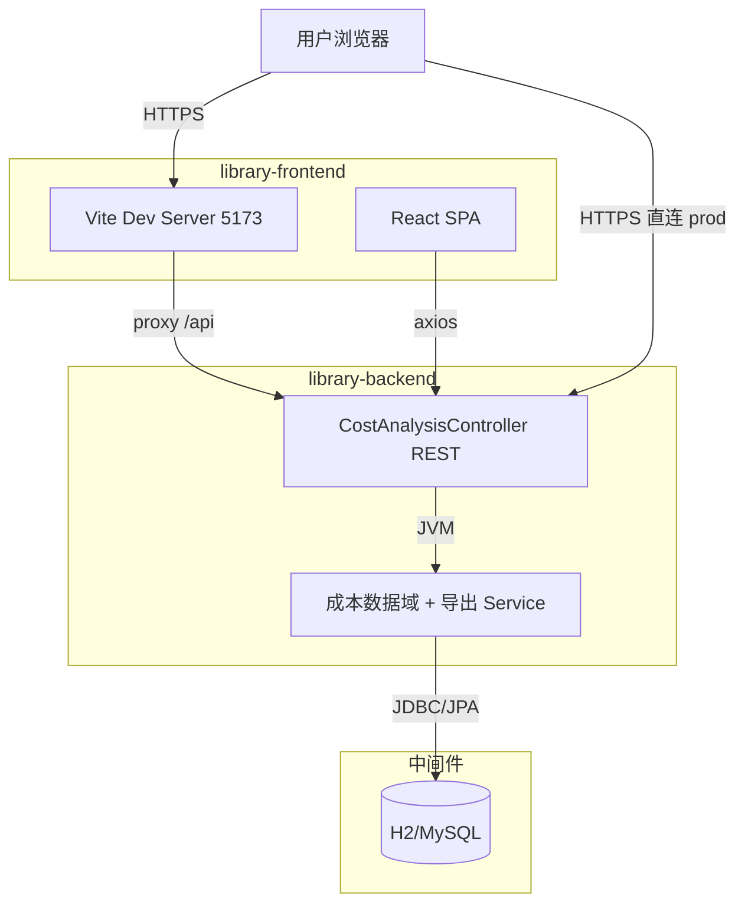
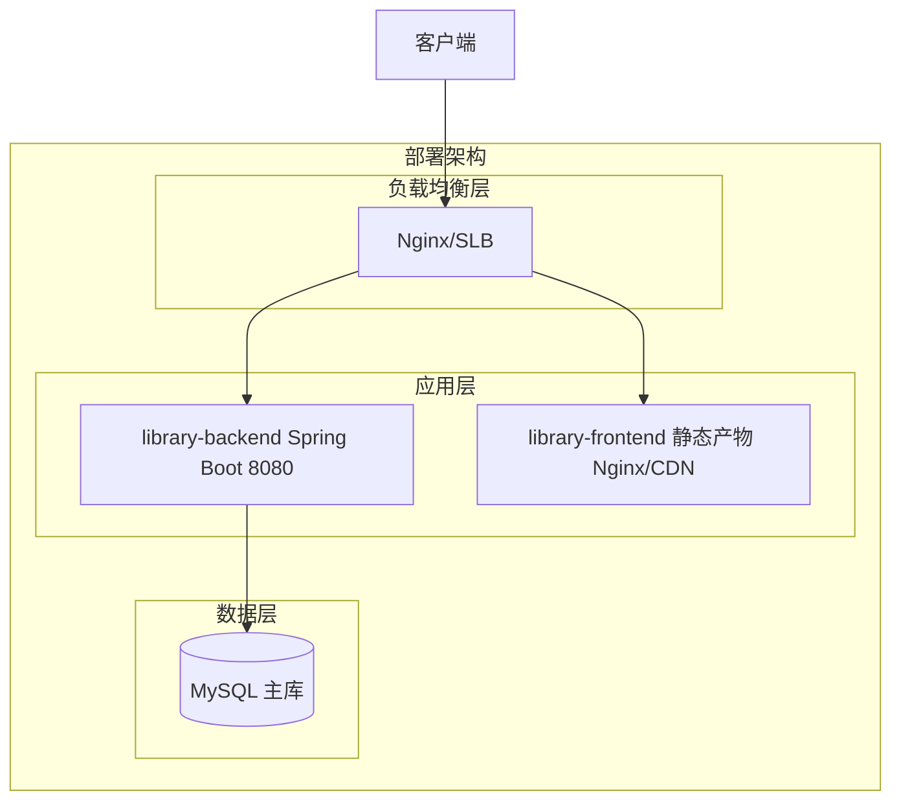
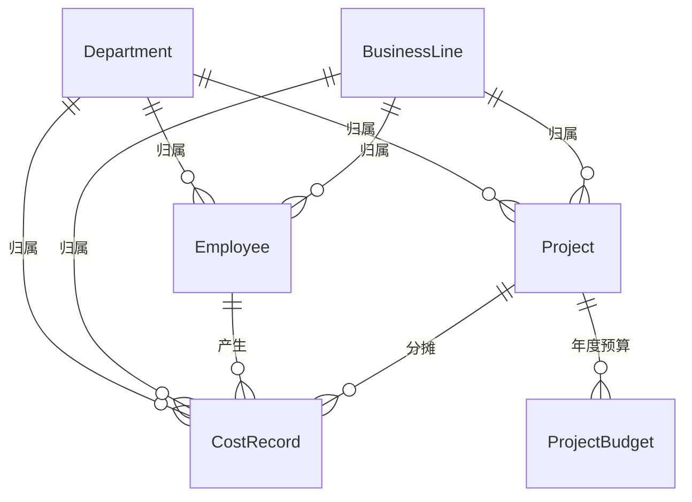
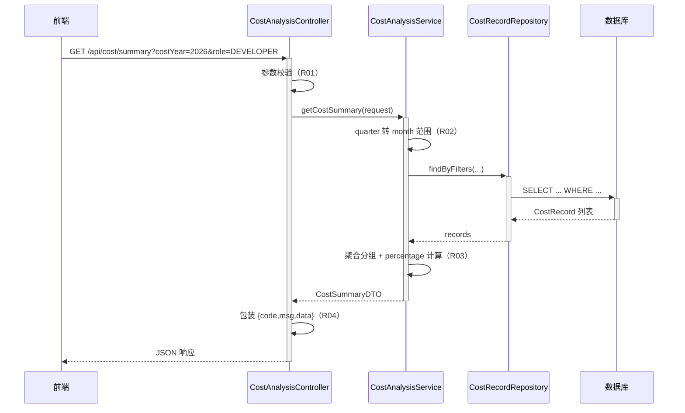
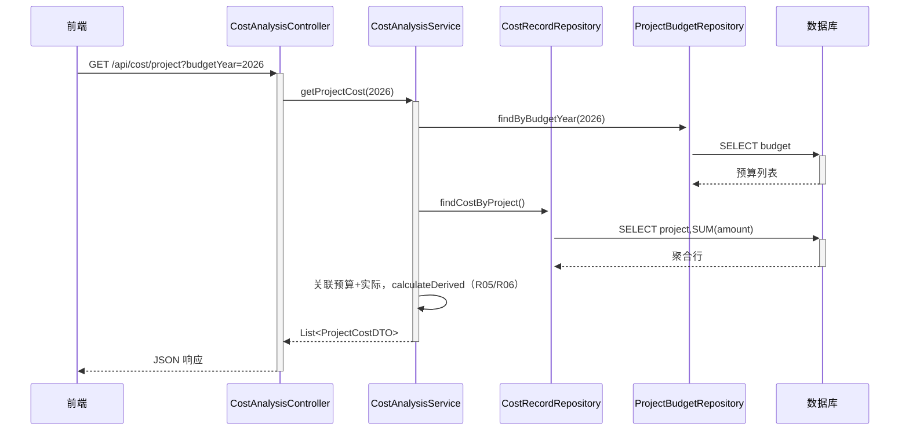
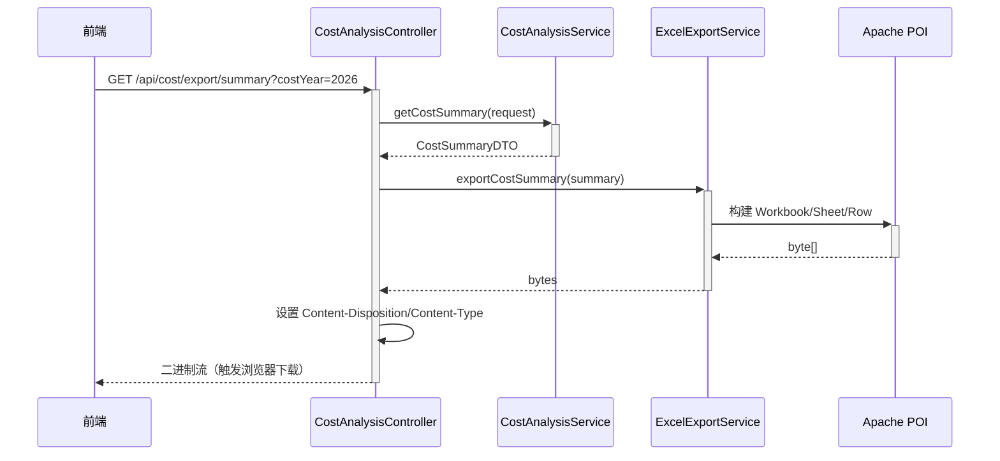

> **文档元信息**
>
> | 项目 | 内容 |
> |------|------|
> | 文档版本 | v1.0 |
> | 作者 | DTCoder（系分生成阶段自动产出） |
> | 创建日期 | 2026-07-31 |
> | 需求来源 | 成本分析报表（Cost Analysis Report）需求描述 |
> | 评审状态 | 待评审 |

# 成本分析报表 系分设计

## 1. 需求与范围

### 背景与目标

企业需要一套成本统计报表系统，用于统计各项成本支出情况。当前缺乏统一的成本可视化与导出能力，管理层无法快速按部门/项目/业务线/人员/时间维度洞察人力成本与项目预算执行情况。本系统目标：前端提供成本分析 Dashboard 与多维度统计页面，后端提供成本数据 REST API 及 Excel 导出能力，支持按部门、项目、业务线、人员、月份、季度、年度多维度展示人力成本（开发、测试、产品、运维）与项目成本（项目预算、实际消耗、预算占比、预计超支金额），并支持报表导出。

### 核心功能

- 成本数据多维统计：按部门、项目、业务线、人员、月份、季度、年度聚合人力成本。
- 人力成本角色拆分：开发、测试、产品、运维四类角色成本占比。
- 项目成本管理：项目预算、实际消耗、预算占比、预计超支金额计算与展示。
- 成本分析 Dashboard：总览卡片 + 趋势图 + 角色占比饼图 + 预算对比柱状图。
- 多维度成本分析页：维度筛选器 + 明细表格 + 图表。
- 报表导出：成本汇总 Excel、项目成本 Excel。

### 约束与非功能要求

- 后端 Java 17，Spring Boot 2.7.18，Maven 构建，包名 `com.library.backend`。
- 前端 Node 18+，Vite 5，TypeScript strict mode，pnpm 包管理。
- API 路径前缀统一 `/api/cost`，所有 JSON 响应 `Content-Type: application/json`。
- 数据库表名前缀 `cost_`，JPA 实体驼峰映射下划线。
- 所有金额字段类型 `BigDecimal`，精度 `scale=2`，货币 `RMB`。
- 跨库接口向后兼容：仅新增字段/接口，不破坏现有契约。
- 前端 axios baseURL 通过 Vite 环境变量 `VITE_API_BASE_URL` 配置。
- 系统为成本只读分析场景，以聚合查询为主，无高频写入并发。

### 排除范围

- 不含成本数据录入/编辑功能（数据由种子数据或后续录入系统提供，本期仅统计展示）。
- 不含用户登录/权限/租户体系（本期为内部分析工具，后续可接入统一鉴权）。
- 不含实时流式成本计算（本期基于关系型库批量聚合）。
- 不含跨云平台（cloud 仓库）集成，cloud 仅作为跨仓工作区参考。

### 需求功能清单与优先级

| 编号 | 功能点 | 优先级 | PRD 原始描述/章节 | 备注 |
|------|--------|--------|-------------------|------|
| F01 | 成本数据多维聚合统计（部门/项目/业务线/人员/月份/季度/年度） | P0 | "按照不同维度展示和统计数据：涉及部门、项目、业务线、人员、月份、季度、年度" | 后端聚合查询 + 前端展示 |
| F02 | 人力成本角色拆分（开发/测试/产品/运维） | P0 | "人力成本（开发、测试、产品、运维）" | EmployeeRole 枚举 + 按角色聚合 |
| F03 | 项目成本：预算/实际消耗/预算占比/预计超支金额 | P0 | "项目成本（项目预算、实际消耗、预算占比、预计超支金额）" | ProjectBudget + 派生计算 |
| F04 | 成本分析 Dashboard 页 | P0 | "前端新建成本统计分析页面以及Dashboard" | 总览卡片 + 图表 |
| F05 | 多维度成本分析页（筛选 + 表格 + 图表） | P0 | "前端新建成本统计分析页面" | 维度筛选器 + 明细表格 |
| F06 | 项目成本明细页 | P1 | "项目成本（...）等信息" | 预算对比柱状图 + 表格 |
| F07 | 报表导出（Excel） | P0 | "支持报表导出" | Apache POI 后端导出 |
| F08 | 月度成本趋势展示 | P1 | "月份"维度衍生 | 折线趋势图 |
| F09 | 季度维度统计 | P1 | "季度"维度 | 由 costMonth 派生季度聚合 |

### 假设与待确认项

| 编号 | 假设/待确认内容 | 当前假设 | 确认状态 |
|------|-----------------|----------|----------|
| A01 | 成本数据来源 | 本期由 `data.sql` 种子数据提供，后续接入录入系统 | 待确认 |
| A02 | 数据库环境 | 开发用 H2 内存库（MySQL 模式），生产用 MySQL 8 | 待确认 |
| A03 | 鉴权方式 | 本期内部分析工具，暂不接入登录鉴权，CORS 允许前端 origin | 待确认 |
| A04 | 货币 | 统一 RMB，金额 BigDecimal scale=2 | 已确认 |
| A05 | 季度定义 | Q1=1-3月，Q2=4-6月，Q3=7-9月，Q4=10-12月 | 待确认 |
| A06 | 成本类型 | 当前仅 LABOR（人力成本），costType 字段预留扩展非人力成本 | 待确认 |
| A07 | 导出格式 | Excel .xlsx（Apache POI ooxml） | 已确认 |

---

## 2. 架构与模块

### 功能架构



- **交互层说明**：对外仅暴露 RESTful `/api/cost/**` 端点（oneapi 风格，供前端 Web 控制台消费），无 OpenAPI 对外接口。
- **核心服务层说明**：成本数据域模块负责多维聚合、角色统计、项目预算派生计算；报表导出模块基于 POI 生成 Excel 二进制流。
- **数据层说明**：6 个 Spring Data JPA Repository，其中 `CostRecordRepository` 承载自定义 JPQL 聚合查询。

**模块清单**

| 模块 | 职责 | 依赖 |
|------|------|------|
| 成本数据域模块（后端） | 实体建模、聚合查询、多维统计、预算派生计算 | CostRecordRepository、ProjectBudgetRepository |
| 报表导出模块（后端） | 基于 Apache POI 生成成本汇总/项目成本 Excel | 成本数据域模块（复用 Service 结果） |
| REST 控制器模块（后端） | 暴露 `/api/cost/**` 端点，统一出参包装，CORS | 成本数据域模块、报表导出模块 |
| 成本分析前端展示模块 | Dashboard/分析页/项目成本页 + 图表组件 + API 封装 | 后端 REST API |

### 应用集成架构



**集成关系说明：**

| 调用方 | 被调用方 | 协议 | 接口类型 | 说明 |
|--------|----------|------|----------|------|
| 用户浏览器 | library-frontend Vite Dev Server | HTTPS | 静态资源 | 开发期 5173 端口 |
| Vite Dev Server | library-backend Controller | HTTP proxy | oneapi REST | 开发期 `/api` 代理到 8080 |
| library-frontend SPA | library-backend Controller | HTTPS/HTTP | oneapi REST | 生产直连，JSON 请求 + Excel 二进制流响应 |
| library-backend Service | H2/MySQL | JDBC | SQL | JPA 聚合查询 |

### 部署架构



**部署说明：**
- **负载均衡层**：Nginx/SLB 统一入口，前端静态资源与后端 API 反向代理分流。
- **应用层**：后端 Spring Boot 单实例（可水平扩副本，无状态）；前端构建产物部署于 Nginx/CDN。
- **数据层**：开发期 H2 内存库；生产 MySQL 8 单主库（成本只读分析，写入由录入系统承担）。

---

## 3. 数据模型与存储

### 实体清单

| 实体名称 | 实体说明 | 所属模块 | 与其他实体的关系 |
|----------|----------|----------|-----------------|
| Department（部门） | 成本归属部门 | 成本数据域 | 一对多 Employee、一对多 Project、一对多 CostRecord |
| BusinessLine（业务线） | 成本归属业务线 | 成本数据域 | 一对多 Employee、一对多 Project、一对多 CostRecord |
| Employee（人员） | 成本归属人员，含角色枚举 | 成本数据域 | 多对一 Department、多对一 BusinessLine；一对多 CostRecord |
| Project（项目） | 成本归属项目 | 成本数据域 | 多对一 BusinessLine、多对一 Department；一对多 CostRecord、一对多 ProjectBudget |
| CostRecord（成本记录） | 人力成本明细 | 成本数据域 | 多对一 Employee、多对一 Project、多对一 Department、多对一 BusinessLine |
| ProjectBudget（项目预算） | 项目年度预算 | 成本数据域 | 多对一 Project |

### 实体关系图



**模型说明：**
- 成本记录（CostRecord）为统计事实表，冗余 department_id/business_line_id 以支持多维聚合下钻，避免全量 join。
- Employee.role 以 Java 枚举 `@Enumerated(EnumType.STRING)` 存为 varchar，符合 db 规范（禁用数据库 enum 类型）。
- 季度维度不在物理表存储，由 costMonth 在 Service 层派生（Q1=1-3...）。
- 金额字段统一 `decimal(12,2)`，预算金额 `decimal(14,2)`（预算量级更大）。

---

## 4. 接口设计

> 全局约定（自动确定，不询问用户）：
> - 错误码格式：`{MODULE}_{SEQ}`，模块映射：`COST`（成本数据域）、`EXP`（报表导出）、`COMMON`（通用）。
> - 通用出参结构：`{code, msg, data}`，`code` 为字符串（成功 `"OK"`，失败如 `"COST_001"`），`msg` 为提示信息，`data` 为业务数据。导出接口例外，返回 Excel 二进制流。

### 4.1 oneapi（Web 控制台接口）

| 编号 | 接口名称 | 方法 | 路径 | 模块 |
|------|----------|------|------|------|
| W01 | 成本汇总查询 | GET | /api/cost/summary | 成本数据域 |
| W02 | 月度趋势查询 | GET | /api/cost/trend | 成本数据域 |
| W03 | 人力成本角色占比查询 | GET | /api/cost/role | 成本数据域 |
| W04 | 项目成本查询 | GET | /api/cost/project | 成本数据域 |
| W05 | 维度聚合查询 | GET | /api/cost/dimension | 成本数据域 |
| W06 | 成本汇总 Excel 导出 | GET | /api/cost/export/summary | 报表导出 |
| W07 | 项目成本 Excel 导出 | GET | /api/cost/export/project | 报表导出 |

### 4.2 OpenAPI（对外接口）

无对外接口（本期为内部分析工具，不暴露 OpenAPI）。

### 4.3 内部接口（Service 层）

| 编号 | 接口名称 | 类 | 方法签名 |
|------|----------|------|----------|
| S01 | 成本汇总 | CostAnalysisService | `CostSummaryDTO getCostSummary(CostQueryRequest req)` |
| S02 | 月度趋势 | CostAnalysisService | `List<DimensionStatDTO> getMonthlyTrend(Integer costYear)` |
| S03 | 角色成本占比 | CostAnalysisService | `List<DimensionStatDTO> getCostByRole()` |
| S04 | 项目成本 | CostAnalysisService | `List<ProjectCostDTO> getProjectCost(Integer budgetYear)` |
| S05 | 维度聚合 | CostAnalysisService | `List<DimensionStatDTO> getCostByDimension(String dimension, Integer year)` |
| S06 | 成本汇总导出 | ExcelExportService | `byte[] exportCostSummary(CostSummaryDTO summary)` |
| S07 | 项目成本导出 | ExcelExportService | `byte[] exportProjectCost(List<ProjectCostDTO> projects)` |

### 4.4 集成接口（Integration 层）

无外部系统集成接口（本期数据由种子数据提供，不接入外部录入系统）。

---

## 5. 功能模块设计

### 5.1 成本数据域模块（后端）

#### 5.1.1 表结构设计

##### 5.1.1.1 cost_department（部门）

| 字段名 | 数据类型 | 约束 | 默认值 | 说明 |
|--------|----------|------|--------|------|
| id | bigint | PK, 自增 | - | 系统自增主键 |
| name | varchar(100) | NOT NULL | - | 部门名称 |
| description | varchar(200) | NULL | - | 部门描述 |
| gmt_create | datetime | NOT NULL | CURRENT_TIMESTAMP | 创建时间 |
| gmt_modified | datetime | NOT NULL | CURRENT_TIMESTAMP | 修改时间 |

**索引：**
- UK: `uk_cost_department_name` (name)
- IDX: 无

##### 5.1.1.2 cost_business_line（业务线）

| 字段名 | 数据类型 | 约束 | 默认值 | 说明 |
|--------|----------|------|--------|------|
| id | bigint | PK, 自增 | - | 系统自增主键 |
| name | varchar(100) | NOT NULL | - | 业务线名称 |
| description | varchar(200) | NULL | - | 业务线描述 |
| gmt_create | datetime | NOT NULL | CURRENT_TIMESTAMP | 创建时间 |
| gmt_modified | datetime | NOT NULL | CURRENT_TIMESTAMP | 修改时间 |

**索引：**
- UK: `uk_cost_business_line_name` (name)

##### 5.1.1.3 cost_employee（人员）

| 字段名 | 数据类型 | 约束 | 默认值 | 说明 |
|--------|----------|------|--------|------|
| id | bigint | PK, 自增 | - | 系统自增主键 |
| name | varchar(50) | NOT NULL | - | 人员姓名 |
| role | varchar(20) | NOT NULL | - | 角色（DEVELOPER/TESTER/PRODUCT/OPS），JPA 枚举字符串存储 |
| department_id | bigint | NOT NULL | - | 所属部门 FK |
| business_line_id | bigint | NOT NULL | - | 所属业务线 FK |
| gmt_create | datetime | NOT NULL | CURRENT_TIMESTAMP | 创建时间 |
| gmt_modified | datetime | NOT NULL | CURRENT_TIMESTAMP | 修改时间 |

**索引：**
- IDX: `idx_cost_employee_dept` (department_id)
- IDX: `idx_cost_employee_biz` (business_line_id)

##### 5.1.1.4 cost_project（项目）

| 字段名 | 数据类型 | 约束 | 默认值 | 说明 |
|--------|----------|------|--------|------|
| id | bigint | PK, 自增 | - | 系统自增主键 |
| name | varchar(100) | NOT NULL | - | 项目名称 |
| business_line_id | bigint | NULL | - | 所属业务线 FK |
| department_id | bigint | NULL | - | 归口部门 FK |
| gmt_create | datetime | NOT NULL | CURRENT_TIMESTAMP | 创建时间 |
| gmt_modified | datetime | NOT NULL | CURRENT_TIMESTAMP | 修改时间 |

**索引：**
- IDX: `idx_cost_project_biz` (business_line_id)
- IDX: `idx_cost_project_dept` (department_id)

##### 5.1.1.5 cost_record（成本记录-事实表）

| 字段名 | 数据类型 | 约束 | 默认值 | 说明 |
|--------|----------|------|--------|------|
| id | bigint | PK, 自增 | - | 系统自增主键 |
| employee_id | bigint | NOT NULL | - | 人员 FK |
| project_id | bigint | NULL | - | 项目 FK（可空，非项目分摊成本） |
| department_id | bigint | NOT NULL | - | 部门 FK（冗余，加速聚合） |
| business_line_id | bigint | NOT NULL | - | 业务线 FK（冗余，加速聚合） |
| cost_year | int | NOT NULL | - | 成本年度 |
| cost_month | int | NOT NULL | - | 成本月份（1-12） |
| amount | decimal(12,2) | NOT NULL | - | 成本金额（RMB） |
| cost_type | varchar(20) | NOT NULL | - | 成本类型（LABOR 人力，预留扩展） |
| gmt_create | datetime | NOT NULL | CURRENT_TIMESTAMP | 创建时间 |
| gmt_modified | datetime | NOT NULL | CURRENT_TIMESTAMP | 修改时间 |

**索引：**
- IDX: `idx_cost_record_year_month` (cost_year, cost_month)
- IDX: `idx_cost_record_dept` (department_id)
- IDX: `idx_cost_record_biz` (business_line_id)
- IDX: `idx_cost_record_proj` (project_id)
- IDX: `idx_cost_record_emp` (employee_id)

##### 5.1.1.6 cost_project_budget（项目预算）

| 字段名 | 数据类型 | 约束 | 默认值 | 说明 |
|--------|----------|------|--------|------|
| id | bigint | PK, 自增 | - | 系统自增主键 |
| project_id | bigint | NOT NULL | - | 项目 FK |
| budget_year | int | NOT NULL | - | 预算年度 |
| budget_amount | decimal(14,2) | NOT NULL | - | 预算金额（RMB） |
| gmt_create | datetime | NOT NULL | CURRENT_TIMESTAMP | 创建时间 |
| gmt_modified | datetime | NOT NULL | CURRENT_TIMESTAMP | 修改时间 |

**索引：**
- UK: `uk_cost_project_budget_proj_year` (project_id, budget_year)

##### 5.1.1.x 枚举与常量定义

| 枚举名称 | 取值 | 含义 | 关联字段 |
|----------|------|------|----------|
| EmployeeRole | DEVELOPER | 开发 | cost_employee.role |
| EmployeeRole | TESTER | 测试 | cost_employee.role |
| EmployeeRole | PRODUCT | 产品 | cost_employee.role |
| EmployeeRole | OPS | 运维 | cost_employee.role |
| CostType | LABOR | 人力成本 | cost_record.cost_type |

> 说明：枚举在 Java 层以 `enum` + `@Enumerated(EnumType.STRING)` 存储，数据库列为 varchar，不使用数据库 enum 类型（符合 db 规范）。

#### 5.1.2 接口详细设计

##### W01 成本汇总查询

- **URI**: GET `/api/cost/summary`
- **描述**: 按多维度筛选条件查询成本汇总，返回总成本、人力成本、记录数及按部门/角色/月份分组明细
- **入参**（Query 参数）:

| 参数名称 | 类型 | 是否必填 | 描述 |
|----------|------|----------|------|
| departmentId | Long | 否 | 部门 ID |
| businessLineId | Long | 否 | 业务线 ID |
| projectId | Long | 否 | 项目 ID |
| employeeId | Long | 否 | 人员 ID |
| costYear | Integer | 否 | 年度 |
| costMonth | Integer | 否 | 月份（1-12） |
| quarter | Integer | 否 | 季度（1-4，Service 层转月份范围） |
| role | String | 否 | 角色（DEVELOPER/TESTER/PRODUCT/OPS） |

- **出参**:

| 参数名称 | 类型 | 描述 |
|----------|------|------|
| code | String | 结果 code |
| msg | String | 提示信息 |
| data | CostSummaryDTO | 成本汇总数据 |

CostSummaryDTO:

| 参数名称 | 类型 | 描述 |
|----------|------|------|
| totalCost | BigDecimal | 总成本 |
| laborCost | BigDecimal | 人力成本 |
| recordCount | Integer | 记录数 |
| byDepartment | List&lt;DimensionStatDTO&gt; | 按部门分组 |
| byRole | List&lt;DimensionStatDTO&gt; | 按角色分组 |
| byMonth | List&lt;DimensionStatDTO&gt; | 按月份分组 |

DimensionStatDTO:

| 参数名称 | 类型 | 描述 |
|----------|------|------|
| dimensionName | String | 维度名称 |
| amount | BigDecimal | 金额 |
| percentage | Double | 占比百分比 |

- **错误码**:

| 错误码 | 说明 |
|--------|------|
| COST_001 | 查询参数非法（quarter 不在 1-4 等） |
| COMMON_500 | 服务内部错误 |

- **业务规则**: quarter 参数在 Service 层转换为 costMonth 范围（Q1→1-3）叠加到筛选；percentage = 分组金额 / 总金额 × 100，保留 2 位。

- **请求示例**:
```
GET /api/cost/summary?costYear=2026&role=DEVELOPER
```

- **响应示例**:
```json
{
  "code": "OK",
  "msg": "SUCCESS",
  "data": {
    "totalCost": 206000.00,
    "laborCost": 206000.00,
    "recordCount": 9,
    "byDepartment": [{"dimensionName":"研发部","amount":110000.00,"percentage":53.40}],
    "byRole": [{"dimensionName":"DEVELOPER","amount":100000.00,"percentage":48.54}],
    "byMonth": [{"dimensionName":"2026-01","amount":88000.00,"percentage":42.72}]
  }
}
```

##### W02 月度趋势查询

- **URI**: GET `/api/cost/trend`
- **描述**: 查询指定年度的月度成本趋势
- **入参**:

| 参数名称 | 类型 | 是否必填 | 描述 |
|----------|------|----------|------|
| year | Integer | 否 | 年度，缺省查全部 |

- **出参**: `data` 为 `List<DimensionStatDTO>`（dimensionName 为 "yyyy-MM"）
- **错误码**: COMMON_500
- **业务规则**: 按 costYear, costMonth 分组求和，percentage 相对该年度总成本。

##### W03 人力成本角色占比查询

- **URI**: GET `/api/cost/role`
- **描述**: 查询人力成本按角色（开发/测试/产品/运维）的占比
- **入参**: 无
- **出参**: `data` 为 `List<DimensionStatDTO>`（dimensionName 为角色名）
- **业务规则**: 按 employee.role 分组求和，percentage 相对所有角色总成本。

##### W04 项目成本查询

- **URI**: GET `/api/cost/project`
- **描述**: 查询项目成本明细，含预算、实际消耗、预算占比、预计超支金额
- **入参**:

| 参数名称 | 类型 | 是否必填 | 描述 |
|----------|------|----------|------|
| budgetYear | Integer | 否 | 预算年度 |

- **出参**: `data` 为 `List<ProjectCostDTO>`

ProjectCostDTO:

| 参数名称 | 类型 | 描述 |
|----------|------|------|
| projectId | Long | 项目 ID |
| projectName | String | 项目名称 |
| budgetAmount | BigDecimal | 预算金额（无预算则 null） |
| actualCost | BigDecimal | 实际消耗 |
| budgetUsageRate | BigDecimal | 预算占比（%），actualCost/budgetAmount×100 |
| overspendAmount | BigDecimal | 预计超支金额，max(actualCost-budgetAmount, 0) |

- **业务规则**: 实际消耗 = 该项目 cost_record amount 求和（按 budgetYear 过滤 cost_year）；budgetAmount 为 0 或 null 时，budgetUsageRate=0、overspendAmount=0。
- **错误码**: COMMON_500

##### W05 维度聚合查询

- **URI**: GET `/api/cost/dimension`
- **描述**: 按指定维度聚合成本
- **入参**:

| 参数名称 | 类型 | 是否必填 | 描述 |
|----------|------|----------|------|
| dimension | String | 是 | 维度名（department/businessLine/project/employee/quarter） |
| year | Integer | 否 | 年度过滤 |

- **出参**: `data` 为 `List<DimensionStatDTO>`
- **业务规则**: dimension=quarter 时按 costMonth 派生季度聚合；其余维度直接 group by。
- **错误码**: COST_002（dimension 取值非法）

##### W06 成本汇总 Excel 导出

- **URI**: GET `/api/cost/export/summary`
- **描述**: 导出成本汇总 Excel，入参同 W01
- **入参**: 同 W01（Query 参数）
- **出参**: 二进制流，`Content-Type: application/vnd.openxmlformats-officedocument.spreadsheetml.sheet`，`Content-Disposition: attachment; filename*=UTF-8''成本汇总报表.xlsx`
- **业务规则**: 复用 S01 结果，POI 生成 Sheet，含总成本/部门/角色/月份明细。
- **错误码**: EXP_001（导出失败）

##### W07 项目成本 Excel 导出

- **URI**: GET `/api/cost/export/project`
- **描述**: 导出项目成本 Excel
- **入参**: 同 W04（budgetYear）
- **出参**: 二进制流，文件名 `项目成本报表.xlsx`
- **业务规则**: 复用 S04 结果。
- **错误码**: EXP_001

#### 5.1.3 子功能详细设计

##### 5.1.3.1 成本多维聚合查询（F01）

- 处理时序图


**业务规则：**
| 规则编号 | 规则描述 | 校验时机 | 不满足时的处理 |
|----------|----------|----------|--------------|
| R01 | quarter ∈ {1,2,3,4} 或为空 | 始终 | 返回 COST_001，提示"季度参数非法" |
| R02 | quarter 转月份范围 Q1→1-3 | 查询前 | 叠加 costMonth 范围筛选 |
| R03 | percentage = 分组金额/总金额×100 | 聚合后 | 总金额为 0 时 percentage=0.0 |
| R04 | 统一出参 {code,msg,data} | 返回前 | 成功 code="OK"，msg="SUCCESS" |

**异常场景：**
| 异常场景 | 处理方式 |
|----------|----------|
| 数据库连接失败 | 捕获 DataAccessException，返回 COMMON_500，提示"服务内部错误" |
| 查询结果为空 | 返回 totalCost=0、空列表，非错误 |

**并发控制（如涉及数据写入）：**
- 并发场景：成本分析为只读查询，无写入并发风险。
- 控制策略：无并发风险，原因：本期 cost_record 由种子数据/录入系统写入，统计接口纯只读。

**状态机设计：**
- 本模块无状态流转实体（cost_record 为不可变事实记录），无状态机。

##### 5.1.3.2 项目预算派生计算（F03）

- 处理时序图


**业务规则：**
| 规则编号 | 规则描述 | 校验时机 | 不满足时的处理 |
|----------|----------|----------|--------------|
| R05 | budgetUsageRate = actualCost×100/budgetAmount，保留 2 位 | 计算时 | budgetAmount≤0 或 null 时置 0 |
| R06 | overspendAmount = max(actualCost-budgetAmount, 0) | 计算时 | 无预算时置 0 |

**异常场景：**
| 异常场景 | 处理方式 |
|----------|----------|
| 项目无预算记录 | budgetAmount=null，占比/超支置 0，不报错 |

##### 5.1.3.3 报表导出（F07）

- 处理时序图


**业务规则：**
| 规则编号 | 规则描述 | 校验时机 | 不满足时的处理 |
|----------|----------|----------|--------------|
| R07 | 文件名 UTF-8 编码（filename*=UTF-8''） | 返回前 | 始终使用 URLEncoder |
| R08 | 导出异常捕获 | 始终 | 返回 EXP_001，提示"导出失败" |

**异常场景：**
| 异常场景 | 处理方式 |
|----------|----------|
| POI 内存溢出（大数据量） | 本期数据量小，不预期；后续可分 Sheet/流式写入 |

**并发控制：**
- 并发场景：多用户同时导出，无写入冲突。
- 控制策略：无并发风险，原因：导出为只读聚合 + 内存生成，无共享可变状态。

### 5.2 报表导出模块（后端）

> 与 5.1.3.3 合并描述。ExcelExportService 提供 S06/S07 两个方法，基于 Apache POI 5.2.3 构建 Workbook。Sheet 结构：
> - 成本汇总导出：Sheet1 总览（总成本/人力成本/记录数）+ Sheet2 部门明细 + Sheet3 角色明细 + Sheet4 月份明细。
> - 项目成本导出：Sheet1 项目列表（项目名/预算/实际/占比/超支）。
>
> 本模块无独立表结构，复用成本数据域 Service 结果。

### 5.3 成本分析前端展示模块（library-frontend）

> 前端模块无表结构设计。页面与组件结构如下：

**页面与组件清单：**

| 文件 | 职责 |
|------|------|
| `src/App.tsx` | 路由（/dashboard、/analysis、/project）+ Ant Design Layout 菜单 |
| `src/pages/Dashboard.tsx` | 成本分析 Dashboard：StatCard 总览 + 趋势图 + 角色饼图 + 预算柱状图 |
| `src/pages/CostAnalysis.tsx` | 多维度成本分析页：DimensionFilter + 部门/月份明细 Table + 图表 |
| `src/pages/ProjectCost.tsx` | 项目成本明细页：预算对比柱状图 + Table（占比/超支 Tag 着色）+ 导出按钮 |
| `src/components/StatCard.tsx` | 统计概览卡片（Ant Design Statistic） |
| `src/components/CostTrendChart.tsx` | 月度趋势折线图（ECharts） |
| `src/components/RoleCostPie.tsx` | 人力成本角色占比饼图（ECharts，角色中文标签映射） |
| `src/components/ProjectBudgetBar.tsx` | 项目预算 vs 实际消耗柱状图（ECharts） |
| `src/components/DimensionFilter.tsx` | 维度筛选器（部门/业务线/项目/年度/月份/角色 + 查询/导出按钮） |
| `src/hooks/useCostData.ts` | 成本数据获取 hooks（useCostSummary/useMonthlyTrend/useProjectCost/useCostByRole） |
| `src/api/client.ts` | axios 实例，baseURL 由 VITE_API_BASE_URL 配置 |
| `src/api/costApi.ts` | 成本 API 请求封装（getCostSummary/getMonthlyTrend/getCostByRole/getProjectCost/getCostByDimension/exportSummaryUrl/exportProjectCostUrl） |
| `src/types/cost.ts` | TS 类型定义（CostQueryRequest/CostSummary/DimensionStat/ProjectCost/EmployeeRole） |

**前端业务规则：**
| 规则编号 | 规则描述 |
|----------|----------|
| FR01 | 预算占比 >100% 红色 Tag，>80% 橙色 Tag，其余绿色 Tag |
| FR02 | 预计超支金额 >0 显示红色 Tag，否则显示 "—" |
| FR03 | 导出按钮调用 exportSummaryUrl/exportProjectCostUrl 构造 URL，window.open 触发下载 |
| FR04 | 角色饼图中文标签映射：DEVELOPER→开发、TESTER→测试、PRODUCT→产品、OPS→运维 |
| FR05 | Dashboard 默认加载当前年度数据 |

**前端异常场景：**
| 异常场景 | 处理方式 |
|----------|----------|
| API 请求失败 | axios 拦截器 console.error，hooks setError 展示 |
| 数据为空 | StatCard 显示 0，图表显示空状态 |

---

## 6. 非功能性需求设计

### 6.1 高可用性
- 后端 Spring Boot 无状态，可多副本部署；MySQL 主库单点风险由录入系统侧保障，本期只读。
- 前端静态产物 CDN 多边缘节点，天然高可用。
- 第三方依赖：Apache POI 为本地计算，无外部服务依赖，无降级需求。

### 6.2 可扩展性
- 水平扩缩容：后端无状态可横向扩副本，前端静态产物可扩 CDN。
- 维度扩展：CostRecord 冗余 department_id/business_line_id，新增维度（如成本中心）可加冗余列 + 聚合查询，向后兼容。
- 成本类型扩展：cost_type 字段预留，新增非人力成本类型不影响现有聚合。

### 6.3 稳定性/可靠性
- 聚合查询大数据量风险：单表预计 1-2 年内 < 500w 行（db 规范阈值），暂不分表；超阈值后续按 cost_year 分区。
- 空结果稳定性：所有查询接口对空结果返回零值/空列表，不报错。
- 导出稳定性：本期数据量小，POI 内存安全；后续大数据量采用分 Sheet/流式 SXSSFWorkbook。

### 6.4 安全性设计

#### 6.4.1 账户系统方案
- 本期内部分析工具，暂不接入登录鉴权（A03 待确认）。后续可接入统一鉴权（如 OAuth/SSO）。

#### 6.4.2 授权&访问控制
##### 6.4.2.1 是否实现水平权限检查
- 不涉及：本期为公共成本分析数据，无租户/个人隔离需求。

##### 6.4.2.2 是否实现垂直权限检查
- 不涉及：本期无角色权限分级，后续接入鉴权后补充。

##### 6.4.2.3 是否检查登录态
- 本期未检查登录态，CORS 允许前端 origin。后续接入鉴权后由全局拦截器统一检查。

#### 6.4.3 数据防护方案
##### 6.4.3.1 是否对敏感数据加密存储
- 不涉及：成本金额为内部经营数据，非个人敏感信息（身份证/银行卡等），无需加密存储。

##### 6.4.3.2 是否对敏感数据展示进行脱敏
- 不涉及：人员姓名为内部工号级展示，非对外公开，暂不脱敏；后续若对外展示需脱敏。

### 6.5 监控/统计/日志/告警
- 后端 logging.level.com.library.backend=DEBUG（开发期），生产调 INFO。
- 关键监控点：API 调用量、聚合查询耗时、导出接口耗时与失败率。
- 告警点：聚合查询 P99 耗时 > 2s、导出失败率 > 1%。

---

## 7. 变更三板斧

### 7.1 可监控
- 服务埋点：CostAnalysisController 各端点记录调用次数、处理结果（code）、处理耗时。
- 三方服务埋点：无外部三方依赖（POI 本地计算）。
- 数据库埋点：JPA show-sql=true（开发期），生产关闭；慢查询由 DB 侧监控。

### 7.2 可灰度
- 本期为全新功能（无旧逻辑），首期全量上线即可，无需灰度。
- 后续若成本域有变更，可按部门尾号灰度引流（dimension 过滤）。

### 7.3 可应急
- 开关控制：cost_type 维度可作为功能开关（仅 LABOR 上线，扩展类型灰度）。
- 回滚兜底：本期为新增模块，回滚即下线 `/api/cost/**` 路由，不影响既有图书管理功能（library-backend 现有空仓库）。
- 回滚依赖：无上下游依赖，回滚安全。

---

## 8. 方案检查（Step 9 checklist）

| 序号 | 检查项 | 结果 | 说明 |
|------|--------|------|------|
| 1 | 模块划分合理性检查（单一职责） | 通过 | 成本数据域/报表导出/前端展示三模块职责单一，接口清晰 |
| 2 | 模块间依赖合理性检查 | 通过 | 导出模块单向依赖成本数据域 Service，无循环依赖 |
| 3 | 数据模型完整性检查 | 通过 | 6 实体覆盖部门/业务线/人员/项目/成本记录/预算，关系完整 |
| 4 | 数据库命名规范检查 | 通过 | 表名 cost_ 前缀小写下划线，索引 pk_/uk_/idx_ 前缀，金额 decimal，时间 datetime |
| 5 | 接口完整性检查 | 通过 | 7 个 oneapi 接口覆盖需求 F01-F09，无 OpenAPI/集成接口（本期不涉及） |
| 6 | 接口出入参类型匹配检查 | 通过 | CostSummaryDTO/DimensionStatDTO/ProjectCostDTO 前后端类型对齐（Java BigDecimal ↔ TS number） |
| 7 | 跨库接口契约兼容性检查 | 通过 | /api/cost/** 全为新增，不破坏 library 既有契约 |
| 8 | 错误码完整性检查 | 通过 | COST_001/002、EXP_001、COMMON_500 覆盖主要异常 |
| 9 | 通用出参结构一致性检查 | 通过 | 统一 {code,msg,data}，导出接口例外返回二进制流 |
| 10 | 业务规则完整性检查 | 通过 | R01-R08 + FR01-FR05 覆盖校验/派生/着色/导出 |
| 11 | 异常场景处理检查 | 通过 | DB 异常/空结果/无预算/导出失败均有处理 |
| 12 | 并发控制检查 | 通过 | 只读分析无写入并发，已说明 |
| 13 | 状态机检查 | 不适用 | cost_record 为不可变事实，无状态流转 |
| 14 | 非功能性需求完整性检查 | 通过 | 高可用/扩展/稳定/安全/监控均覆盖 |
| 15 | 安全性检查 | 通过（附待确认） | 本期内部分析暂不鉴权（A03 待确认），后续接入统一鉴权 |
| 16 | 变更三板斧检查 | 通过 | 可监控/可灰度/可应急均设计 |
| 17 | 需求覆盖检查 | 通过 | F01-F09 全覆盖（详见需求追溯） |
| 18 | 占位符扫描 | 通过 | 无 TBD/TODO 占位符 |
| 19 | 跨仓产物落盘检查 | 通过 | design.md 落盘于 library-backend worktree_path 下 .agents/system.changes/ |

**需求追溯矩阵：**

| 需求项 | 覆盖章节 | 状态 |
|--------|----------|------|
| 统计企业各项成本支出 | §5.1（聚合查询）+ §4 W01/W05 | ✅ |
| 前端成本统计分析页面 | §5.3（CostAnalysis.tsx）+ §4 W01 | ✅ |
| 前端 Dashboard | §5.3（Dashboard.tsx）+ §4 W01/W02/W03/W04 | ✅ |
| 按部门维度展示 | §5.1.1.1 + §5.1.3.1 + §4 W01 byDepartment | ✅ |
| 按项目维度展示 | §5.1.1.4/5/6 + §5.1.3.2 + §4 W04 | ✅ |
| 按业务线维度展示 | §5.1.1.2 + §4 W05 dimension=businessLine | ✅ |
| 按人员维度展示 | §5.1.1.3 + §4 W05 dimension=employee | ✅ |
| 按月份维度展示 | §5.1.1.5 cost_month + §4 W02 | ✅ |
| 按季度维度展示 | §5.1.3.1 R02 + §4 W05 dimension=quarter | ✅ |
| 按年度维度展示 | §5.1.1.5 cost_year + §4 W01/W04 | ✅ |
| 人力成本（开发/测试/产品/运维） | §5.1.1.x EmployeeRole + §4 W03 | ✅ |
| 项目预算 | §5.1.1.6 + §5.1.3.2 R05 | ✅ |
| 实际消耗 | §5.1.3.2（cost_record 聚合到 project） | ✅ |
| 预算占比 | §5.1.3.2 R05 budgetUsageRate | ✅ |
| 预计超支金额 | §5.1.3.2 R06 overspendAmount | ✅ |
| 支持报表导出 | §5.2 + §4 W06/W07 | ✅ |

无遗漏需求项。
