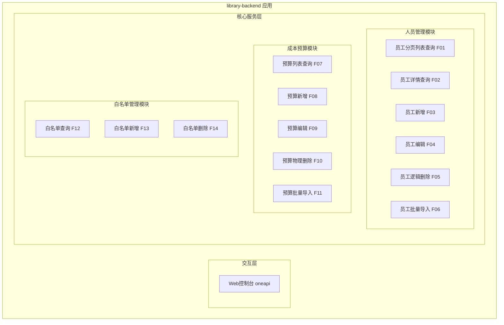
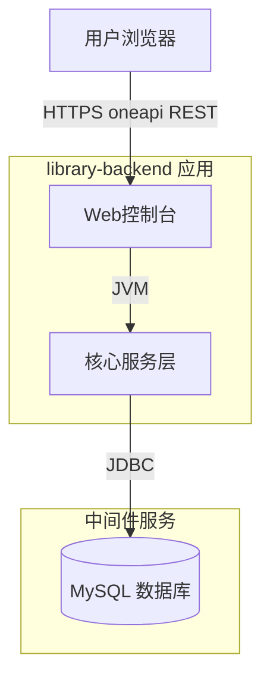
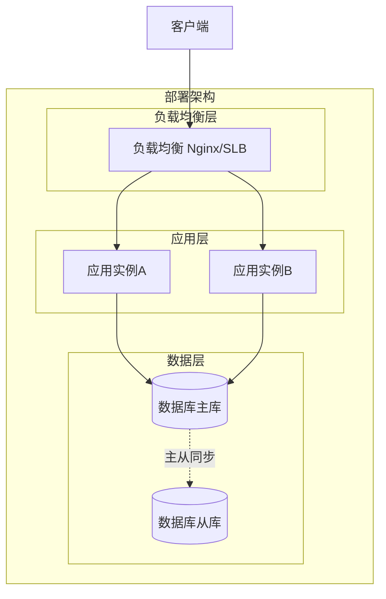
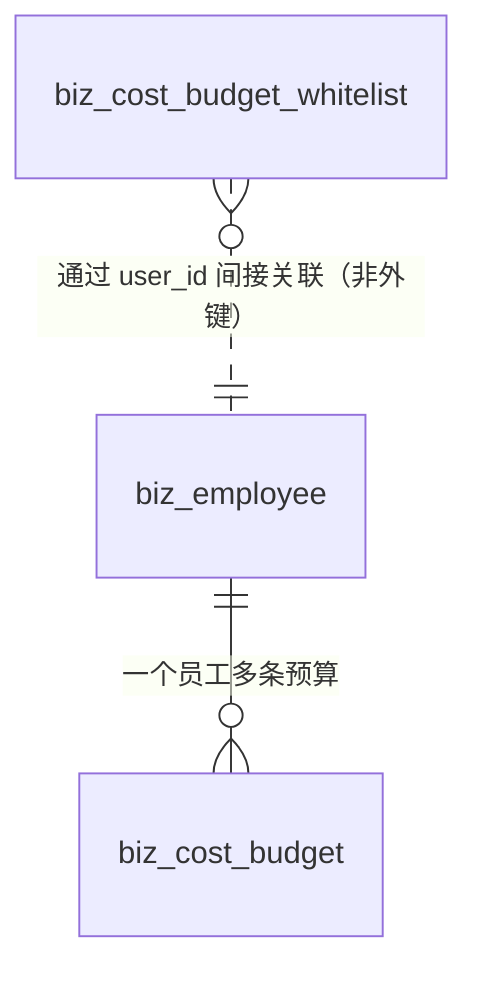
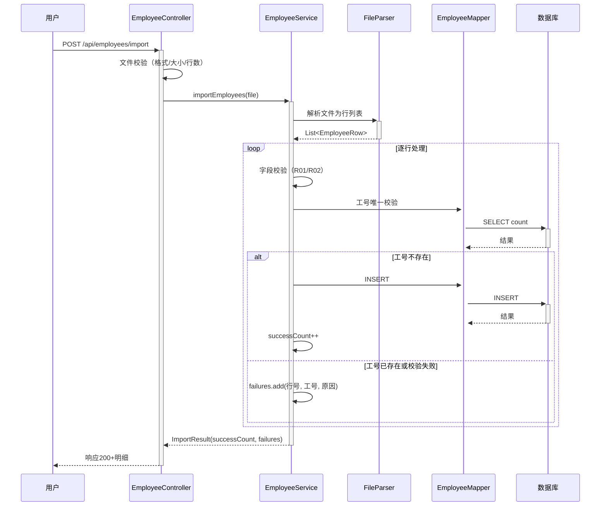
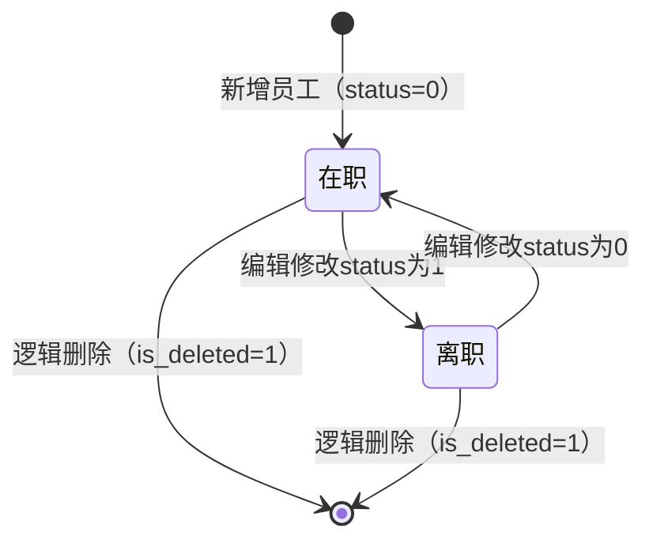
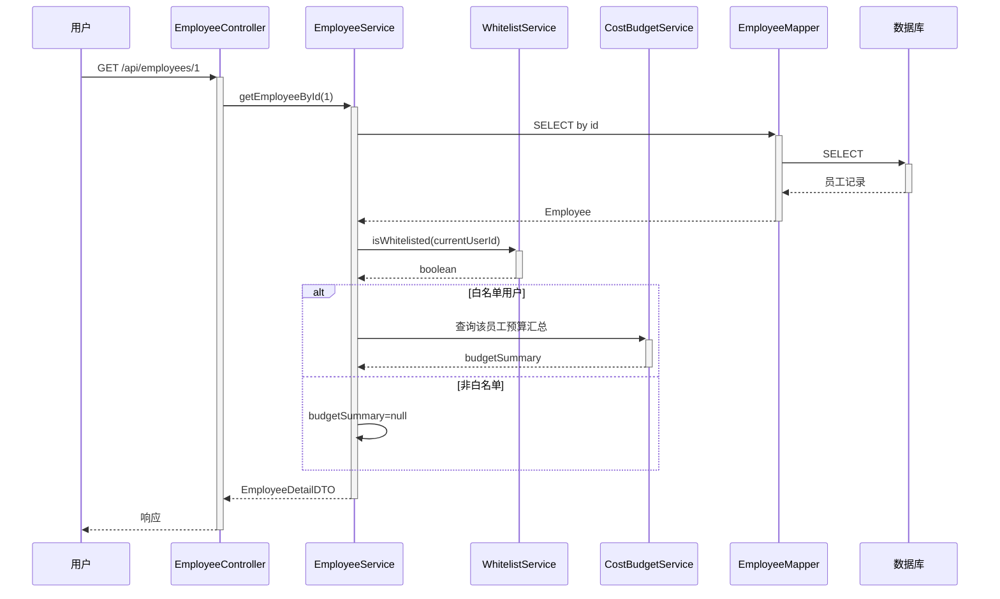
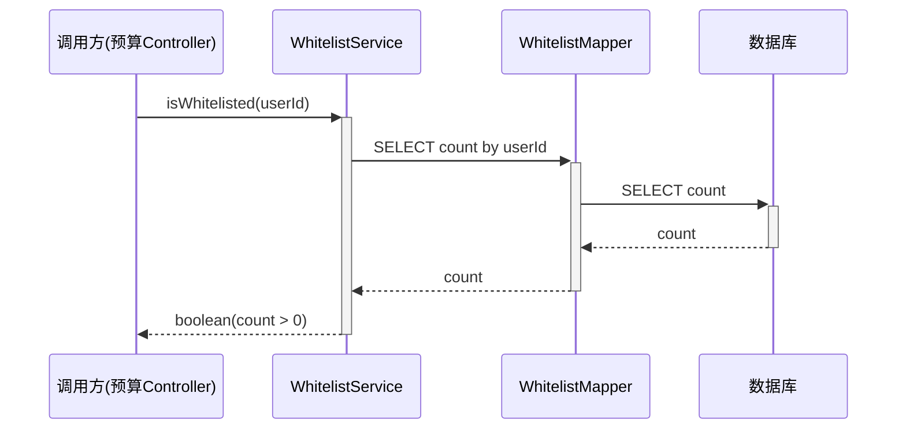
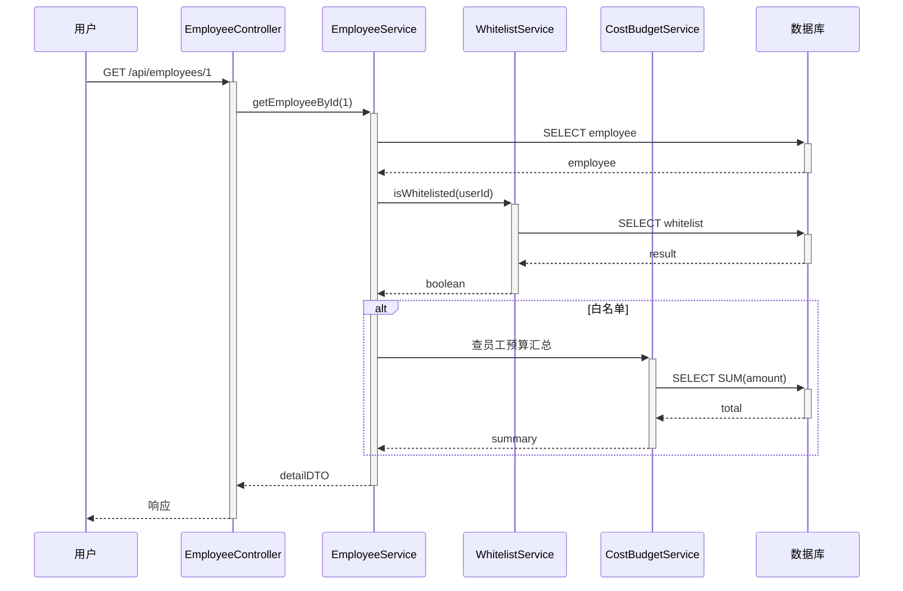

> **文档元信息**
>
> | 项目 | 内容 |
> |------|------|
> | 文档版本 | v1.0 |
> | 作者 | DTCoder（系分生成自动产出） |
> | 创建日期 | 2026-07-30 |
> | 需求来源 | docs/specs/2026-07-30-personnel-dashboard-clarification.md |
> | 评审状态 | 待评审 |

# 人员看板 系分设计

## 1. 需求与范围

- **背景与目标**：开发一个人员信息管理面板（非敏捷看板），承载两个业务域：域 A 人员管理（员工基本信息 CRUD + 批量导入）和域 B 成本预算（按人员记录预算金额，带白名单可见性控制 + 批量导入）。目标为团队提供统一的人员信息维护入口与成本预算管控能力。
- **核心功能**：员工信息分页查询/详情/新增/编辑/逻辑删除/批量导入；成本预算列表/新增/编辑/物理删除/批量导入/白名单管理。
- **约束与非功能要求**：
  - 导入文件格式：Excel(.xlsx) 优先，CSV 兼容；单次导入上限 1000 行，文件上限 5MB。
  - 导入采用逐行独立处理——单行失败不影响其他行入库；整体级失败（格式/大小/超限）直接拒绝不进入解析。
  - 成本预算仅对白名单用户可见，非白名单返回 403 且不泄露数据是否存在。
  - 工号全局唯一；人员逻辑删除（软删），预算物理删除。
  - 接口 RESTful 风格，仅新增向后兼容。
  - 前后端 REST 契约一致（字段名、分页参数、导入响应结构）。
- **排除范围**：敏捷拖拽看板、成本实际发生额核算、部门树管理、预算审批流、SSO/组织架构同步。

### 需求功能清单与优先级

| 编号 | 功能点 | 优先级 | PRD 原始描述/章节 | 备注 |
|------|--------|--------|-------------------|------|
| F01 | 员工分页列表查询（按姓名/工号/部门/在职状态筛选） | P0 | 澄清文档 §3 人员管理 | 列表默认过滤已删除 |
| F02 | 员工详情查询（含该人预算汇总） | P0 | 澄清文档 §3 人员管理 | 预算汇总需白名单鉴权 |
| F03 | 员工新增（工号唯一校验） | P0 | 澄清文档 §3 人员管理 | 工号不可重复 |
| F04 | 员工编辑（工号不可改） | P0 | 澄清文档 §3 人员管理 | 仅可改非工号字段 |
| F05 | 员工逻辑删除（软删） | P0 | 澄清文档 §3 人员管理 | 预算关联仍可读 |
| F06 | 员工批量导入（返回成功数+失败明细） | P0 | 澄清文档 §3 人员管理 | Excel/CSV 逐行处理 |
| F07 | 成本预算列表查询（人员+月份维度） | P0 | 澄清文档 §3 成本预算 | 白名单鉴权 |
| F08 | 成本预算新增 | P0 | 澄清文档 §3 成本预算 | 白名单鉴权，唯一索引兜底 |
| F09 | 成本预算编辑 | P0 | 澄清文档 §3 成本预算 | 白名单鉴权 |
| F10 | 成本预算物理删除 | P0 | 澄清文档 §3 成本预算 | 白名单鉴权 |
| F11 | 成本预算批量导入（工号/月份/金额） | P0 | 澄清文档 §3 成本预算 | 白名单鉴权，逐行处理 |
| F12 | 成本预算白名单查询 | P0 | 澄清文档 §3 成本预算 | 查询白名单用户 |
| F13 | 成本预算白名单新增 | P0 | 澄清文档 §3 成本预算 | 添加白名单用户 |
| F14 | 成本预算白名单删除 | P0 | 澄清文档 §3 成本预算 | 移除白名单用户 |

### 假设与待确认项

| 编号 | 假设/待确认内容 | 当前假设 | 确认状态 |
|------|-----------------|----------|----------|
| A01 | 部门是否升级为独立实体 | 假设：当前为字符串字段，不做独立实体表，原因：需求未要求部门树管理，简化实现 | 已确认 |
| A02 | 白名单 userId 取自何种认证体系 | 假设：外部标识字符串，由调用方传入 user_id，后端不做 SSO 对接 | 已确认 |
| A03 | 预算是否需部门/项目汇总视图 | 假设：当前仅按人×月，不做汇总视图，原因：需求未要求 | 已确认 |
| A04 | 前端技术栈选型 | 假设：待 library-frontend 初始化确认，本系分聚焦后端 | 已确认 |
| A05 | 租户隔离 | 假设：默认采用 tenant_id 做租户隔离（全量模式新增 tenant_id 字段） | 已确认 |
| A06 | 登录态校验方式 | 假设：全局统一拦截器校验登录态，通过请求头/上下文获取当前 user_id | 已确认 |

## 2. 架构与模块

### 功能架构



- 交互层说明：通过 oneapi（/api 前缀）提供 REST 接口供前端 Web 控制台调用；无外部系统 OpenAPI 集成。
- 核心服务层说明：
  - 人员管理模块：负责员工信息全生命周期管理与批量导入解析。
  - 成本预算模块：负责按人员×月份维度的预算 CRUD 与批量导入，依赖白名单鉴权。
  - 白名单管理模块：负责成本预算可见性控制，预算模块所有接口前置白名单校验。
- 扩展/集成层说明：本项不适用，原因：无外部系统集成需求。

**模块清单**

| 模块 | 职责 | 依赖 |
|------|------|------|
| 人员管理模块 | 员工信息 CRUD、批量导入解析、工号唯一校验 | 无外部服务 |
| 成本预算模块 | 预算 CRUD、批量导入解析、唯一索引兜底、预算汇总查询 | 白名单管理模块（鉴权）、人员管理模块（员工关联） |
| 白名单管理模块 | 白名单用户 CRUD、预算接口鉴权拦截 | 无外部服务 |

### 应用集成架构



**集成关系说明：**

| 调用方 | 被调用方 | 协议 | 接口类型 | 说明 |
|--------|----------|------|----------|------|
| 用户浏览器 | library-backend Web控制台 | HTTPS | oneapi REST | 前端调用后端 REST 接口，前端据白名单状态决定是否渲染预算入口 |
| library-backend 核心服务层 | MySQL 数据库 | JDBC | SQL | 人员/预算/白名单数据持久化 |

### 部署架构



**部署说明：**
- **负载均衡层**：Nginx/SLB 负载均衡，无状态应用可水平扩展。
- **应用层**：双实例部署，假设：容器化部署，支持蓝绿/灰度发布。
- **数据层**：MySQL 主从架构，主库写、从库读，假设：单实例起步可后续升级主从。

## 3. 数据模型与存储

### 实体清单

| 实体名称 | 实体说明 | 所属模块 | 与其他实体的关系 |
|----------|----------|----------|-----------------|
| biz_employee | 员工信息主表，记录员工基本信息与在职状态 | 人员管理模块 | 一对多关联 biz_cost_budget（一个员工多条预算） |
| biz_cost_budget | 成本预算表，按人员×月份记录预算金额 | 成本预算模块 | 多对一关联 biz_employee（多条预算属同一员工） |
| biz_cost_budget_whitelist | 成本预算白名单表，记录可访问预算数据的用户 | 白名单管理模块 | 无直接实体关联（通过 user_id 与外部认证体系关联） |

### 实体关系图



**模型说明：**
- biz_employee 与 biz_cost_budget 为一对多关系，通过 employee_id 关联；员工逻辑删除后预算仍按 employee_id 可读。
- biz_cost_budget_whitelist 为独立实体，通过 user_id（外部标识字符串）与认证体系关联，不做数据库外键约束。
- 假设：所有表新增 tenant_id 字段做租户隔离，所有查询默认带 tenant_id 过滤。
- 无缓存/MQ 需求，所有数据直接读写数据库。

## 4. 接口设计

### 4.1 oneapi（Web 控制台接口）

| 编号 | 接口名称 | 方法 | 路径 | 模块 |
|------|----------|------|------|------|
| W01 | 员工分页列表查询 | GET | /api/employees | 人员管理模块 |
| W02 | 员工详情查询 | GET | /api/employees/{id} | 人员管理模块 |
| W03 | 员工新增 | POST | /api/employees | 人员管理模块 |
| W04 | 员工编辑 | PUT | /api/employees/{id} | 人员管理模块 |
| W05 | 员工逻辑删除 | DELETE | /api/employees/{id} | 人员管理模块 |
| W06 | 员工批量导入 | POST | /api/employees/import | 人员管理模块 |
| W07 | 成本预算列表查询 | GET | /api/cost-budgets | 成本预算模块 |
| W08 | 成本预算新增 | POST | /api/cost-budgets | 成本预算模块 |
| W09 | 成本预算编辑 | PUT | /api/cost-budgets/{id} | 成本预算模块 |
| W10 | 成本预算物理删除 | DELETE | /api/cost-budgets/{id} | 成本预算模块 |
| W11 | 成本预算批量导入 | POST | /api/cost-budgets/import | 成本预算模块 |
| W12 | 白名单查询 | GET | /api/cost-budgets/whitelist | 白名单管理模块 |
| W13 | 白名单新增 | POST | /api/cost-budgets/whitelist | 白名单管理模块 |
| W14 | 白名单删除 | DELETE | /api/cost-budgets/whitelist/{userId} | 白名单管理模块 |

### 4.2 OpenAPI（对外接口）

本项不适用，原因：本次需求无外部系统对接，所有接口通过 oneapi 供前端 Web 控制台调用。

### 4.3 内部接口（Service 层）

| 编号 | 接口名称 | 类 | 方法签名 |
|------|----------|------|----------|
| S01 | 员工分页查询 | EmployeeService | PageResult<EmployeeDTO> pageEmployees(EmployeeQuery query) |
| S02 | 员工详情查询 | EmployeeService | EmployeeDetailDTO getEmployeeById(Long id) |
| S03 | 员工新增 | EmployeeService | Long createEmployee(EmployeeCreateCmd cmd) |
| S04 | 员工编辑 | EmployeeService | void updateEmployee(Long id, EmployeeUpdateCmd cmd) |
| S05 | 员工逻辑删除 | EmployeeService | void deleteEmployee(Long id) |
| S06 | 员工批量导入 | EmployeeService | ImportResult importEmployees(MultipartFile file) |
| S07 | 预算列表查询 | CostBudgetService | PageResult<CostBudgetDTO> pageBudgets(CostBudgetQuery query) |
| S08 | 预算新增 | CostBudgetService | Long createBudget(CostBudgetCreateCmd cmd) |
| S09 | 预算编辑 | CostBudgetService | void updateBudget(Long id, CostBudgetUpdateCmd cmd) |
| S10 | 预算物理删除 | CostBudgetService | void deleteBudget(Long id) |
| S11 | 预算批量导入 | CostBudgetService | ImportResult importBudgets(MultipartFile file) |
| S12 | 白名单查询 | CostBudgetWhitelistService | List<WhitelistDTO> listWhitelist() |
| S13 | 白名单新增 | CostBudgetWhitelistService | void addWhitelist(String userId) |
| S14 | 白名单删除 | CostBudgetWhitelistService | void removeWhitelist(String userId) |
| S15 | 白名单鉴权校验 | CostBudgetWhitelistService | boolean isWhitelisted(String userId) |

### 4.4 集成接口（Integration 层）

本项不适用，原因：无外部系统集成需求。

## 5. 功能模块设计

### 全局约定

| 约定项 | 约定内容 |
|--------|----------|
| 错误码格式 | {MODULE}_{SEQ}，如 EMPLOYEE_001、BUDGET_001、WHITELIST_001 |
| 通用出参结构 | {code, msg, data}，code=200 表示成功，非 200 表示错误 |
| 模块-错误码前缀映射 | 人员管理=EMPLOYEE，成本预算=BUDGET，白名单管理=WHITELIST |

### 5.1 人员管理模块

#### 5.1.1 表结构设计

##### 5.1.1.1 biz_employee（员工信息表）

| 字段名 | 数据类型 | 约束 | 默认值 | 说明 |
|--------|----------|------|--------|------|
| id | bigint | PK, 自增 | - | 系统自增主键 |
| tenant_id | varchar(32) | NOT NULL | '' | 租户标识，租户隔离 |
| employee_no | varchar(32) | NOT NULL | '' | 工号，全局唯一（业务唯一） |
| name | varchar(64) | NOT NULL | '' | 员工姓名 |
| department | varchar(64) | NOT NULL | '' | 部门（字符串字段，非独立实体） |
| position | varchar(64) | NOT NULL DEFAULT '' | '' | 岗位 |
| hire_date | date | NULL | NULL | 入职日期 |
| phone | varchar(20) | NOT NULL DEFAULT '' | '' | 手机号 |
| email | varchar(128) | NOT NULL DEFAULT '' | '' | 邮箱 |
| status | tinyint | NOT NULL | 0 | 在职状态：0=在职，1=离职 |
| is_deleted | tinyint | NOT NULL | 0 | 逻辑删除标记：0=未删除，1=已删除 |
| gmt_create | datetime | NOT NULL | CURRENT_TIMESTAMP | 创建时间 |
| gmt_modified | datetime | NOT NULL | CURRENT_TIMESTAMP | 修改时间 |

**索引：**
- PK: `pk_biz_employee` (id)
- UK: `uk_biz_employee_no` (tenant_id, employee_no) — 租户内工号唯一
- IDX: `idx_biz_employee_name` (tenant_id, name) — 按姓名筛选
- IDX: `idx_biz_employee_dept` (tenant_id, department) — 按部门筛选
- IDX: `idx_biz_employee_status` (tenant_id, status, is_deleted) — 按状态筛选

##### 5.1.1.2 枚举与常量定义

| 枚举名称 | 取值 | 含义 | 关联字段 |
|----------|------|------|----------|
| EmployeeStatus | 0 | 在职 | biz_employee.status |
| EmployeeStatus | 1 | 离职 | biz_employee.status |
| IsDeleted | 0 | 未删除 | biz_employee.is_deleted |
| IsDeleted | 1 | 已删除 | biz_employee.is_deleted |

#### 5.1.2 接口详细设计

##### W01 员工分页列表查询

- **URI**: GET /api/employees
- **描述**: 按条件分页查询员工列表，默认过滤已逻辑删除记录
- **入参**:

| 参数名称 | 类型 | 是否必填 | 描述 |
|----------|------|----------|------|
| name | String | 否 | 员工姓名（模糊匹配） |
| employeeNo | String | 否 | 工号（精确匹配） |
| department | String | 否 | 部门（精确匹配） |
| status | Integer | 否 | 在职状态：0=在职，1=离职 |
| pageNo | Integer | 是 | 页码，从1开始 |
| pageSize | Integer | 是 | 每页条数，默认20 |

- **出参**:

| 参数名称 | 类型 | 描述 |
|----------|------|------|
| code | Integer | 结果code |
| msg | String | 提示信息 |
| data.total | Long | 总记录数 |
| data.list | List<EmployeeDTO> | 员工列表 |

- **错误码**:

| 错误码 | 说明 |
|--------|------|
| EMPLOYEE_001 | 参数校验失败 |

- **业务规则**: 列表默认过滤 is_deleted=1（已删除），仅返回未删除员工；按 gmt_modified 倒序排列

- **请求示例**:
```json
GET /api/employees?name=张&status=0&pageNo=1&pageSize=20
```

- **响应示例**:
```json
{
  "code": 200,
  "msg": "SUCCESS",
  "data": {
    "total": 50,
    "list": [
      {"id": 1, "employeeNo": "E001", "name": "张三", "department": "研发部", "position": "工程师", "status": 0}
    ]
  }
}
```

##### W02 员工详情查询

- **URI**: GET /api/employees/{id}
- **描述**: 查询单个员工详情，含该员工的预算汇总（需白名单鉴权）
- **入参**:

| 参数名称 | 类型 | 是否必填 | 描述 |
|----------|------|----------|------|
| id | Long | 是 | 员工ID（路径参数） |

- **出参**:

| 参数名称 | 类型 | 描述 |
|----------|------|------|
| code | Integer | 结果code |
| msg | String | 提示信息 |
| data.id | Long | 员工ID |
| data.employeeNo | String | 工号 |
| data.name | String | 姓名 |
| data.department | String | 部门 |
| data.position | String | 岗位 |
| data.hireDate | String | 入职日期（yyyy-MM-dd） |
| data.phone | String | 手机号 |
| data.email | String | 邮箱 |
| data.status | Integer | 在职状态 |
| data.budgetSummary | Object | 预算汇总（仅白名单用户可见，非白名单返回null） |

- **错误码**:

| 错误码 | 说明 |
|--------|------|
| EMPLOYEE_002 | 员工不存在 |

- **业务规则**: 预算汇总需调用白名单校验（S15 isWhitelisted），非白名单用户 budgetSummary 返回 null 而非 403（详情接口本身允许访问）

- **请求示例**:
```json
GET /api/employees/1
```

- **响应示例**:
```json
{
  "code": 200,
  "msg": "SUCCESS",
  "data": {
    "id": 1, "employeeNo": "E001", "name": "张三", "department": "研发部",
    "budgetSummary": {"totalAmount": 50000.00}
  }
}
```

##### W03 员工新增

- **URI**: POST /api/employees
- **描述**: 新增员工，校验工号唯一
- **入参**:

| 参数名称 | 类型 | 是否必填 | 描述 |
|----------|------|----------|------|
| employeeNo | String | 是 | 工号 |
| name | String | 是 | 姓名 |
| department | String | 是 | 部门 |
| position | String | 否 | 岗位 |
| hireDate | String | 否 | 入职日期（yyyy-MM-dd） |
| phone | String | 否 | 手机号 |
| email | String | 否 | 邮箱 |
| status | Integer | 否 | 在职状态，默认0 |

- **出参**:

| 参数名称 | 类型 | 描述 |
|----------|------|------|
| code | Integer | 结果code |
| msg | String | 提示信息 |
| data | Long | 新增员工ID |

- **错误码**:

| 错误码 | 说明 |
|--------|------|
| EMPLOYEE_001 | 参数校验失败 |
| EMPLOYEE_003 | 工号已存在 |

- **业务规则**: 工号在租户内唯一，新增前校验 employee_no 是否已存在（含已逻辑删除记录）

- **请求示例**:
```json
POST /api/employees
{"employeeNo": "E001", "name": "张三", "department": "研发部"}
```

- **响应示例**:
```json
{
  "code": 200, "msg": "SUCCESS", "data": 1
}
```

##### W04 员工编辑

- **URI**: PUT /api/employees/{id}
- **描述**: 编辑员工信息，工号不可修改
- **入参**:

| 参数名称 | 类型 | 是否必填 | 描述 |
|----------|------|----------|------|
| id | Long | 是 | 员工ID（路径参数） |
| name | String | 否 | 姓名 |
| department | String | 否 | 部门 |
| position | String | 否 | 岗位 |
| hireDate | String | 否 | 入职日期 |
| phone | String | 否 | 手机号 |
| email | String | 否 | 邮箱 |
| status | Integer | 否 | 在职状态 |

- **出参**:

| 参数名称 | 类型 | 描述 |
|----------|------|------|
| code | Integer | 结果code |
| msg | String | 提示信息 |
| data | Object | 空 |

- **错误码**:

| 错误码 | 说明 |
|--------|------|
| EMPLOYEE_001 | 参数校验失败 |
| EMPLOYEE_002 | 员工不存在 |
| EMPLOYEE_004 | 工号不可修改 |

- **业务规则**: 入参不包含 employeeNo 字段或包含但与原值一致时忽略；若包含且与原值不一致，返回 EMPLOYEE_004 拒绝修改

##### W05 员工逻辑删除

- **URI**: DELETE /api/employees/{id}
- **描述**: 逻辑删除员工（软删），预算关联仍可读
- **入参**:

| 参数名称 | 类型 | 是否必填 | 描述 |
|----------|------|----------|------|
| id | Long | 是 | 员工ID（路径参数） |

- **出参**:

| 参数名称 | 类型 | 描述 |
|----------|------|------|
| code | Integer | 结果code |
| msg | String | 提示信息 |
| data | Object | 空 |

- **错误码**:

| 错误码 | 说明 |
|--------|------|
| EMPLOYEE_002 | 员工不存在 |

- **业务规则**: 将 is_deleted 置为 1，不物理删除；预算关联仍按 employee_id 可读

##### W06 员工批量导入

- **URI**: POST /api/employees/import
- **描述**: 批量导入员工（Excel/CSV），逐行独立处理，返回成功数+失败明细
- **入参**:

| 参数名称 | 类型 | 是否必填 | 描述 |
|----------|------|----------|------|
| file | MultipartFile | 是 | 上传文件（.xlsx/.csv），上限5MB，上限1000行 |

- **出参**:

| 参数名称 | 类型 | 描述 |
|----------|------|------|
| code | Integer | 结果code |
| msg | String | 提示信息 |
| data.successCount | Integer | 成功导入行数 |
| data.failureCount | Integer | 失败行数 |
| data.failures | List | 失败明细列表 |

- **错误码**:

| 错误码 | 说明 |
|--------|------|
| EMPLOYEE_005 | 文件为空或格式不支持 |
| EMPLOYEE_006 | 单次导入上限1000行 |
| EMPLOYEE_007 | 文件过大，上限5MB |
| EMPLOYEE_008 | 导入服务异常，请重试 |

- **业务规则**: 逐行独立处理，单行失败不影响其他行；全部行失败仍返回200+完整failures明细；导入列定义：工号/姓名/部门/岗位/入职日期/手机/邮箱/状态

- **请求示例**:
```json
POST /api/employees/import (multipart/form-data, file=employees.xlsx)
```

- **响应示例**:
```json
{
  "code": 200, "msg": "SUCCESS",
  "data": {
    "successCount": 48, "failureCount": 2,
    "failures": [{"row": 3, "employeeNo": "E003", "reason": "工号已存在"}]
  }
}
```

#### 5.1.3 子功能详细设计

##### 5.1.3.1 员工批量导入（F06）

- 处理时序图


**业务规则：**
| 规则编号 | 规则描述 | 校验时机 | 不满足时的处理 |
|----------|----------|----------|--------------|
| R01 | 必填字段（工号/姓名）非空 | 逐行处理时 | 跳过该行，记入failures：必填字段缺失 |
| R02 | 工号在租户内唯一（含已删除） | 逐行入库前 | 跳过该行，记入failures：工号已存在 |
| R03 | 日期格式合法（yyyy-MM-dd） | 逐行处理时 | 跳过该行，记入failures：字段格式错误 |
| R04 | 状态枚举合法（0或1） | 逐行处理时 | 跳过该行，记入failures：字段格式错误 |
| R05 | 文件行数≤1000 | 解析前 | 整体拒绝，返回400+单次导入上限1000行 |
| R06 | 文件大小≤5MB | 解析前 | 整体拒绝，返回413+文件过大 |
| R07 | 文件格式为.xlsx或.csv | 解析前 | 整体拒绝，返回400+文件为空或格式不支持 |

**异常场景：**
| 异常场景 | 处理方式 |
|----------|----------|
| 全部行失败（successCount=0） | 仍正常返回200+完整failures明细，不抛5xx |
| 系统内部异常（DB/解析崩溃） | 返回500+导入服务异常请重试，已入库数据不回滚（逐行独立入库） |
| 文件内工号重复 | 逐行处理时第二行起命中已入库，记入failures：工号已存在 |

**并发控制（如涉及数据写入）：**
- 并发场景：两个用户同时导入含相同工号的文件
- 控制策略：唯一索引 uk_biz_employee_no 兜底 + 逐行独立 try-catch，单行唯一约束冲突记入 failures 不影响其他行。无乐观锁需求（逐行独立处理）。

**状态机设计（员工在职状态）：**


**状态流转规则：**
| 当前状态 | 目标状态 | 流转条件 | 前置校验 | 触发动作 |
|----------|----------|----------|----------|----------|
| 在职(0) | 离职(1) | 编辑接口修改status | 员工存在且未删除 | 更新status字段 |
| 离职(1) | 在职(0) | 编辑接口修改status | 员工存在且未删除 | 更新status字段 |
| 任意状态 | 已删除 | 逻辑删除接口 | 员工存在 | is_deleted置1 |

##### 5.1.3.2 员工详情含预算汇总（F02）

- 处理时序图


**异常场景：**
| 异常场景 | 处理方式 |
|----------|----------|
| 员工不存在 | 返回404+员工不存在 |
| 员工已逻辑删除 | 假设：详情接口仍可查询已删除员工（is_deleted过滤仅列表生效），预算汇总同上 |

**技术选型方案对比（文件解析）：**

| 方案 | 优点 | 缺点 |
|------|------|------|
| 方案A: Apache POI 解析xlsx + 自研CSV解析 | 功能全面，支持复杂Excel | POI内存占用较高 |
| 方案B: EasyExcel（阿里）解析xlsx + 自研CSV解析 | 流式读取，内存友好，社区活跃 | 需引入EasyExcel依赖 |
| 方案C: 全CSV，不做Excel | 实现最简 | 不满足xlsx优先需求 |

**推荐：方案B（EasyExcel）**。理由：流式解析内存友好，适合批量导入场景，社区活跃维护成本低。

**模块自检：**

| 检查项 | 结果 |
|--------|------|
| F01-F06 功能点覆盖 | 完备（6个功能点均有接口+子功能设计） |
| 过度设计检查 | 无过度设计（CRUD+导入为标准实现，状态机仅2状态） |
| 表结构符合db.md规范 | 符合（整形主键、datetime非timestamp、decimal金额、小写下划线命名） |
| 索引合理性 | 合理（工号唯一索引+姓名/部门/状态查询索引） |

### 5.2 成本预算模块

#### 5.2.1 表结构设计

##### 5.2.1.1 biz_cost_budget（成本预算表）

| 字段名 | 数据类型 | 约束 | 默认值 | 说明 |
|--------|----------|------|--------|------|
| id | bigint | PK, 自增 | - | 系统自增主键 |
| tenant_id | varchar(32) | NOT NULL | '' | 租户标识 |
| employee_id | bigint | NOT NULL | 0 | 员工ID，关联 biz_employee.id |
| month | varchar(7) | NOT NULL | '' | 预算月份（yyyy-MM） |
| amount | decimal(14,2) | NOT NULL | 0.00 | 预算金额（单位：元，范围0~10^12） |
| gmt_create | datetime | NOT NULL | CURRENT_TIMESTAMP | 创建时间 |
| gmt_modified | datetime | NOT NULL | CURRENT_TIMESTAMP | 修改时间 |

**索引：**
- PK: `pk_biz_cost_budget` (id)
- UK: `uk_biz_cost_budget_emp_month` (tenant_id, employee_id, month) — 租户内人员×月份唯一
- IDX: `idx_biz_cost_budget_emp` (tenant_id, employee_id) — 按员工查询
- IDX: `idx_biz_cost_budget_month` (tenant_id, month) — 按月份查询

##### 5.2.1.2 枚举与常量定义

| 枚举名称 | 取值 | 含义 | 关联字段 |
|----------|------|------|----------|
| BudgetAmountRange | 0 ~ 1000000000000.00 | 金额范围：≥0且≤10^12 | biz_cost_budget.amount |

> 本模块无状态枚举字段（无状态流转），budget仅 CRUD 无状态机。

#### 5.2.2 接口详细设计

##### W07 成本预算列表查询

- **URI**: GET /api/cost-budgets
- **描述**: 按人员+月份维度查询预算列表，需白名单鉴权
- **入参**:

| 参数名称 | 类型 | 是否必填 | 描述 |
|----------|------|----------|------|
| employeeId | Long | 否 | 员工ID |
| employeeNo | String | 否 | 工号（可选，转查employeeId） |
| month | String | 否 | 月份（yyyy-MM） |
| pageNo | Integer | 是 | 页码 |
| pageSize | Integer | 是 | 每页条数 |

- **出参**:

| 参数名称 | 类型 | 描述 |
|----------|------|------|
| code | Integer | 结果code |
| msg | String | 提示信息 |
| data.total | Long | 总记录数 |
| data.list | List<CostBudgetDTO> | 预算列表（含员工姓名冗余） |

- **错误码**:

| 错误码 | 说明 |
|--------|------|
| BUDGET_001 | 参数校验失败 |
| BUDGET_002 | 无成本预算访问权限 |

- **业务规则**: 前置白名单鉴权（S15），非白名单返回403+无成本预算访问权限，不泄露数据是否存在

##### W08 成本预算新增

- **URI**: POST /api/cost-budgets
- **描述**: 新增预算记录，需白名单鉴权
- **入参**:

| 参数名称 | 类型 | 是否必填 | 描述 |
|----------|------|----------|------|
| employeeId | Long | 是 | 员工ID |
| month | String | 是 | 月份（yyyy-MM） |
| amount | BigDecimal | 是 | 预算金额（0~10^12） |

- **出参**:

| 参数名称 | 类型 | 描述 |
|----------|------|------|
| code | Integer | 结果code |
| msg | String | 提示信息 |
| data | Long | 新增预算ID |

- **错误码**:

| 错误码 | 说明 |
|--------|------|
| BUDGET_001 | 参数校验失败 |
| BUDGET_002 | 无成本预算访问权限 |
| BUDGET_003 | 该月份预算已存在 |
| BUDGET_004 | 预算金额超出范围 |

- **业务规则**: 前置白名单鉴权；金额范围0~10^12校验；唯一索引兜底同人员同月重复

##### W09 成本预算编辑

- **URI**: PUT /api/cost-budgets/{id}
- **描述**: 编辑预算记录，需白名单鉴权
- **入参**:

| 参数名称 | 类型 | 是否必填 | 描述 |
|----------|------|----------|------|
| id | Long | 是 | 预算ID（路径参数） |
| month | String | 否 | 月份 |
| amount | BigDecimal | 否 | 预算金额 |

- **出参**:

| 参数名称 | 类型 | 描述 |
|----------|------|------|
| code | Integer | 结果code |
| msg | String | 提示信息 |
| data | Object | 空 |

- **错误码**:

| 错误码 | 说明 |
|--------|------|
| BUDGET_001 | 参数校验失败 |
| BUDGET_002 | 无成本预算访问权限 |
| BUDGET_003 | 该月份预算已存在 |
| BUDGET_005 | 预算不存在 |

##### W10 成本预算物理删除

- **URI**: DELETE /api/cost-budgets/{id}
- **描述**: 物理删除预算记录，需白名单鉴权
- **入参**:

| 参数名称 | 类型 | 是否必填 | 描述 |
|----------|------|----------|------|
| id | Long | 是 | 预算ID（路径参数） |

- **出参**:

| 参数名称 | 类型 | 描述 |
|----------|------|------|
| code | Integer | 结果code |
| msg | String | 提示信息 |
| data | Object | 空 |

- **错误码**:

| 错误码 | 说明 |
|--------|------|
| BUDGET_002 | 无成本预算访问权限 |
| BUDGET_005 | 预算不存在 |

##### W11 成本预算批量导入

- **URI**: POST /api/cost-budgets/import
- **描述**: 批量导入预算（Excel/CSV），逐行独立处理，需白名单鉴权
- **入参**:

| 参数名称 | 类型 | 是否必填 | 描述 |
|----------|------|----------|------|
| file | MultipartFile | 是 | 上传文件（.xlsx/.csv），上限5MB，上限1000行 |

- **出参**:

| 参数名称 | 类型 | 描述 |
|----------|------|------|
| code | Integer | 结果code |
| msg | String | 提示信息 |
| data.successCount | Integer | 成功导入行数 |
| data.failureCount | Integer | 失败行数 |
| data.failures | List | 失败明细列表 |

- **错误码**:

| 错误码 | 说明 |
|--------|------|
| BUDGET_002 | 无成本预算访问权限 |
| BUDGET_006 | 文件为空或格式不支持 |
| BUDGET_007 | 单次导入上限1000行 |
| BUDGET_008 | 文件过大，上限5MB |
| BUDGET_009 | 导入服务异常，请重试 |

- **业务规则**: 前置白名单鉴权；逐行独立处理；导入列定义：工号/月份/金额；金额越界跳过记入failures：预算金额超出范围；引用不存在工号跳过记入failures：工号不存在

#### 5.2.3 子功能详细设计

##### 5.2.3.1 预算批量导入（F11）

- 处理时序图
```mermaid
sequenceDiagram
    participant C as 用户
    participant Ctrl as CostBudgetController
    participant WlSvc as WhitelistService
    participant Svc as CostBudgetService
    participant EmpSvc as EmployeeService
    participant Parser as FileParser
    participant Mapper as CostBudgetMapper
    participant DB as 数据库

    C->>+Ctrl: POST /api/cost-budgets/import
    Ctrl->>+WlSvc: isWhitelisted(currentUserId)
    alt 非白名单
        WlSvc-->>Ctrl: false
        Ctrl-->>-C: 403 无成本预算访问权限
    else 白名单
        WlSvc-->>-Ctrl: true
        Ctrl->>Ctrl: 文件校验（格式/大小/行数）
        Ctrl->>+Svc: importBudgets(file)
        Svc->>+Parser: 解析文件
        Parser-->>-Svc: List<BudgetRow>
        loop 逐行处理
            Svc->>+EmpSvc: 按工号查员工ID
            EmpSvc-->>-Svc: employeeId 或 null
            alt 工号不存在
                Svc->>Svc: failures.add(工号不存在)
            else
                Svc->>Svc: 金额范围校验（R03）
                Svc->>Svc: 唯一性校验（R04）
                Svc->>+Mapper: INSERT
                Mapper->>+DB: INSERT
                DB-->>-Mapper: 结果
                Svc->>Svc: successCount++ 或 failures.add
            end
        end
        Svc-->>-Ctrl: ImportResult
        Ctrl-->>-C: 200+明细
    end
```

**业务规则：**
| 规则编号 | 规则描述 | 校验时机 | 不满足时的处理 |
|----------|----------|----------|--------------|
| R01 | 工号/月份/金额必填 | 逐行处理时 | 跳过该行，记入failures：必填字段缺失 |
| R02 | 月份格式合法（yyyy-MM） | 逐行处理时 | 跳过该行，记入failures：字段格式错误 |
| R03 | 金额范围0~10^12 | 逐行处理时 | 跳过该行，记入failures：预算金额超出范围 |
| R04 | 同人员同月唯一 | 逐行入库前 | 跳过该行，记入failures：该月份预算已存在 |
| R05 | 引用工号存在 | 逐行入库前 | 跳过该行，记入failures：工号不存在 |
| R06 | 白名单鉴权 | 接口入口 | 返回403+无成本预算访问权限 |
| R07 | 文件行数≤1000 | 解析前 | 整体拒绝，返回400 |
| R08 | 文件大小≤5MB | 解析前 | 整体拒绝，返回413 |

**异常场景：**
| 异常场景 | 处理方式 |
|----------|----------|
| 全部行失败 | 仍返回200+完整failures明细 |
| 系统内部异常 | 返回500+导入服务异常，不回滚已入库数据 |
| 并发同人员同月导入 | 唯一索引兜底，单行冲突记入failures |

**并发控制：**
- 并发场景：并发编辑同一预算（同人员同月），或并发导入相同记录
- 控制策略：唯一索引 uk_biz_cost_budget_emp_month 兜底 + 逐行 try-catch；新增/编辑时捕获唯一约束冲突返回 BUDGET_003。无乐观锁需求。

##### 5.2.3.2 预算CRUD白名单鉴权（F07-F10）

- 处理时序图
```mermaid
sequenceDiagram
    participant C as 用户
    participant Ctrl as CostBudgetController
    participant WlSvc as WhitelistService
    participant Svc as CostBudgetService
    participant Mapper as CostBudgetMapper
    participant DB as 数据库

    C->>+Ctrl: 请求预算接口
    Ctrl->>+WlSvc: isWhitelisted(currentUserId)
    alt 非白名单
        WlSvc-->>Ctrl: false
        Ctrl-->>-C: 403 无成本预算访问权限
    else 白名单
        WlSvc-->>-Ctrl: true
        Ctrl->>+Svc: 执行CRUD
        Svc->>+Mapper: 数据操作
        Mapper->>+DB: SQL
        DB-->>-Mapper: 结果
        Mapper-->>-Svc: 返回
        Svc-->>-Ctrl: 结果
        Ctrl-->>-C: 响应
    end
```

**模块自检：**

| 检查项 | 结果 |
|--------|------|
| F07-F11 功能点覆盖 | 完备（5个功能点均有接口+子功能设计） |
| 过度设计检查 | 无过度设计（CRUD+导入+白名单拦截为标准实现） |
| 表结构符合db.md规范 | 符合（decimal金额、datetime时间、无外键约束、唯一索引） |
| 跨模块依赖 | 清晰（预算模块→白名单模块鉴权、预算模块→人员模块关联） |

### 5.3 白名单管理模块

#### 5.3.1 表结构设计

##### 5.3.1.1 biz_cost_budget_whitelist（成本预算白名单表）

| 字段名 | 数据类型 | 约束 | 默认值 | 说明 |
|--------|----------|------|--------|------|
| id | bigint | PK, 自增 | - | 系统自增主键 |
| tenant_id | varchar(32) | NOT NULL | '' | 租户标识 |
| user_id | varchar(64) | NOT NULL | '' | 用户标识（外部认证体系标识字符串） |
| gmt_create | datetime | NOT NULL | CURRENT_TIMESTAMP | 创建时间 |
| gmt_modified | datetime | NOT NULL | CURRENT_TIMESTAMP | 修改时间 |

**索引：**
- PK: `pk_biz_cost_budget_whitelist` (id)
- UK: `uk_biz_cost_budget_wl_user` (tenant_id, user_id) — 租户内用户唯一
- IDX: `idx_biz_cost_budget_wl_tenant` (tenant_id) — 按租户查询白名单列表

##### 5.3.1.2 枚举与常量定义

本模块无枚举/常量定义。

#### 5.3.2 接口详细设计

##### W12 白名单查询

- **URI**: GET /api/cost-budgets/whitelist
- **描述**: 查询白名单用户列表
- **入参**: 无（从上下文获取 tenant_id）

- **出参**:

| 参数名称 | 类型 | 描述 |
|----------|------|------|
| code | Integer | 结果code |
| msg | String | 提示信息 |
| data | List<WhitelistDTO> | 白名单用户列表 |

- **错误码**:

| 错误码 | 说明 |
|--------|------|
| WHITELIST_001 | 参数校验失败 |

##### W13 白名单新增

- **URI**: POST /api/cost-budgets/whitelist
- **描述**: 添加白名单用户
- **入参**:

| 参数名称 | 类型 | 是否必填 | 描述 |
|----------|------|----------|------|
| userId | String | 是 | 用户标识 |

- **出参**:

| 参数名称 | 类型 | 描述 |
|----------|------|------|
| code | Integer | 结果code |
| msg | String | 提示信息 |
| data | Object | 空 |

- **错误码**:

| 错误码 | 说明 |
|--------|------|
| WHITELIST_001 | 参数校验失败 |
| WHITELIST_002 | 用户已在白名单 |

- **业务规则**: 唯一索引 uk_biz_cost_budget_wl_user 兜底重复添加

##### W14 白名单删除

- **URI**: DELETE /api/cost-budgets/whitelist/{userId}
- **描述**: 移除白名单用户
- **入参**:

| 参数名称 | 类型 | 是否必填 | 描述 |
|----------|------|----------|------|
| userId | String | 是 | 用户标识（路径参数） |

- **出参**:

| 参数名称 | 类型 | 描述 |
|----------|------|------|
| code | Integer | 结果code |
| msg | String | 提示信息 |
| data | Object | 空 |

- **错误码**:

| 错误码 | 说明 |
|--------|------|
| WHITELIST_003 | 用户不在白名单 |

#### 5.3.3 子功能详细设计

##### 5.3.3.1 白名单鉴权校验（S15 isWhitelisted）

- 处理时序图


**业务规则：**
| 规则编号 | 规则描述 | 校验时机 | 不满足时的处理 |
|----------|----------|----------|--------------|
| R01 | user_id 在租户白名单表存在 | 预算接口入口 | 返回403+无成本预算访问权限 |

**异常场景：**
| 异常场景 | 处理方式 |
|----------|----------|
| 鉴权查询DB异常 | 假设：fail-closed（拒绝访问），返回403避免数据泄露 |

**并发控制：**
- 并发场景：白名单新增/删除与鉴权查询并发
- 控制策略：无并发风险，原因：白名单为读多写少，鉴权查询为简单count，新增/删除有唯一索引兜底

**模块自检：**

| 检查项 | 结果 |
|--------|------|
| F12-F14 功能点覆盖 | 完备（3个功能点均有接口+子功能设计） |
| 过度设计检查 | 无过度设计（白名单CRUD+鉴权拦截为标准实现） |
| 表结构符合db.md规范 | 符合（整形主键、datetime、唯一索引） |
| fail-closed策略 | 合理（鉴权异常时拒绝访问，保护预算数据） |

### 跨模块调用链

##### 员工详情含预算汇总 跨模块时序



## 6. 非功能性需求设计

### 6.1 高可用性
- 应用无状态，支持多实例水平扩展；依赖 MySQL 主从保证数据层可用性。
- 第三方依赖：无外部系统集成，下游仅数据库，DB异常时返回500提示重试，导入服务异常不回滚已入库数据（逐行独立入库）。
- 可降级：预算汇总查询在白名单校验异常时 fail-closed 返回 null（详情接口）或 403（预算接口），保证核心人员管理功能不受影响。

### 6.2 可扩展性
- 水平扩缩容：应用无状态，可通过 Nginx/SLB 增加实例数。
- 垂直扩缩容：支持调整实例资源配置。
- 数据扩展：单表数据量达500w可考虑分表（按 tenant_id 分片），当前设计 tenant_id 为索引前缀为后续分表预留。

### 6.3 稳定性/可靠性
- 边界场景：导入1000行上限、5MB文件上限、金额10^12上限均有校验拦截。
- 逐行独立处理保证部分失败不影响整体导入结果。
- 白名单 fail-closed 策略保证预算数据不泄露。

### 6.4 安全性设计

#### 6.4.1 账户系统方案
- 假设：采用外部认证体系，通过请求上下文获取当前 user_id，不在本系统实现登录注册。首次系分由安全评审确认具体认证方案。

#### 6.4.2 授权&访问控制

##### 6.4.2.1 是否实现水平权限检查
- 自实现水平权限检查：通过 tenant_id 隔离租户数据，所有查询默认带 tenant_id 过滤。
- 白名单模块实现成本预算的可见性控制（类似水平权限）。

##### 6.4.2.2 是否实现垂直权限检查
- 白名单机制实现成本预算的垂直权限控制：仅白名单用户可访问预算数据。
- 白名单管理接口（W12-W14）假设：需管理员角色，具体角色体系待确认（A06）。

##### 6.4.2.3 是否检查登录态
- 假设：全局统一拦截器校验登录态，从请求上下文获取 user_id 和 tenant_id。

#### 6.4.3 数据防护方案

##### 6.4.3.1 是否对敏感数据加密存储
- 本系统无身份证/银行卡等高敏感字段需加密存储。
- 手机号/邮箱为普通敏感字段，假设：明文存储（内部管理系统），如需加密待确认。

##### 6.4.3.2 是否对敏感数据展示进行脱敏
- 手机号在列表展示时可做脱敏（中间4位掩码），假设：前端脱敏展示，后端返回明文。

### 6.5 监控/统计/日志/告警
- 监控点：接口调用量/耗时、导入成功率/失败率、白名单鉴权拦截次数。
- 日志：导入失败明细记录到日志（含行号/工号/原因），便于排查。
- 告警：导入失败率超阈值告警；白名单鉴权403频次异常告警。

## 7. 变更三板斧

### 7.1 可监控
- 服务埋点：每个 oneapi 接口记录调用量、耗时、错误码分布。
- 导入服务埋点：记录 successCount/failureCount/failures 原因分布。
- 白名单鉴权埋点：记录 isWhitelisted 调用量与拒绝次数。

### 7.2 可灰度
- 假设：本需求为全新功能（非存量改造），无灰度切换旧逻辑需求。
- 如需灰度：可通过配置开关控制白名单鉴权是否启用，按 tenant_id 尾号灰度。

### 7.3 可应急
- 白名单鉴权开关：通过配置可快速关闭白名单拦截（应急降级为全员可见），但需安全评估。
- 导入开关：通过配置可关闭导入入口（如导入服务异常时）。
- 回滚：全新功能无旧版本兼容问题，发布包回滚兜底。

## 8. 方案检查

| 检查项 | 结果 | 说明 |
|--------|------|------|
| 模块划分合理性检查 | 通过 | 三模块单一职责（人员/预算/白名单），无循环依赖，无功能点超50%模块 |
| 依赖关系合理性 | 通过 | 无外部系统依赖，下游仅DB，DB异常返回500+重试提示 |
| 单点问题检查（部署层面） | 通过 | 应用多实例+LB无单点，DB主从避免单点 |
| 表模型设计范式检查 | 通过 | 满足第三范式，biz_employee与biz_cost_budget通过employee_id关联非冗余 |
| 隐私安全检查 | 通过 | 手机号脱敏（前端）、白名单fail-closed、403不泄露数据存在性 |
| 兼容性检查（接口） | 通过 | 全新接口，仅新增向后兼容 |
| 兼容性检查（表） | 通过 | 全新表，新旧版本均无影响 |
| 数据迁移检查 | 通过 | 全新表无初始化数据需求；如需初始化白名单需运营配置 |
| 一致性检查（功能点） | 通过 | F01-F14在Step5均有对应接口+子功能设计 |
| 一致性检查（表） | 通过 | 3个实体在Step5均有完整表结构定义 |
| 一致性检查（接口） | 通过 | W01-W14在Step5均有详细定义 |
| 一致性检查（枚举） | 通过 | 枚举定义与表字段说明一致（EmployeeStatus/IsDeleted/BudgetAmountRange） |
| 状态机完整性检查 | 通过 | biz_employee有状态机图（在职/离职/已删除），无孤岛状态；biz_cost_budget无状态字段不适用 |
| 并发风险检查 | 通过 | 工号唯一索引+预算唯一索引兜底，逐行try-catch处理冲突，无乐观锁需求 |
| 单点问题检查（定时任务层面） | 不适用 | 原因：无定时任务需求 |
| 非功能性设计可行性检查 | 通过 | 高可用/可扩展/安全设计均可落地 |
| 变更三板斧设计可行性检查（可监控） | 通过 | 接口/导入/鉴权埋点设计可行 |
| 变更三板斧设计可行性检查（可灰度） | 通过 | 全新功能无灰度切换需求，配置开关可按tenant灰度 |
| 变更三板斧设计可行性检查（可应急） | 通过 | 白名单/导入开关+发布包回滚，应急方案简单快速 |
